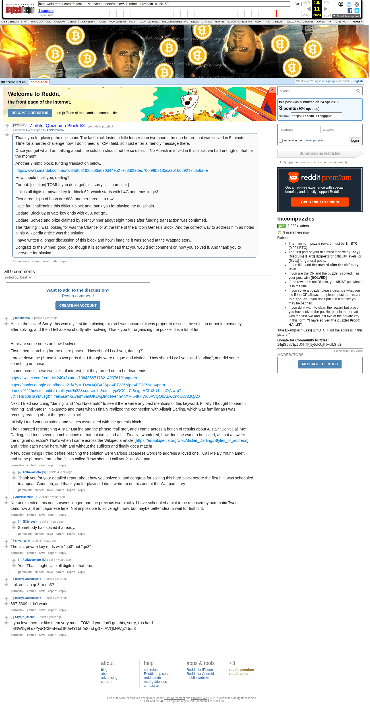

# [7 mbtc] Quizchain Block 63

[Original thread](https://www.reddit.com/r/bitcoinpuzzles/comments/bgqkw5/7_mbtc_quizchain_block_63/). The `sourceUrl` of the [quizchain/63](../../../src/collections/quizchain/63.ts) record and the source of four of its hints and the funding transaction. The WIF of block 62 is printed here by u/Crypto_Rachel. The post went up on April 24, 2019, at 04:59:02 UTC, 48 seconds before the block time of its funding transaction. Its last edit is stamped 23:13:32 UTC on April 24, 2019, so the transcript shows the post as it stood after the claim.

## Historical provenance

The Wayback Machine holds one capture of the `old.reddit.com` URL and one of the `www.reddit.com` URL. Provenance rests on the [old.reddit.com capture](https://web.archive.org/web/20230611124903/https://old.reddit.com/r/bitcoinpuzzles/comments/bgqkw5/7_mbtc_quizchain_block_63/), stamped June 11, 2023, 12:49:03 UTC, whose HTML carries the post, which matches the transcript below word for word. It renders nine comments, and each matches the Arctic Shift record of the same ID by author and text. Only the markdown of links and lists renders differently. The capture was read on September 27, 2026. `archive_content: confirmed` on that basis.

The [Arctic Shift](https://arctic-shift.photon-reddit.com/) Reddit archive, read the same day, lists the same nine comments. The transcript takes authors, text and scores from it and nests the comments as the capture does.

The record names none of the commenters: nothing on the chain ties a claim to a name.

## Transcript

> Thank you for playing the quizchain. The last block lasted a little longer than two hours, the one before that was solved in 5 minutes. TIme for a harder challenge now. I don't need a TOMI field, so I just enter a friendly message there.
>
> Once you get what I am talking about, the solution should not be so difficult. No Atbash involved in this block, we had enough of that for the moment.
>
> Another 7 mbtc block, funding transaction below.
>
> https://www.smartbit.com.au/tx/34df681625c66a690d44e527ec8d0f96ec700f98b3105caa516d29217cd56a0e
>
> How should I call you, darling?
>
> Format: [solution] TOMI If you don't get this, sorry, it is hard [link]
>
> Link is all digits of private key for block 62, which starts with L4G and ends in qe3.
>
> First three digits of hash are 888, another three in a row.
>
> Have fun challenging this difficult block and thank you for playing the quizchain.
>
> Update: Block 62 private key ends with qu3, not qe3.
>
> Update: Solved and prize claimed by silent winner about eight hours after funding transaction was confirmed.
>
> The "darling" I was looking for was the Chancellor at the time of the Bitcoin Genesis Block. And the correct way to address him as noted in his Wikipedia article was the solution.
>
> I have written a longer discussion of this block and how I imagine it was solved at the Wattpad story.
>
> Congrats to the winner, good job, though it is somewhat sad that you would not comment on how you solved it. And thank you to everyone for playing.

## Comments

**u/mooncritic**, 4 points:

> Hi, I'm the solver! Sorry, this was my first time playing this so I was unsure if it was proper to discuss the solution or not immediately after solving, and then I fell asleep shortly after solving. Thank you for organizing the puzzle, it is a lot of fun.
>
> Here are some notes on how I solved it:
>
> First I tried searching for the entire phrase, "How should I call you, darling?"
>
> I broke down the phrase into two parts that I thought were unique and distinct, "How should I call you" and "darling", and did some searching on these.
>
> I came across these two links of interest, but they turned out to be dead ends:
>
> [https://twitter.com/redbrick2404/status/1084366717621493761?lang=en](https://twitter.com/redbrick2404/status/1084366717621493761?lang=en)
>
> [https://books.google.com/books?id=7yM-DwAAQBAJ&pg=PT236&lpg=PT236&dq=para-dome+%22how+should+i+call+you%22&source=bl&ots=\_ypQO0s-Cl&sig=ACfU3U1ccnOjNw-pT-JtNTHBd3bTaYM5zg&hl=en&sa=X&ved=2ahUKEwjJmdeI-enhAhXMl54KHWuuAVQQ6AEwCnoECAMQAQ](https://books.google.com/books?id=7yM-DwAAQBAJ&pg=PT236&lpg=PT236&dq=para-dome+%22how+should+i+call+you%22&source=bl&ots=_ypQO0s-Cl&sig=ACfU3U1ccnOjNw-pT-JtNTHBd3bTaYM5zg&hl=en&sa=X&ved=2ahUKEwjJmdeI-enhAhXMl54KHWuuAVQQ6AEwCnoECAMQAQ)
>
> Next, I tried searching "darling" and "Aoi Nakamoto" to see if there were any past mentions of this keyword. Finally I thought to search "darling" and Satoshi Nakamoto and thats when I finally realized the connection with Alistair Darling, which was familiar as I was recently reading about the genesis block.
>
> Initially I tried various strings and values associated with the genesis block.
>
> Then I started researching Alistair Darling and the phrase "call me", and I came across a bunch of results about Alistair "Don't Call Me" Darling, so I tried several combinations of that but didn't find a hit. Finally I wondered, how does he want to be called, as that answers the original question? That's when I came across the Wikipedia article ([https://en.wikipedia.org/wiki/Alistair\_Darling#Styles\_of\_address](https://en.wikipedia.org/wiki/Alistair_Darling#Styles_of_address)) and I tried each name here, with and without the suffixes and finally got a match!
>
> A few other things I tried before reaching the solution were various Japanese words to address a loved one, "Call Me By Your Name", and some phrases from a fan fiction called "How should I call you?" on Wattpad.

**u/AoiNakamoto**, 1 point, reply to u/mooncritic:

> Thank you for your detailed report about how you solved it, and congrats for solving this hard block before the first hint was scheduled to appear. Good job, and thank you for playing. I did a write-up on this one at the Wattpad story.

**u/AoiNakamoto**, 2 points:

> Not unexpected, this one survives longer than the previous two blocks. I have scheduled a hint to be released by automatic Tweet tomorrow at 8 am Japanese time. Not impossible to solve right now, but maybe better idea to wait for first hint.

**u/JDScreesh**, 1 point, reply to u/AoiNakamoto:

> Somebody has solved it already.

**u/silver_anth**, 1 point:

> The last private key ends with "qu3" not "qe3"

**u/AoiNakamoto**, 1 point, reply to u/silver_anth:

> Yes. That is right. Use all digits of that one.

**u/martypyouknowme**, 1 point:

> Link ends in qe3 or qu3?

**u/martypyouknowme**, 1 point:

> 867-5309 didn't work

**u/Crypto_Rachel**, 1 point:

> if you love them or like them very much TOMI If you don't get this, sorry, it is hard L4GWDy9Ld3ZydGCtFaHaaDEJe4YL5hAiSLsLgGzdEVQkNWgZUqu3

## Screenshot

The screenshot is a render of the archive capture, not of the live page, so it carries the Wayback banner at the top. The "4 years ago" stamps are relative to the capture, June 11, 2023. Capture method and limits: [source archive](../README.md).
