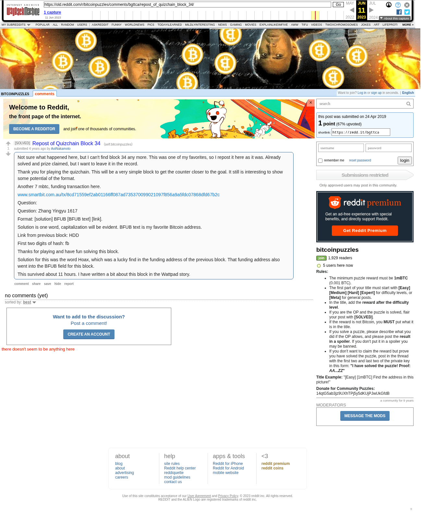

# Repost of Quizchain Block 34

[Original thread](https://www.reddit.com/r/bitcoinpuzzles/comments/bgttca/repost_of_quizchain_block_34/). The `sourceUrl` of the [quizchain/34](../../../src/collections/quizchain/34.ts) record and the source of three of its hints and the funding transaction, with the solution the author edited in. The post went up on April 24, 2019, at 12:08:29 UTC, 11 days after the block time of its funding transaction. It reposts block 34, whose original post had disappeared from the subreddit by then.

## Historical provenance

The Wayback Machine holds one capture of the `old.reddit.com` URL and one of the `www.reddit.com` URL. Provenance rests on the [old.reddit.com capture](https://web.archive.org/web/20230611091152/https://old.reddit.com/r/bitcoinpuzzles/comments/bgttca/repost_of_quizchain_block_34/), stamped June 11, 2023, 09:11:52 UTC, whose HTML carries the post, which matches the transcript below word for word. The thread has no comments, in the capture or in the [Arctic Shift](https://arctic-shift.photon-reddit.com/) Reddit archive. The capture was read on September 27, 2026. `archive_content: confirmed` on that basis.

## Transcript

> Not sure what happened here, but I can't find block 34 any more. This was one of my favorites, so I repost it here as it was. Already solved and prize claimed, but I want to leave it in the record.
>
> Thank you for playing the quizchain. This will be a very simple block to get the counter closer to the goal. It still is interesting to show some potential of the format.
>
> Another 7 mbtc, funding transaction here.
>
> www.smartbit.com.au/tx/8cd71559ef2ab01166ff087ad735370099021097f856a9a5fdc07868dfd67b2c
>
> Question:
>
> Question: Zhang Yingyu 1617
>
> Format: [solution] BFUB [BFUB text] [link].
>
> Solution is one word, capitalization will be evident. BFUB text is my favorite Bitcoin address.
>
> Link from previous block: HDD
>
> First two digits of hash: fb
>
> Thanks for playing and have fun solving this block.
>
> Solution for this was the word Hoax, which was a lucky find in the funding address of the previous block. That funding address also went into the BFUB field for this block.
>
> This survived about 11 hours. I have written a bit about this block in the Wattpad story.

## Screenshot

The screenshot is a render of the archive capture, not of the live page, so it carries the Wayback banner at the top. The "4 years ago" stamps are relative to the capture, June 11, 2023. Capture method and limits: [source archive](../README.md).
