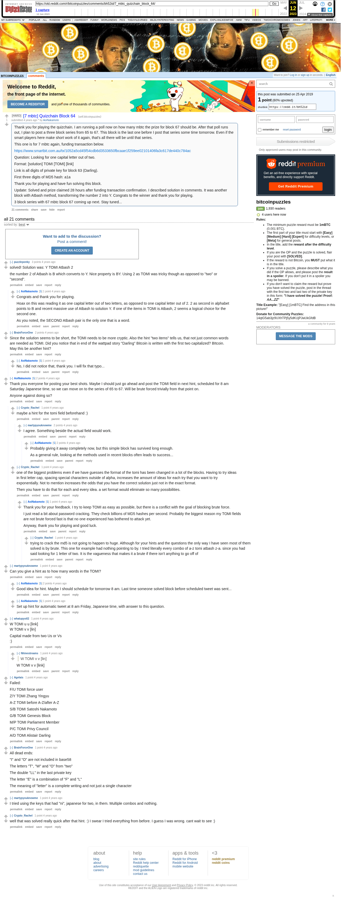

# [7 mbtc] Quizchain Block 64

[Original thread](https://www.reddit.com/r/bitcoinpuzzles/comments/bh52id/7_mbtc_quizchain_block_64/). The `sourceUrl` of the [quizchain/64](../../../src/collections/quizchain/64.ts) record and the source of two of its hints and the funding transaction. The post went up on April 25, 2019, at 05:46:13 UTC, 7 minutes after the block time of its funding transaction. Its last edit is stamped 10:54:00 UTC on April 26, 2019, so the transcript shows the post as it stood after the claim.

## Historical provenance

The Wayback Machine holds one capture of the `old.reddit.com` URL and one of the `www.reddit.com` URL. Provenance rests on the [old.reddit.com capture](https://web.archive.org/web/20230612123614/https://old.reddit.com/r/bitcoinpuzzles/comments/bh52id/7_mbtc_quizchain_block_64/), stamped June 12, 2023, 12:36:14 UTC, whose HTML carries the post, which matches the transcript below word for word. It renders 20 comments, and each matches the Arctic Shift record of the same ID by author and text. Only the markdown of links and lists renders differently. The capture was read on September 27, 2026. `archive_content: confirmed` on that basis.

The [Arctic Shift](https://arctic-shift.photon-reddit.com/) Reddit archive, read the same day, lists 21 comments, one of which the capture does not render. The transcript takes every comment, its author, text and score from Arctic Shift and nests them as the capture does. One of them is a deleted comment, kept below as `[deleted]`.

The record names none of the commenters: nothing on the chain ties a claim to a name.

## Transcript

> Thank you for playing the quizchain. I am running a poll now on how many mbtc the prize for block 67 should be. After that poll runs out, I plan to post a three block series from 65 to 67. This block is the last one before I post that series some time tomorrow. Even if the smart players here make short work of it again, that's all there will be until that series.
>
> This one is for 7 mbtc again, funding transaction below.
>
> https://www.smartbit.com.au/tx/1052a5cd45f54cdb6d3533650fbcaae1f259ee02101406fa3c617de440c784ac
>
> Question: Looking for one capital letter out of two.
>
> Format: [solution] TOMI [TOMI] [link]
>
> Link is all digits of private key for block 63 (Darling).
>
> First three digits of MD5 hash: a1a
>
> Thank you for playing and have fun solving this block.
>
> Update: Solved and prize claimed 28 hours after funding transaction confirmation. I described solution in comments. It was another block with Atbash method, transforming the number 2 into Y. Congrats to the winner and thank you for playing.
>
> 3 block series with 67 mbtc block 67 coming up next. Stay tuned...

## Comments

**u/puzzleponky**, 3 points:

> solved! Solution was: Y TOMI Atbash 2
>
> the number 2 of Atbash is B which converts to Y. Nice property is BY. Using 2 as TOMI was tricky though as opposed to "two" or "second".

**u/AoiNakamoto**, 1 point, reply to u/puzzleponky:

> Congrats and thank you for playing.
>
> Hoax on this was reading it as one capital letter out of two letters, as opposed to one capital letter out of 2. 2 as second in alphabet points to B and recent massive use of Atbash to solution Y. If one of the items in TOMI is Atbash, 2 seems a logical choice for the second one.
>
> As you noted, the SECOND Atbash pair is the only one that is a word.

**u/BrainForceOne**, 2 points:

> Since the solution seems to be short, the TOMI needs to be more cryptic. Also the hint "two items" tells us, that not just common words are needed as TOMI.
> Did you notice that in end of the wattpad story "Darling" Bitcoin is written with the first two capitalized? BItcoin. May this be another hint?

**u/AoiNakamoto**, 1 point, reply to u/BrainForceOne:

> No, I did not notice that, thank you. I will fix that typo...

**u/AoiNakamoto**, 2 points:

> Thank you everyone for posting your best shots. Maybe I should just go ahead and post the TOMI field in next hint, scheduled for 8 am Saturday Japanese time, so we can move on to the series of 65 to 67. Will be brute forced trivially from that point on.
>
> Anyone against doing so?

**u/Crypto_Rachel**, 1 point, reply to u/AoiNakamoto:

> maybe a hint for the tomi field beforehand :)

**u/martypyouknowme**, 2 points, reply to u/Crypto_Rachel:

> I agree. Something beside the actual field would work.

**u/AoiNakamoto**, 2 points, reply to u/martypyouknowme:

> Probably giving it away completely now, but this simple block has survived long enough.
>
> As a general rule, looking at the methods used in recent blocks often leads to success...

**u/Crypto_Rachel**, 1 point, reply to u/AoiNakamoto:

> one of the biggest problems even if we have guesses the format of the tomi has been changed in a lot of the blocks. Having to try ideas in first letter cap, spacing special characters outside of alpha, increases the amount of ideas for each try that you want to try exponentially. Not to mention increases the odds that you have the correct solution just not in the exact format.
>
> Then you have to do that for each and every idea. a set format would eliminate so many possibilities.

**u/AoiNakamoto**, 1 point, reply to u/Crypto_Rachel:

> Thank you for your feedback. I try to keep TOMI as easy as possible, but there is a conflict with the goal of blocking brute force.
>
> I just read a bit about password cracking. They check billions of MD5 hashes per second. Probably the biggest reason my TOMI fields are not brute forced fast is that no one experienced has bothered to attack yet.
>
> Anyway, thank you for playing and good luck.

**u/Crypto_Rachel**, 1 point, reply to u/AoiNakamoto:

> trying to crack the md5 is not going to happen to huge.
> Although for your hints and the questions the only way I have seen most of them solved is by brute. This one for example had nothing pointing to by. I tried literally every combo of a-z tomi atbash z-a. since you had said looking for 1 letter of two.
> It is the vagueness that makes it a brute if there isn't anything to go off of

**u/martypyouknowme**, 1 point:

> Can you give a hint as to how many words in the TOMI?

**u/AoiNakamoto**, 2 points, reply to u/martypyouknowme:

> Good idea for hint. Maybe I should schedule for tomorrow 8 am. Last time someone solved block before scheduled tweet was sent...

**u/AoiNakamoto**, 1 point, reply to u/martypyouknowme:

> Set up hint for automatic tweet at 8 am Friday, Japanese time, with answer to this question.

**u/whatupyo02**, 1 point:

> W TOMI u u \[link\]
> W TOMI v v \[lin\]
>
> Capital made from two Us or Vs
> :)

**u/Nhinestreams**, 1 point, reply to u/whatupyo02:

> > W TOMI v v \[lin\]
>
> W TOMI v v \[link\]

**u/Agelais**, 1 point:

> Failed:
>
> F/U TOMI force user
>
> Z/Y TOMI Zhang Yingyu
>
> A-Z TOMI before A-Z/after A-Z
>
> S/B TOMI Satoshi Nakamoto
>
> G/B TOMI Genesis Block
>
> M/P TOMI Parliament Member
>
> P/C TOMI Privy Council
>
> A/D TOMI Alistair Darling

**u/BrainForceOne**, 1 point:

> All dead ends:
>
> "I" and "O" are not included in base58
>
> The letters "T", "W" and "O" from "two"
>
> The double "LL" in the last private key
>
> The letter "E" is a combination of "F" and "L"
>
> The meaning of "letter" is a complete writing and not just a single character

**u/martypyouknowme**, 1 point:

> I tried using the keys that had "ni", japanese for two, in them. Multiple combos and nothing.

**u/Crypto_Rachel**, 1 point:

> well that was solved really quick after that hint. :) I swear I tried everything from before. I guess I was wrong. cant wait to see :)

**[deleted]**:

> [removed]

## Screenshot

The screenshot is a render of the archive capture, not of the live page, so it carries the Wayback banner at the top. The "4 years ago" stamps are relative to the capture, June 12, 2023. Capture method and limits: [source archive](../README.md).
