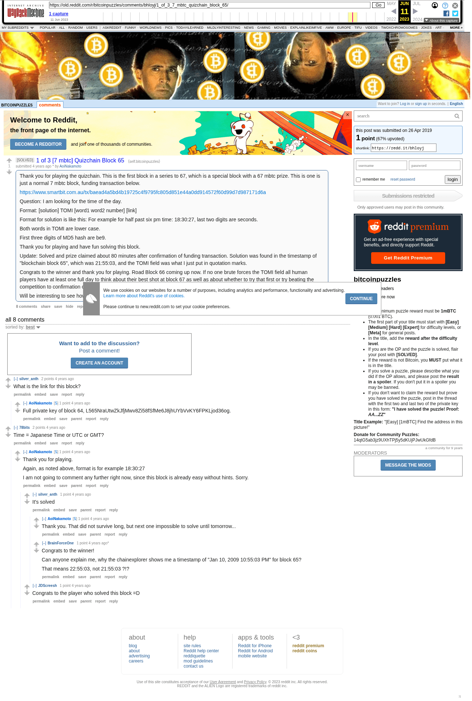

# 1 of 3 [7 mbtc] Quizchain Block 65

[Original thread](https://www.reddit.com/r/bitcoinpuzzles/comments/bhloyj/1_of_3_7_mbtc_quizchain_block_65/). The `sourceUrl` of the [quizchain/65](../../../src/collections/quizchain/65.ts) record and the source of three of its hints and the funding transaction, with the solution the author edited in. The WIF of block 64 is printed here by the author. The post went up on April 26, 2019, at 12:25:33 UTC, 4 minutes after the block time of its funding transaction. Its last edit is stamped 14:00:03 UTC on April 26, 2019, so the transcript shows the post as it stood after the claim.

## Historical provenance

The Wayback Machine holds one capture of the `old.reddit.com` URL and one of the `www.reddit.com` URL. Provenance rests on the [old.reddit.com capture](https://web.archive.org/web/20230611174311/https://old.reddit.com/r/bitcoinpuzzles/comments/bhloyj/1_of_3_7_mbtc_quizchain_block_65/), stamped June 11, 2023, 17:43:11 UTC, whose HTML carries the post, which matches the transcript below word for word. It renders eight comments, and each matches the Arctic Shift record of the same ID by author and text. Only the markdown of links and lists renders differently. The capture was read on September 27, 2026. `archive_content: confirmed` on that basis.

The [Arctic Shift](https://arctic-shift.photon-reddit.com/) Reddit archive, read the same day, lists the same eight comments. The transcript takes authors, text and scores from it and nests the comments as the capture does.

The record names none of the commenters: nothing on the chain ties a claim to a name.

## Transcript

> Thank you for playing the quizchain. This is the first block in a series to 67, which is a special block with a 67 mbtc prize. This is one is just a normal 7 mbtc block, funding transaction below.
>
> https://www.smartbit.com.au/tx/baead4a5bd4b19725c4f9795fc805d851e44a0dd914572f60d99d7d987171d6a
>
> Question: I am looking for the time of the day.
>
> Format: [solution] TOMI [word1 word2 number] [link]
>
> Format for solution is like this: For example for half past six pm time: 18:30:27, last two digits are seconds.
>
> Both words in TOMI are lower case.
>
> First three digits of MD5 hash are be9.
>
> Thank you for playing and have fun solving this block.
>
> Update: Solved and prize claimed about 80 minutes after confirmation of funding transaction. Solution was found in the timestamp of "blockchain block 65", which was 21:55:03, and the TOMI field was what I just put in quotation marks.
>
> Congrats to the winner and thank you for playing. Road Block 66 coming up now. If no one brute forces the TOMI field all human players have at least one full day to think about their best shot at block 67 as well as about whether to try that first or try beating the competition to confirmation of prize sweep transaction for block 66.
>
> Will be interesting to see how this plays out tomorrow...

## Comments

**u/silver_anth**, 2 points:

> What is the link for this block?

**u/AoiNakamoto**, 1 point, reply to u/silver_anth:

> Full private key of block 64, L565NraUtwZkJfjMwv8Zi58fSfMe6J8jhUYbVvKY6FPKLjod36og.

**u/78bits**, 2 points:

> Time = Japanese Time or UTC or GMT?

**u/AoiNakamoto**, 1 point, reply to u/78bits:

> Thank you for playing.
>
> Again, as noted above, format is for example 18:30:27
>
> I am not going to comment any further right now, since this block is already easy without hints. Sorry.

**u/silver_anth**, 1 point, reply to u/AoiNakamoto:

> It's solved

**u/AoiNakamoto**, 1 point, reply to u/silver_anth:

> Thank you. That did not survive long, but next one impossible to solve until tomorrow...

**u/BrainForceOne**, 1 point, reply to u/silver_anth:

> Congrats to the winner!
>
> Can anyone explain me, why the chainexplorer shows me a timestamp of "Jan 10, 2009 10:55:03 PM" for block 65?
>
> That means 22:55:03, not 21:55:03 ?!?

**u/JDScreesh**, 1 point, reply to u/AoiNakamoto:

> Congrats to the player who solved this block =D

## Screenshot

The screenshot is a render of the archive capture, not of the live page, so it carries the Wayback banner at the top. The "4 years ago" stamps are relative to the capture, June 11, 2023. Capture method and limits: [source archive](../README.md).
