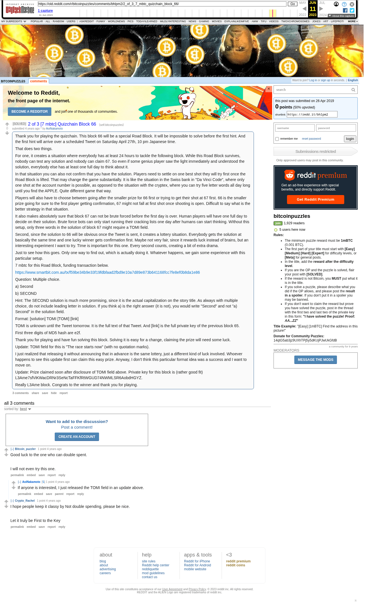

# 2 of 3 [7 mbtc] Quizchain Block 66

[Original thread](https://www.reddit.com/r/bitcoinpuzzles/comments/bhlpm2/2_of_3_7_mbtc_quizchain_block_66/). The `sourceUrl` of the [quizchain/66](../../../src/collections/quizchain/66.ts) record and the source of two of its hints and the funding transaction, with the solution the author edited in. The WIF of block 66 is printed here by the author, in the post. The post went up on April 26, 2019, at 12:28:02 UTC, 7 minutes after the block time of its funding transaction. Its last edit is stamped 01:44:03 UTC on April 27, 2019, so the transcript shows the post as it stood after the claim.

## Historical provenance

The Wayback Machine holds one capture of the `old.reddit.com` URL and one of the `www.reddit.com` URL. Provenance rests on the [old.reddit.com capture](https://web.archive.org/web/20230611073821/https://old.reddit.com/r/bitcoinpuzzles/comments/bhlpm2/2_of_3_7_mbtc_quizchain_block_66/), stamped June 11, 2023, 07:38:21 UTC, whose HTML carries the post, which matches the transcript below word for word. It renders three comments, and each matches the Arctic Shift record of the same ID by author and text. Only the markdown of links and lists renders differently. The capture was read on September 27, 2026. `archive_content: confirmed` on that basis.

The [Arctic Shift](https://arctic-shift.photon-reddit.com/) Reddit archive, read the same day, lists 4 comments, one of which the capture does not render. The transcript takes every comment, its author, text and score from Arctic Shift and nests them as the capture does. One of them is a deleted comment, kept below as `[deleted]`.

The record names none of the commenters: nothing on the chain ties a claim to a name.

## Transcript

> Thank you for playing the quizchain. This block 66 will be a special Road Block. It will be impossible to solve before the first hint. And the first hint will arrive over a scheduled Tweet on Saturday April 27th, 10 pm Japanese time.
>
> That does two things.
>
> For one, it creates a situation where everybody has at least 24 hours to tackle the following block. While this Road Block survives, nobody can test any solution and nobody can claim 67. So even if some genius player saw the light immediately and understood the solution, everybody else has at least one full day to think about it.
>
> In that situation you can also not confirm that you have the solution. Players need to settle on one best shot they will try first once the Road Block is lifted. That may change the game substantially. It is like the situation in the Swiss bank in "Da Vinci Code", where only one shot at the account number is possible, as opposed to the situation with the cryptex, where you can try five letter words all day long until you find the APPLE. Quite different game that way.
>
> Players will also have to choose between going after the smaller prize for 66 first or trying to get their shot at 67 first. 66 is the smaller prize going for sure to the first player getting confirmation, 67 might not fall at first shot once shooting is open. Difficult to say what is the better strategy in that situation.
>
> It also makes absolutely sure that block 67 can not be brute forced before the first day is over. Human players will have one full day to decide on their solution. Brute force bots can only start running their cracking lists one day after humans can start thinking. WIthout this setup, only three words in the solution of block 67 might require a TOMI field.
>
> Second, since the solution to 66 will be obvious once the Tweet is sent, it creates a lottery situation. Everybody gets the solution at basically the same time and one lucky winner gets confirmation first. Maybe not very fair, since it rewards luck instead of brains, but an interesting experiment I want to try. TIme is important for this one. Every second counts, creating a bit of extra drama.
>
> Just to see how this goes. Only one way to find out, which is actually doing it. Whatever happens, we gain some experience with this particular setup.
>
> 7 mbtc for this Road Block, funding transaction below.
>
> https://www.smartbit.com.au/tx/f59be34b9e33f19fdbfaad2fbd9e10a7d89e873b641168fcc7fe8ef0b8da1e86
>
> Question: Multiple choice.
>
> a) Second
>
> b) SECOND
>
> Hint: The SECOND solution is much more promising, since it is the actual capitalization on the story title. As always with multiple choice, do not include leading letter in solution. If you think a) is the right answer (it is not), you would write "Second" and not "a) Second" in the solution field.
>
> Format: [solution] TOMI [TOMI] [link]
>
> TOMI is unknown until the Tweet tomorrow. It is the full text of that Tweet. And [link] is the full private key of the previous block 65.
>
> First three digits of MD5 hash are e2f.
>
> Thank you for playing and have fun solving this block. Solving it is easy for a change, claiming the prize will need some luck.
>
> Update: TOMI field for this is "The race starts now" (with no quotation marks).
>
> I just realized that releasing it without announcing that in advance is the same lottery, just a different kind of luck involved. Whoever happens to see this update first can claim this easy prize. Anyway, I don't think this particular format idea was a success and I want to move on.
>
> Update: Prize claimed soon after disclosure of TOMI field above. Private key for this block is (rather good fit) L3Ame7sfViKWacDRNr3SeNcTaFFKfRtWGUD74NWMLSR6AobdHGYZ.
>
> Really L3Ame block. Congrats to the winner and thank you for playing.

## Comments

**u/Bitcoin_puzzler**, 1 point:

> Good luck to the one who can double spent.
>
> I will not even try this one.

**u/AoiNakamoto**, 1 point, reply to u/Bitcoin_puzzler:

> If anyone is interested, I just released the TOMI field in an update above.

**u/Crypto_Rachel**, 1 point:

> I hope people keep it classy by Not double spending, please be nice.
>
> Let it truly be First to the Key

**[deleted]**:

> [deleted]

## Screenshot

The screenshot is a render of the archive capture, not of the live page, so it carries the Wayback banner at the top. The "4 years ago" stamps are relative to the capture, June 11, 2023. Capture method and limits: [source archive](../README.md).
