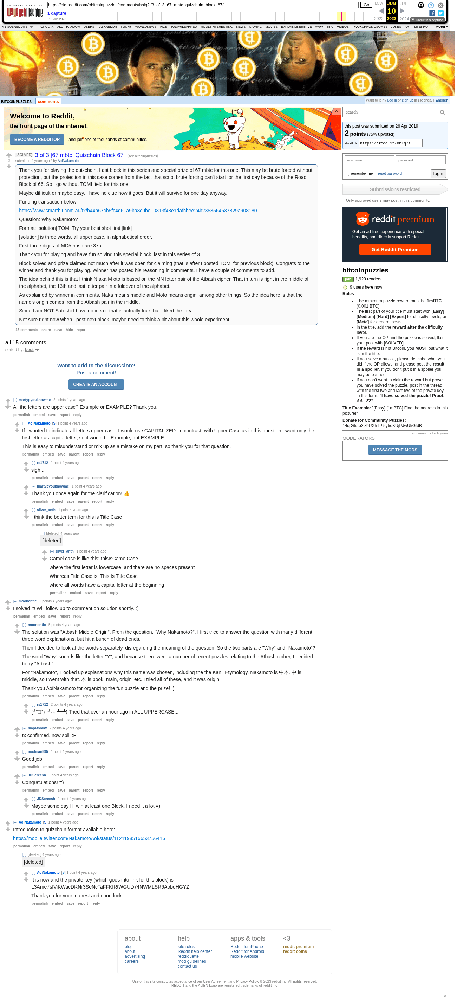

# 3 of 3 [67 mbtc] Quizchain Block 67

[Original thread](https://www.reddit.com/r/bitcoinpuzzles/comments/bhlq2i/3_of_3_67_mbtc_quizchain_block_67/). The `sourceUrl` of the [quizchain/67](../../../src/collections/quizchain/67.ts) record and the source of three of its hints and the funding transaction. The WIF of block 66 is printed here by the author. The post went up on April 26, 2019, at 12:29:36 UTC, 8 minutes after the block time of its funding transaction. Its last edit is stamped 23:53:35 UTC on April 27, 2019, so the transcript shows the post as it stood after the claim.

## Historical provenance

The Wayback Machine holds one capture of the `old.reddit.com` URL and one of the `www.reddit.com` URL, plus one of single comment permalinks. Provenance rests on the [old.reddit.com capture](https://web.archive.org/web/20230610214007/https://old.reddit.com/r/bitcoinpuzzles/comments/bhlq2i/3_of_3_67_mbtc_quizchain_block_67/), stamped June 10, 2023, 21:40:07 UTC, whose HTML carries the post, which matches the transcript below word for word. It renders 17 comments, and each matches the Arctic Shift record of the same ID by author and text. Only the markdown of links and lists renders differently. The capture was read on September 27, 2026. `archive_content: confirmed` on that basis.

The [Arctic Shift](https://arctic-shift.photon-reddit.com/) Reddit archive, read the same day, lists 17 comments, two of which the capture does not render: deleted ones and replies behind a "load more" link. The transcript takes every comment, its author, text and score from Arctic Shift and nests them as the capture does. Two of them are deleted comments, kept below as `[deleted]`.

The record names none of the commenters: nothing on the chain ties a claim to a name.

## Transcript

> Thank you for playing the quizchain. Last block in this series and special prize of 67 mbtc for this one. This may be brute forced without protection, but the protection in this case comes from the fact that script brute forcing can't start for the first day because of the Road Block of 66. So I go without TOMI field for this one.
>
> Maybe difficult or maybe easy. I have no clue how it goes. But it will survive for one day anyway.
>
> Funding transaction below.
>
> https://www.smartbit.com.au/tx/b44b67cb5fc4d61a9ba3c9be10313f48e1dafcbee24b2353564637829a908180
>
> Question: Why Nakamoto?
>
> Format: [solution] TOMI Try your best shot first [link]
>
> [solution] is three words, all upper case, in alphabetical order.
>
> First three digits of MD5 hash are 37a.
>
> Thank you for playing and have fun solving this special block, last in this series of 3.
>
> Block solved and prize claimed not much after it was open for claiming (that is after I posted TOMI for previous block). Congrats to the winner and thank you for playing. Winner has posted his reasoning in comments. I have a couple of comments to add.
>
> The idea behind this is that I think N aka M oto is based on the MN letter pair of the Atbash cipher. That in turn is right in the middle of the alphabet, the 13th and last letter pair in a foldover of the alphabet.
>
> As explained by winner in comments, Naka means middle and Moto means origin, among other things. So the idea here is that the name's origin comes from the Atbash pair in the middle.
>
> Since I am NOT Satoshi I have no idea if that is actually true, but I liked the idea.
>
> Not sure right now when I post next block, maybe need to think a bit about this whole experiment.

## Comments

**u/martypyouknowme**, 2 points:

> All the letters are upper case? Example or EXAMPLE? Thank you.

**u/AoiNakamoto**, 1 point, reply to u/martypyouknowme:

> If I wanted to indicate all letters upper case, I would use CAPITALIZED. In contrast, with Upper Case as in this question I want only the first letter as capital letter, so it would be Example, not EXAMPLE.
>
> This is easy to misunderstand or mix up as a mistake on my part, so thank you for that question.

**u/rs1712**, 1 point, reply to u/AoiNakamoto:

> sigh...

**u/martypyouknowme**, 1 point, reply to u/AoiNakamoto:

> Thank you once again for the clarification! 👍

**u/silver_anth**, 1 point, reply to u/AoiNakamoto:

> I think the better term for this is Title Case

**[deleted]**, reply to u/silver_anth:

> [deleted]

**u/silver_anth**, 1 point, reply to a deleted comment:

> Camel case is like this: thisIsCamelCase
>
> where the first letter is lowercase, and there are no spaces present
>
> Whereas Title Case is: This Is Title Case
>
> where all words have a capital letter at the beginning

**u/mooncritic**, 2 points:

> I solved it! Will follow up to comment on solution shortly. :)

**u/mooncritic**, 4 points, reply to u/mooncritic:

> The solution was "Atbash Middle Origin". From the question, "Why Nakamoto?", I first tried to answer the question with many different three word explanations, but hit a bunch of dead ends.
>
> Then I decided to look at the words separately, disregarding the meaning of the question. So the two parts are "Why" and "Nakamoto"?
>
> The word "Why" sounds like the letter "Y", and because there were a number of recent puzzles relating to the Atbash cipher, I decided to try "Atbash".
>
> For "Nakamoto", I looked up explanations why this name was chosen, including the the Kanji Etymology. Nakamoto is 中本. 中 is middle, so I went with that. 本 is book, main, origin, etc. I tried all of these, and it was origin!
>
> Thank you AoiNakamoto for organizing the fun puzzle and the prize! :)

**u/rs1712**, 2 points, reply to u/mooncritic:

> (╯°□°）╯︵ ┻━┻)
> Tried that over an hour ago in ALL UPPERCASE....

**u/mapl3sn0w**, 2 points, reply to u/mooncritic:

> tx confirmed. now spill :P

**u/madman895**, 1 point, reply to u/mooncritic:

> Good job!

**u/JDScreesh**, 1 point, reply to u/mooncritic:

> Congratulations! =)

**u/JDScreesh**, 1 point, reply to u/JDScreesh:

> Maybe some day I'll win at least one Block. I need it a lot =)

**u/AoiNakamoto**, 1 point:

> Introduction to quizchain format available here:
>
> https://mobile.twitter.com/NakamotoAoi/status/1121198516653756416

**[deleted]**, reply to u/AoiNakamoto:

> [deleted]

**u/AoiNakamoto**, 1 point, reply to a deleted comment:

> It is now and the private key (which goes into link for this block) is
> L3Ame7sfViKWacDRNr3SeNcTaFFKfRtWGUD74NWMLSR6AobdHGYZ.
>
> Thank you for your interest and good luck.

## Screenshot

The screenshot is a render of the archive capture, not of the live page, so it carries the Wayback banner at the top. The "4 years ago" stamps are relative to the capture, June 10, 2023. Capture method and limits: [source archive](../README.md).
