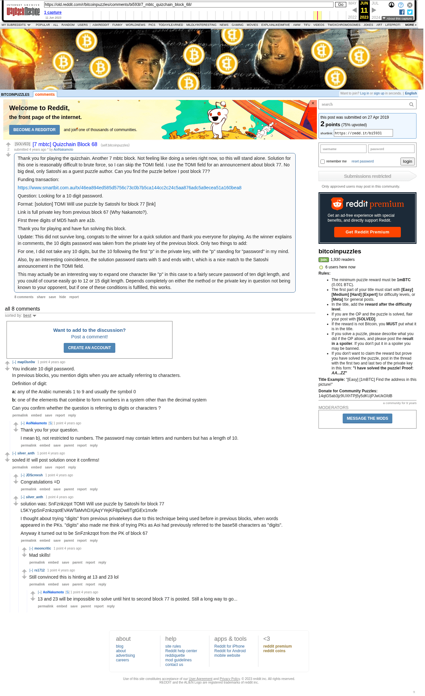

# [7 mbtc] Quizchain Block 68

[Original thread](https://www.reddit.com/r/bitcoinpuzzles/comments/bi593l/7_mbtc_quizchain_block_68/). The `sourceUrl` of the [quizchain/68](../../../src/collections/quizchain/68.ts) record and the source of three of its hints and the funding transaction, with the solution the author edited in. The WIF of block 67 is printed here by u/silver_anth. The post went up on April 27, 2019, at 23:54:52 UTC, 24 minutes before the block time of its funding transaction. Its last edit is stamped 02:02:56 UTC on April 28, 2019, so the transcript shows the post as it stood after the claim.

## Historical provenance

The Wayback Machine holds one capture of the `old.reddit.com` URL and one of the `www.reddit.com` URL. Provenance rests on the [old.reddit.com capture](https://web.archive.org/web/20230611154423/https://old.reddit.com/r/bitcoinpuzzles/comments/bi593l/7_mbtc_quizchain_block_68/), stamped June 11, 2023, 15:44:23 UTC, whose HTML carries the post, which matches the transcript below word for word. It renders eight comments, and each matches the Arctic Shift record of the same ID by author and text. Only the markdown of links and lists renders differently. The capture was read on September 27, 2026. `archive_content: confirmed` on that basis.

The [Arctic Shift](https://arctic-shift.photon-reddit.com/) Reddit archive, read the same day, lists the same eight comments. The transcript takes authors, text and scores from it and nests the comments as the capture does.

The record names none of the commenters: nothing on the chain ties a claim to a name.

## Transcript

> Thank you for playing the quizchain. Another 7 mbtc block. Not feeling like doing a series right now, so this will stand alone. Solution for this one is reasonably difficult to brute force, so I can skip the TOMI field. I use the TOMI field for an announcement about block 77. No big deal, only Satoshi as a guest puzzle author. Can you find the puzzle before I post block 77?
>
> Funding transaction:
>
> https://www.smartbit.com.au/tx/46ea894ed585d5756c73c0b7b5ca144cc2c24c5aa876adc5a9ecea51a160bea8
>
> Question: Looking for a 10 digit password.
>
> Format: [solution] TOMI Will use puzzle by Satoshi for block 77 [link]
>
> Link is full private key from previous block 67 (Why Nakamoto?).
>
> FIrst three digits of MD5 hash are a1b.
>
> Thank you for playing and have fun solving this block.
>
> Update: This did not survive long, congrats to the winner for a quick solution and thank you everyone for playing. As the winner explains in comments, the 10 digits password was taken from the private key of the previous block. Only two things to add:
>
> For one, I did not take any 10 digits, but the 10 following the first "p" in the private key, with the "p" standing for "password" in my mind.
>
> Also, by an interesting coincidence, the solution password starts with S and ends with t, which is a nice match to the Satoshi announcement in the TOMI field.
>
> This may actually be an interesting way to expand one character like "p" in this case to a fairly secure password of ten digit length, and you could of course easily go to 12 or 15 digit length. Depends completely on either the method or the private key in question not being known to your opponent, but if one of these conditions is fulfilled, this works.

## Comments

**u/mapl3sn0w**, 1 point:

> You indicate 10 digit password.
> In previous blocks, you mention digits when you are actually referring to characters.
>
> Definition of digit:
>
> **a:** any of the Arabic numerals 1 to 9 and usually the symbol 0
>
> **b:** one of the elements that combine to form numbers in a system other than the decimal system
>
> Can you confirm whether the question is referring to digits or characters ?

**u/AoiNakamoto**, 1 point, reply to u/mapl3sn0w:

> Thank you for your question.
>
> I mean b), not restricted to numbers. The password may contain letters and numbers but has a length of 10.

**u/silver_anth**, 1 point:

> sovled it! will post solution once it confirms!

**u/JDScreesh**, 1 point, reply to u/silver_anth:

> Congratulations =D

**u/silver_anth**, 1 point, reply to u/silver_anth:

> solution was: SnFznkzqot TOMI Will use puzzle by Satoshi for block 77 L5KYypSnFznkzqotEVAWTaMvhDXjAqYYejKF8pDw8TgtGEx1mxfe
>
> I thought about trying "digits" from previous privatekeys due to this technique being used before in previous blocks, when words appeared in the PKs. "digits" also made me think of trying PKs as Aoi had previously referred to the base58 characters as "digits".
>
> Anyway it turned out to be SnFznkzqot from the PK of block 67

**u/mooncritic**, 1 point, reply to u/silver_anth:

> Mad skills!

**u/rs1712**, 1 point, reply to u/silver_anth:

> Still convinced this is hinting at 13 and 23 lol

**u/AoiNakamoto**, 1 point, reply to u/rs1712:

> 13 and 23 will be impossible to solve until hint to second block 77 is posted. Still a long way to go...

## Screenshot

The screenshot is a render of the archive capture, not of the live page, so it carries the Wayback banner at the top. The "4 years ago" stamps are relative to the capture, June 11, 2023. Capture method and limits: [source archive](../README.md).
