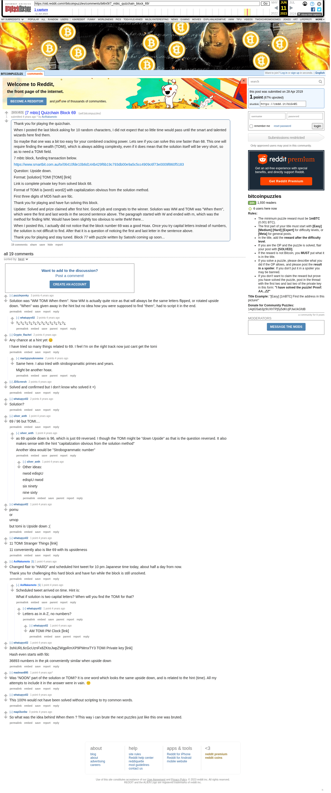

# [7 mbtc] Quizchain Block 69

[Original thread](https://www.reddit.com/r/bitcoinpuzzles/comments/bi6n0l/7_mbtc_quizchain_block_69/). The `sourceUrl` of the [quizchain/69](../../../src/collections/quizchain/69.ts) record and the source of two of its hints and the funding transaction, with the solution the author edited in. The post went up on April 28, 2019, at 02:31:42 UTC, 3 minutes before the block time of its funding transaction. Its last edit is stamped 22:25:09 UTC on April 29, 2019, so the transcript shows the post as it stood after the claim.

## Historical provenance

The Wayback Machine holds one capture of the `old.reddit.com` URL and one of the `www.reddit.com` URL. Provenance rests on the [old.reddit.com capture](https://web.archive.org/web/20230611183259/https://old.reddit.com/r/bitcoinpuzzles/comments/bi6n0l/7_mbtc_quizchain_block_69/), stamped June 11, 2023, 18:32:59 UTC, whose HTML carries the post, which matches the transcript below word for word. It renders 19 comments, and each matches the Arctic Shift record of the same ID by author and text. Only the markdown of links and lists renders differently. The capture was read on September 27, 2026. `archive_content: confirmed` on that basis.

The [Arctic Shift](https://arctic-shift.photon-reddit.com/) Reddit archive, read the same day, lists 20 comments, one of which the capture does not render. The transcript takes every comment, its author, text and score from Arctic Shift and nests them as the capture does. One of them is a deleted comment, kept below as `[deleted]`.

The record names none of the commenters: nothing on the chain ties a claim to a name.

## Transcript

> Thank you for playing the quizchain.
>
> When I posted the last block asking for 10 random characters, I did not expect that so little time would pass until the smart and talented wizards here find them.
>
> So maybe that one was a bit too easy for your combined cracking power. Lets see if you can solve this one faster than 68. This one will require finding the wealth (TOMI), which is always adding complexity, even if it does mean that the solution itself will be very short, so as to need a TOMI field.
>
> 7 mbtc block, funding transaction below.
>
> https://www.smartbit.com.au/tx/06410fde10b6d144b429f6b19c793db00e9a5c5cc4909c6f73e0009f860f5183
>
> Question: Upside down.
>
> Format: [solution] TOMI [TOMI] [link]
>
> Link is complete private key from solved block 68.
>
> Format of TOMI is [word1 word2] with capitalization obvious from the solution method.
>
> First three digits of MD5 hash are fdc.
>
> Thank you for playing and have fun solving this block.
>
> Update: Solved and prize claimed after first hint. Good job and congrats to the winner. Solution was WM and TOMI was "When them", which were the first and last words in the second sentence above. The paragraph started with W and ended with m, which was the method for finding WM. Would have been slightly too obvious to write theM there...
>
> When I posted this, I actually did not notice that the block number 69 was a good Hoax. Once you try capital letters instead of numbers, the solution is not difficult to find. After that it is a question of noticing the first and last letter in the sentence above.
>
> Thank you for playing and stay tuned. Block 77 with puzzle written by Satoshi coming up soon...

## Comments

**u/puzzleponky**, 3 points:

> Solution was "WM TOMI When them". Now WM is actually quite nice as that will always be the same letters flipped, or rotated upside down. "When" was given away in the hint but no idea how you were supposed to find "them", had to script it in the end.

**u/whatupyo02**, 2 points, reply to u/puzzleponky:

> ?¿?¿?¿?¿?¿?¿?¿?¿?¿?¿?¿?¿

**u/Crypto_Rachel**, 2 points:

> Any chance at a hint yet 😊
>
> I have tried so many things related to 69. I feel I'm on the right track now just cant get the tomi

**u/martypyouknowme**, 2 points, reply to u/Crypto_Rachel:

> Same here. I also tried with strobogramattic primes and years.
>
> Might be another hoax.

**u/JDScreesh**, 2 points:

> Solved and confirmed but I don't know who solved it =)

**u/whatupyo02**, 2 points:

> Solution?

**u/silver_anth**, 1 point:

> 69 / 96 but TOMI....

**u/silver_anth**, 1 point, reply to u/silver_anth:

> as 69 upside down is 96, which is just 69 reversed. I though the TOMI might be "down Upside" as that is the question reversed. It also makes sense with the hint "capitalization obvious from the solution method"
>
> Another idea would be "Strobogrammatic number"

**u/silver_anth**, 1 point, reply to u/silver_anth:

> Other ideas:
>
> nwod edispU
>
> edispU nwod
>
> six ninety
>
> nine sixty

**u/whatupyo02**, 1 point:

> pomu
> or
> umop
>
> but tomi is Upside down ;(

**u/whatupyo02**, 1 point:

> 11 TOMI Stranger Things \[link\]
>
> 11 conveniently also is like 69 with its upsideness

**u/AoiNakamoto**, 1 point:

> Changed flair to "HARD" and scheduled hint tweet for 10 pm Japanese time today, about half a day from now.
>
> Thank you for challenging this hard block and have fun while the block is still unsolved.

**u/AoiNakamoto**, 1 point, reply to u/AoiNakamoto:

> Scheduled tweet arrived on time. Hint is:
>
> What if solution is two capital letters? When will you find the TOMI for that?

**u/whatupyo02**, 1 point, reply to u/AoiNakamoto:

> Letters as in A-Z, no numbers?

**u/whatupyo02**, 1 point, reply to u/whatupyo02:

> AM TOMI PM Clock \[link\]

**u/whatupyo02**, 1 point:

> 3sNURL6cGcUznFx8ZKtoJwpZWgpRmXP9PMmxTY3 TOMI Private key \[link\]
>
> Hash even starts with fdc
>
> 36893 numbers in the pk conveniently similar when upside down

**u/madman895**, 1 point:

> Was “NOON” part of the solution or TOMI? It is one word which looks the same upside down, and is related to the hint (time). All my attempts to include it in the answer were in vain. 😕

**u/whatupyo02**, 1 point:

> This 100% would not have been solved without scripting to try common words.

**u/mapl3sn0w**, 0 points:

> So what was the idea behind When them ? This way i can brute the next puzzles just like this one was bruted.

**[deleted]**:

> [deleted]

## Screenshot

The screenshot is a render of the archive capture, not of the live page, so it carries the Wayback banner at the top. The "4 years ago" stamps are relative to the capture, June 11, 2023. Capture method and limits: [source archive](../README.md).
