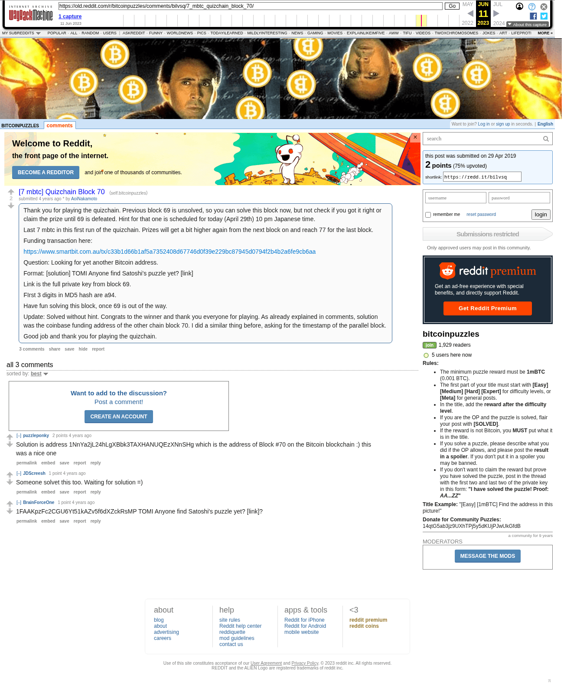

# [7 mbtc] Quizchain Block 70

[Original thread](https://www.reddit.com/r/bitcoinpuzzles/comments/bilvsq/7_mbtc_quizchain_block_70/). The `sourceUrl` of the [quizchain/70](../../../src/collections/quizchain/70.ts) record and the source of three of its hints and the funding transaction, with the solution the author edited in. The post went up on April 29, 2019, at 05:37:40 UTC, 4 minutes after the block time of its funding transaction. Its last edit is stamped 22:30:38 UTC on April 29, 2019, so the transcript shows the post as it stood after the claim.

## Historical provenance

The Wayback Machine holds one capture of the `old.reddit.com` URL and one of the `www.reddit.com` URL. Provenance rests on the [old.reddit.com capture](https://web.archive.org/web/20230611081503/https://old.reddit.com/r/bitcoinpuzzles/comments/bilvsq/7_mbtc_quizchain_block_70/), stamped June 11, 2023, 08:15:03 UTC, whose HTML carries the post, which matches the transcript below word for word. It renders three comments, and each matches the Arctic Shift record of the same ID by author and text. Only the markdown of links and lists renders differently. The capture was read on September 27, 2026. `archive_content: confirmed` on that basis.

The [Arctic Shift](https://arctic-shift.photon-reddit.com/) Reddit archive, read the same day, lists the same three comments. The transcript takes authors, text and scores from it and nests the comments as the capture does.

The record names none of the commenters: nothing on the chain ties a claim to a name.

## Transcript

> Thank you for playing the quizchain. Previous block 69 is unsolved, so you can solve this block now, but not check if you got it right or claim the prize until 69 is defeated. Hint for that one is scheduled for today (April 29th) 10 pm Japanese time.
>
> Last 7 mbtc in this first run of the quizchain. Prizes will get a bit higher again from the next block on and reach 77 for the last block.
>
> Funding transaction here:
>
> https://www.smartbit.com.au/tx/c33b1d66b1af5a7352408d67746d0f39e229bc87945d0794f2b4b2a6fe9cb6aa
>
> Question: Looking for yet another Bitcoin address.
>
> Format: [solution] TOMI Anyone find Satoshi's puzzle yet? [link]
>
> Link is the full private key from block 69.
>
> FIrst 3 digits in MD5 hash are a94.
>
> Have fun solving this block, once 69 is out of the way.
>
> Update: Solved without hint. Congrats to the winner and thank you everyone for playing. As already explained in comments, solution was the coinbase funding address of the other chain block 70. I did a similar thing before, asking for the timestamp of the parallel block.
>
> Good job and thank you for playing the quizchain.

## Comments

**u/puzzleponky**, 2 points:

> Solution is address 1NnYa2jL24hLgXBbk3TAXHANUQEzXNnSHg which is the address of Block #70 on the Bitcoin blockchain :) this was a nice one

**u/JDScreesh**, 1 point:

> Someone solvet this too. Waiting for solution =)

**u/BrainForceOne**, 1 point:

> 1FAAKpzFc2CGU6Yt51kAZv5f6dXZckRsMP TOMI Anyone find Satoshi's puzzle yet? [link]?

## Screenshot

The screenshot is a render of the archive capture, not of the live page, so it carries the Wayback banner at the top. The "4 years ago" stamps are relative to the capture, June 11, 2023. Capture method and limits: [source archive](../README.md).
