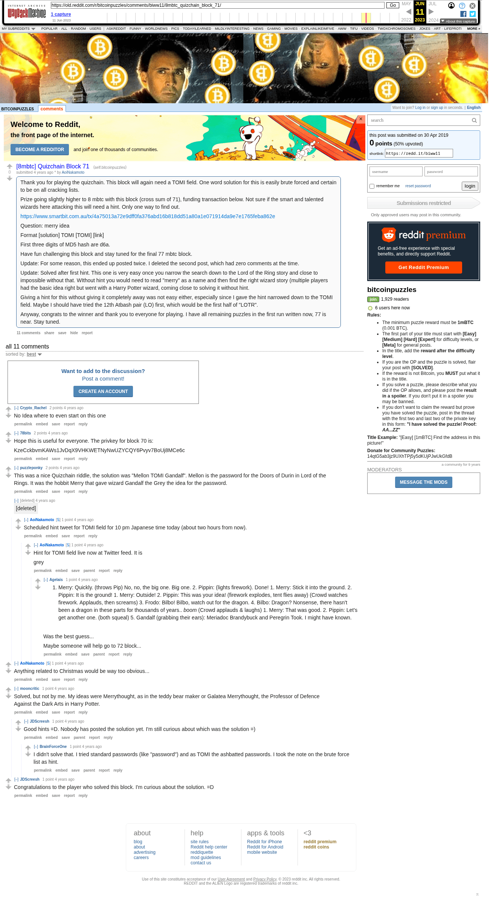

# [8mbtc] Quizchain Block 71

[Original thread](https://www.reddit.com/r/bitcoinpuzzles/comments/biww11/8mbtc_quizchain_block_71/). The `sourceUrl` of the [quizchain/71](../../../src/collections/quizchain/71.ts) record and the source of two of its hints and the funding transaction. The WIF of block 70 is printed here by u/78bits. The post went up on April 30, 2019, at 00:27:37 UTC, 6 minutes before the block time of its funding transaction. Its last edit is stamped 08:50:29 UTC on May 1, 2019, so the transcript shows the post as it stood after the claim.

## Historical provenance

The Wayback Machine holds one capture of the `old.reddit.com` URL and one of the `www.reddit.com` URL. Provenance rests on the [old.reddit.com capture](https://web.archive.org/web/20230611104725/https://old.reddit.com/r/bitcoinpuzzles/comments/biww11/8mbtc_quizchain_block_71/), stamped June 11, 2023, 10:47:25 UTC, whose HTML carries the post, which matches the transcript below word for word. It renders 12 comments, and each matches the Arctic Shift record of the same ID by author and text. Only the markdown of links and lists renders differently. The capture was read on September 27, 2026. `archive_content: confirmed` on that basis.

The [Arctic Shift](https://arctic-shift.photon-reddit.com/) Reddit archive, read the same day, lists 12 comments, one of which the capture does not render. The transcript takes every comment, its author, text and score from Arctic Shift and nests them as the capture does. One of them is a deleted comment, kept below as `[deleted]`.

The record names none of the commenters: nothing on the chain ties a claim to a name.

## Transcript

> Thank you for playing the quizchain. This block will again need a TOMI field. One word solution for this is easily brute forced and certain to be on all cracking lists.
>
> Prize going slightly higher to 8 mbtc with this block (cross sum of 71), funding transaction below. Not sure if the smart and talented wizards here attacking this will need a hint. Only one way to find out.
>
> https://www.smartbit.com.au/tx/4a75013a72e9dff0fa376abd16b818dd51a80a1e071914da9e7e1765feba862e
>
> Question: merry idea
>
> Format [solution] TOMI [TOMI] [link]
>
> First three digits of MD5 hash are d6a.
>
> Have fun challenging this block and stay tuned for the final 77 mbtc block.
>
> Update: For some reason, this ended up posted twice. I deleted the second post, which had zero comments at the time.
>
> Update: Solved after first hint. This one is very easy once you narrow the search down to the Lord of the Ring story and close to impossible without that. WIthout hint you would need to read "merry" as a name and then find the right wizard story (multiple players had the basic idea right but went with a Harry Potter wizard, coming close to solving it without hint.
>
> Giving a hint for this without giving it completely away was not easy either, especially since I gave the hint narrowed down to the TOMI field. Maybe I should have tried the 12th Atbash pair (LO) first, which would be the first half of "LOTR".
>
> Anyway, congrats to the winner and thank you to everyone for playing. I have all remaining puzzles in the first run written now, 77 is near. Stay tuned.

## Comments

**u/Crypto_Rachel**, 2 points:

> No Idea where to even start on this one

**u/78bits**, 2 points:

> Hope this is useful for everyone. The privkey for block 70 is:
>
> KzeCckbvmKAWs1JvDqX9VHKWETNyNwUZYCQY6Pvyv7BoUj8MCe6c

**u/puzzleponky**, 2 points:

> This was a nice Quizchain riddle, the solution was "Mellon TOMI Gandalf". Mellon is the password for the Doors of Durin in Lord of the Rings. It was the hobbit Merry that gave wizard Gandalf the Grey the idea for the password.

**u/AoiNakamoto**, 1 point:

> Anything related to Christmas would be way too obvious...

**u/mooncritic**, 1 point:

> Solved, but not by me. My ideas were Merrythought, as in the teddy bear maker or Galatea Merrythought, the Professor of Defence Against the Dark Arts in Harry Potter.

**u/JDScreesh**, 1 point, reply to u/mooncritic:

> Good hints =D. Nobody has posted the solution yet. I'm still curious about which was the solution =)

**u/BrainForceOne**, 1 point, reply to u/JDScreesh:

> I didn't solve that. I tried standard passwords (like "password") and as TOMI the ashbatted passwords. I took the note on the brute force list as hint.

**u/JDScreesh**, 1 point:

> Congratulations to the player who solved this block. I'm curious about the solution. =D

**[deleted]**:

> [deleted]

**u/AoiNakamoto**, 1 point, reply to a deleted comment:

> Scheduled hint tweet for TOMI field for 10 pm Japanese time today (about two hours from now).

**u/AoiNakamoto**, 1 point, reply to u/AoiNakamoto:

> Hint for TOMI field live now at Twitter feed. It is
>
> grey

**u/Agelais**, 1 point, reply to u/AoiNakamoto:

> 1. Merry: Quickly. (throws Pip) No, no, the big one. Big one. 2. Pippin: (lights firework). Done! 1. Merry: Stick it into the ground. 2. Pippin: It is the ground! 1. Merry: Outside! 2. Pippin: This was your idea! (firework explodes, tent flies away) (Crowd watches firework. Applauds, then screams) 3. Frodo: Bilbo! Bilbo, watch out for the dragon. 4. Bilbo: Dragon? Nonsense, there hasn't been a dragon in these parts for thousands of years.. _boom_ (Crowd applauds & laughs) 1. Merry: That was good. 2. Pippin: Let's get another one. (both squeal) 5. Gandalf (grabbing their ears): Meriadoc Brandybuck and Peregrin Took. I might have known.
>
> Was the best guess...
>
> Maybe someone will help go to 72 block...

## Screenshot

The screenshot is a render of the archive capture, not of the live page, so it carries the Wayback banner at the top. The "4 years ago" stamps are relative to the capture, June 11, 2023. Capture method and limits: [source archive](../README.md).
