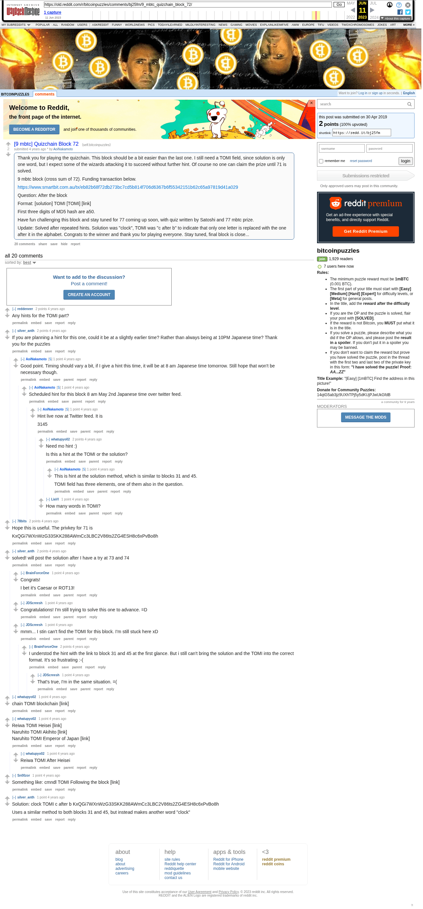

# [9 mbtc] Quizchain Block 72

[Original thread](https://www.reddit.com/r/bitcoinpuzzles/comments/bj25fm/9_mbtc_quizchain_block_72/). The `sourceUrl` of the [quizchain/72](../../../src/collections/quizchain/72.ts) record and the source of its question and the funding transaction, with the solution the author edited in. The WIF of block 71 is printed here by u/78bits. The post went up on April 30, 2019, at 11:24:43 UTC, 41 minutes before the block time of its funding transaction. Its last edit is stamped 23:38:03 UTC on May 2, 2019, so the transcript shows the post as it stood after the claim.

## Historical provenance

The Wayback Machine holds one capture of the `old.reddit.com` URL and one of the `www.reddit.com` URL. Provenance rests on the [old.reddit.com capture](https://web.archive.org/web/20230611091415/https://old.reddit.com/r/bitcoinpuzzles/comments/bj25fm/9_mbtc_quizchain_block_72/), stamped June 11, 2023, 09:14:15 UTC, whose HTML carries the post, which matches the transcript below word for word. It renders 20 comments, and each matches the Arctic Shift record of the same ID by author and text. Only the markdown of links and lists renders differently. The capture was read on September 27, 2026. `archive_content: confirmed` on that basis.

The [Arctic Shift](https://arctic-shift.photon-reddit.com/) Reddit archive, read the same day, lists the same 20 comments. The transcript takes authors, text and scores from it and nests the comments as the capture does.

The record names none of the commenters: nothing on the chain ties a claim to a name.

## Transcript

> Thank you for playing the quizchain. This block should be a bit easier than the last one. I still need a TOMI field, since solution is only one word, but I expect some of the wizards attacking it to succeed without further hint. Of course no one can claim the prize until 71 is solved.
>
> 9 mbtc block (cross sum of 72). Funding transaction below.
>
> https://www.smartbit.com.au/tx/eb82b68f72db273bc7cd5b814f706d6367b6f55342151b62c65a97819d41a029
>
> Question: After the block
>
> Format: [solution] TOMI [TOMI] [link]
>
> First three digits of MD5 hash are a50.
>
> Have fun challenging this block and stay tuned for 77 coming up soon, with quiz written by Satoshi and 77 mbtc prize.
>
> Update: Solved after repeated hints. Solution was "clock", TOMI was "c after b" to indicate that only one letter is replaced with the one after it in the alphabet. Congrats to the winner and thank you for playing everyone. Stay tuned, final block is close...

## Comments

**u/reddeneer**, 2 points:

> Any hints for the TOMI part?

**u/silver_anth**, 2 points:

> If you are planning a hint for this one, could it be at a slightly earlier time? Rather than always being at 10PM Japanese time? Thank you for the puzzles

**u/AoiNakamoto**, 1 point, reply to u/silver_anth:

> Good point. Timing should vary a bit, if I give a hint this time, it will be at 8 am Japanese time tomorrow. Still hope that won't be necessary though.

**u/AoiNakamoto**, 1 point, reply to u/AoiNakamoto:

> Scheduled hint for this block 8 am May 2nd Japanese time over twitter feed.

**u/AoiNakamoto**, 1 point, reply to u/AoiNakamoto:

> Hint live now at Twitter feed. It is
>
> 3145

**u/whatupyo02**, 2 points, reply to u/AoiNakamoto:

> Need mo hint :)
>
> Is this a hint at the TOMI or the solution?

**u/AoiNakamoto**, 1 point, reply to u/whatupyo02:

> This is hint at the solution method, which is similar to blocks 31 and 45.
>
> TOMI field has three elements, one of them also in the question.

**u/LiaVl**, 1 point, reply to u/AoiNakamoto:

> How many words in TOMI?

**u/78bits**, 2 points:

> Hope this is useful. The privkey for 71 is
>
> KxQGi7WXnWzG33SKK288AWmCc3LBC2V86ts2ZG4ESH8c6xPvBo8h

**u/silver_anth**, 2 points:

> solved! will post the solution after I have a try at 73 and 74

**u/BrainForceOne**, 1 point, reply to u/silver_anth:

> Congrats!
>
> I bet it's Caesar or ROT13!

**u/JDScreesh**, 1 point, reply to u/silver_anth:

> Congratulations! I'm still trying to solve this one to advance. =D

**u/JDScreesh**, 1 point, reply to u/silver_anth:

> mmm... I stin can't find the TOMI for this block. I'm still stuck here xD

**u/BrainForceOne**, 2 points, reply to u/JDScreesh:

> I understod the hint with the link to block 31 and 45 at the first glance. But i still can't bring the solution and the TOMI into the correct format. It's so frustrating :-(

**u/JDScreesh**, 1 point, reply to u/BrainForceOne:

> That's true, I'm in the same situation. =(

**u/whatupyo02**, 1 point:

> chain TOMI blockchain \[link\]

**u/whatupyo02**, 1 point:

> Reiwa TOMI Heisei \[link\]
> Naruhito TOMI Akihito \[link\]
> Naruhito TOMI Emperor of Japan \[link\]

**u/whatupyo02**, 1 point, reply to u/whatupyo02:

> Reiwa TOMI After Heisei

**u/Sn00zor**, 1 point:

> Something like: cmndl TOMI Following the block [link]

**u/silver_anth**, 1 point:

> Solution: clock TOMI c after b KxQGi7WXnWzG33SKK288AWmCc3LBC2V86ts2ZG4ESH8c6xPvBo8h
>
> Uses a similar method to both blocks 31 and 45, but instead makes another word "clock"

## Screenshot

The screenshot is a render of the archive capture, not of the live page, so it carries the Wayback banner at the top. The "4 years ago" stamps are relative to the capture, June 11, 2023. Capture method and limits: [source archive](../README.md).
