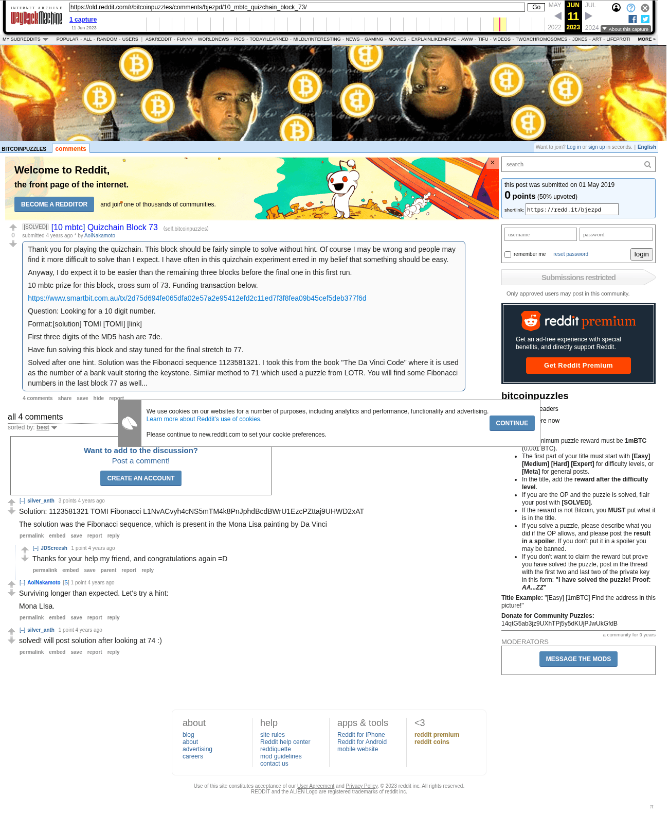

# [10 mbtc] Quizchain Block 73

[Original thread](https://www.reddit.com/r/bitcoinpuzzles/comments/bjezpd/10_mbtc_quizchain_block_73/). The `sourceUrl` of the [quizchain/73](../../../src/collections/quizchain/73.ts) record and the source of two of its hints and the funding transaction, with the solution the author edited in. The WIF of block 72 is printed here by u/silver_anth. The post went up on May 1, 2019, at 09:08:38 UTC, 12 minutes before the block time of its funding transaction. Its last edit is stamped 23:43:55 UTC on May 2, 2019, so the transcript shows the post as it stood after the claim.

## Historical provenance

The Wayback Machine holds one capture of the `old.reddit.com` URL and one of the `www.reddit.com` URL. Provenance rests on the [old.reddit.com capture](https://web.archive.org/web/20230611113806/https://old.reddit.com/r/bitcoinpuzzles/comments/bjezpd/10_mbtc_quizchain_block_73/), stamped June 11, 2023, 11:38:06 UTC, whose HTML carries the post, which matches the transcript below word for word. It renders four comments, and each matches the Arctic Shift record of the same ID by author and text. Only the markdown of links and lists renders differently. The capture was read on September 27, 2026. `archive_content: confirmed` on that basis.

The [Arctic Shift](https://arctic-shift.photon-reddit.com/) Reddit archive, read the same day, lists the same four comments. The transcript takes authors, text and scores from it and nests the comments as the capture does.

The record names none of the commenters: nothing on the chain ties a claim to a name.

## Transcript

> Thank you for playing the quizchain. This block should be fairly simple to solve without hint. Of course I may be wrong and people may find it more difficult to solve than I expect. I have often in this quizchain experiment erred in my belief that something should be easy.
>
> Anyway, I do expect it to be easier than the remaining three blocks before the final one in this first run.
>
> 10 mbtc prize for this block, cross sum of 73. Funding transaction below.
>
> https://www.smartbit.com.au/tx/2d75d694fe065dfa02e57a2e95412efd2c11ed7f3f8fea09b45cef5deb377f6d
>
> Question: Looking for a 10 digit number.
>
> Format:[solution] TOMI [TOMI] [link]
>
> First three digits of the MD5 hash are 7de.
>
> Have fun solving this block and stay tuned for the final stretch to 77.
>
> Solved after one hint. Solution was the Fibonacci sequence 1123581321. I took this from the book "The Da Vinci Code" where it is used as the number of a bank vault storing the keystone. Similar method to 71 which used a puzzle from LOTR. You will find some Fibonacci numbers in the last block 77 as well...

## Comments

**u/silver_anth**, 3 points:

> Solution: 1123581321 TOMI Fibonacci L1NvACvyh4cNS5mTM4k8PnJphdBcdBWrU1EzcPZttaj9UHWD2xAT
>
> The solution was the Fibonacci sequence, which is present in the Mona Lisa painting by Da Vinci

**u/JDScreesh**, 1 point, reply to u/silver_anth:

> Thanks for your help my friend, and congratulations again =D

**u/AoiNakamoto**, 1 point:

> Surviving longer than expected. Let's try a hint:
>
> Mona LIsa.

**u/silver_anth**, 1 point:

> solved! will post solution after looking at 74 :)

## Screenshot

The screenshot is a render of the archive capture, not of the live page, so it carries the Wayback banner at the top. The "4 years ago" stamps are relative to the capture, June 11, 2023. Capture method and limits: [source archive](../README.md).
