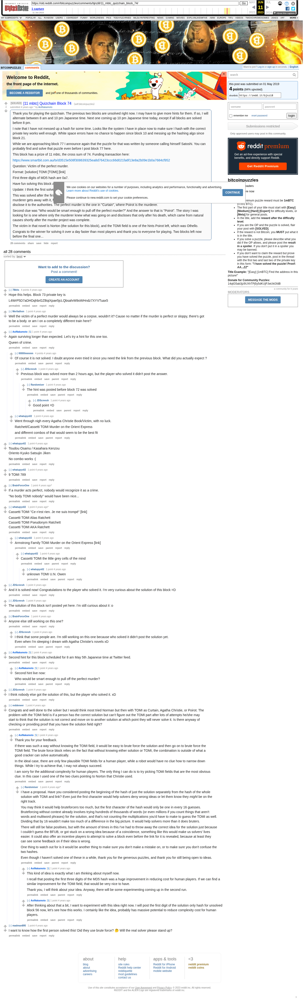

# [11 mbtc] Quizchain Block 74

[Original thread](https://www.reddit.com/r/bitcoinpuzzles/comments/bjnzi8/11_mbtc_quizchain_block_74/). The `sourceUrl` of the [quizchain/74](../../../src/collections/quizchain/74.ts) record and the source of its question and the funding transaction, with the solution the author edited in. The WIF of block 73 is printed here by u/78bits. The post went up on May 1, 2019, at 23:21:56 UTC, 20 minutes before the block time of its funding transaction. Its last edit is stamped 05:55:46 UTC on May 5, 2019, so the transcript shows the post as it stood after the claim.

## Historical provenance

The Wayback Machine holds one capture of the `old.reddit.com` URL and one of the `www.reddit.com` URL. Provenance rests on the [old.reddit.com capture](https://web.archive.org/web/20230611174331/https://old.reddit.com/r/bitcoinpuzzles/comments/bjnzi8/11_mbtc_quizchain_block_74/), stamped June 11, 2023, 17:43:31 UTC, whose HTML carries the post, which matches the transcript below word for word. It renders 28 comments, and each matches the Arctic Shift record of the same ID by author and text. Only the markdown of links and lists renders differently. The capture was read on September 27, 2026. `archive_content: confirmed` on that basis.

The [Arctic Shift](https://arctic-shift.photon-reddit.com/) Reddit archive, read the same day, lists the same 28 comments. The transcript takes authors, text and scores from it and nests the comments as the capture does.

The record names none of the commenters: nothing on the chain ties a claim to a name.

## Transcript

> Thank you for playing the quizchain. The previous two blocks are unsolved right now. I may have to give more hints for them. If so, I will alternate between 8 am and 10 pm Japanese time. Next one coming up 10 pm Japanese time today, except if all blocks are solved before 8 pm.
>
> I note that I have not messed up a hash for some time. Looks like the system I have in place now to make sure I hash with the correct private key works well enough. White space errors have no chance to happen since block 10 and messing up the hashing algo since block 21.
>
> While we are approaching block 77 I announce again that the puzzle for that was written by someone calling himself Satoshi. You can probably find and solve that puzzle even before I post block 77 here.
>
> This block has a prize of 11 mbtc, the cross sum of 74. Funding transaction here:
>
> https://www.smartbit.com.au/tx/d3515e508f308639325ea8d76423ccc66d021fa6f13e8a2b09e1b0a7684cf952
>
> Question: Victim of the perfect murder.
>
> Format: [solution] TOMI [TOMI] [link]
>
> FIrst three digits of MD5 hash are 0a7.
>
> Have fun solving this block and stay tuned for the final of the first series.
>
> Update: I think the first solver has had enough of a head start on other players now and it is time to post the solution.
>
> This was solved after the first hint "Queen of crime", which pointed to a novel by Agatha Christie. There are several stories where the murderer gets away with it, for example the Orient Express plot. But in that one, Poirot finds the solution and just chooses not to disclose it to the authorities. The perfect murder is the one in "Curtain", where Poirot is the murderer.
>
> Second clue was "Who would be smart enough to pull off the perfect murder?" And the answer to that is "Poirot". The story I was looking for is one where only the murderer knew what was going on and discloses that only after his death, which came from natural causes shortly after the murder project was complete.
>
> The victim in that novel is Norton (the solution for this block), and the TOMI field is one of the hints Poirot left, which was Othello.
>
> Congrats to the winner for solving it over a day faster than most players and thank you to everyone for playing. Two blocks left now before the final one...

## Comments

**u/78bits**, 4 points:

> Hope this helps. Block 73 private key is
>
> L4WrP5D7aDHDqhbrGZBqiXpae5jcLQbsahrM9oWHndz7XYVTuax5

**u/Merliathon**, 1 point:

> Well the victim of a perfect murder would always be a corpse, wouldn't it? Cause no matter if the murder is perfect or sloppy, there's got to be a body. or am I on a completely different train here?

**u/AoiNakamoto**, 1 point:

> Again surviving longer than expected. Let's try a hint for this one too.
>
> Queen of crime.

**u/llllllllllmmmm**, 2 points, reply to u/AoiNakamoto:

> Of course it is not solved.
> I doubt anyone even tried it since you need the link from the previous block.
> What did you actually expect ?

**u/JDScreesh**, 1 point, reply to u/llllllllllmmmm:

> Previous block was solved more than 2 hours ago, but the player who solved it didn't post the answer.

**u/Randomiser**, 1 point, reply to u/JDScreesh:

> The hint was posted before block 72 was solved

**u/JDScreesh**, 1 point, reply to u/Randomiser:

> Good point =D

**u/whatupyo02**, 1 point, reply to u/AoiNakamoto:

> Went through nigh every Agatha Christie Book/Victim, with no luck.
>
> Ratchett/Cassetti TOMI Murder on the Orient Express
>
> and different combos of that would seem to be the best fit

**u/whatupyo02**, 1 point:

> Toudou Osamu / Kasahara Kenzou
> Oriento Kyuko Satsujin Jiken
>
> No combo works :(

**u/whatupyo02**, 1 point:

> 9 TOMI 789

**u/BrainForceOne**, 1 point:

> If a murder acts perfect, nobody would recognize it as a crime.
>
> "No body TOMI nobody" would have been nice...

**u/whatupyo02**, 1 point:

> Cassetti TOMI "Ce n'est rien. Je me suis trompé" \[link\]
>
> Cassetti TOMI Alias Ratchett
> Cassetti TOMI Pseudonym Ratchett
> Cassetti TOMI AKA Ratchett

**u/whatupyo02**, 1 point, reply to u/whatupyo02:

> Armstrong Family TOMI Murder on the Orient Express \[link\]

**u/whatupyo02**, 1 point, reply to u/whatupyo02:

> Cassetti TOMI the little grey cells of the mind

**u/whatupyo02**, 1 point, reply to u/whatupyo02:

> unknown TOMI U.N. Owen

**u/JDScreesh**, 1 point:

> And it is solved now! Congratulations to the player who solved it. I'm very curious about the solution of this block =D

**u/JDScreesh**, 1 point:

> The solution of this block isn't posted yet here. I'm still curious about it :o

**u/BrainForceOne**, 1 point:

> Anyone else still working on this one?

**u/JDScreesh**, 1 point, reply to u/BrainForceOne:

> I think that some people are. I'm still working on this one because who solved it didn't post the solution yet.
> Even when I'm sleeping I dream with Agatha Christie's novels xD

**u/AoiNakamoto**, 1 point:

> Second hint for this block scheduled for 8 am May 5th Japanese time at Twitter feed.

**u/AoiNakamoto**, 1 point, reply to u/AoiNakamoto:

> Second hint live now:
>
> Who would be smart enough to pull off the perfect murder?

**u/JDScreesh**, 1 point:

> I think nobody else got the solution of this, but the player who solved it. xD

**u/reddeneer**, 1 point:

> Congrats and well done to the solver but I would think most tried Norman but then with TOMI as Curtain, Agatha Christie, or Poirot. The problem with the TOMI field is if a person has the correct solution but can't figure out the TOMI part after lots of attempts he/she may start to think that the solution is not correct and move on to another solution at which point they will never solve it. Is there anyway of checking or providing proof that you have the solution field right?

**u/AoiNakamoto**, 1 point, reply to u/reddeneer:

> Thank you for your feedback.
>
> If there was such a way without knowing the TOMI field, it would be easy to brute force the solution and then go on to brute force the TOMI field. The brute force block relies on the fact that without knowing either solution or TOMI, the combination is outside of what a good cracker can solve automatically.
>
> In the ideal case, there are only few plausible TOMI fields for a human player, while a robot would have no clue how to narrow down things. While I try to achieve that, I may not always succeed.
>
> I am sorry for the additional complexity for human players. The only thing I can do is to try picking TOMI fields that are the most obvious clue. In this case I used one of the two clues pointing to Norton that Christie used.

**u/Randomiser**, 1 point, reply to u/AoiNakamoto:

> I have a proposal. Have you considered posting the beginning of the hash of just the solution separately from the hash of the whole solution with TOMI and link? Even just the first character would help solvers deny wrong ideas or let them know they _might_ be on the right track.
>
> You may think it would help bruteforcers too much, but the first character of the hash would only be one in every 16 guesses. Bruteforcing without context already involves trying hundreds of thousands of words (or even millions if you count things that aren't words and multiword phrases) for the solution, and that's not counting the multiplications you'd have to make to guess the TOMI as well. Dividing that by 16 wouldn't make too much of a difference in the big picture. It would help solvers more than it does bruters.
>
> There will still be false positives, but with the amount of times in this I've had to throw away the correct idea for the solution just because I couldn't guess the BFUB, or got stuck on a wrong idea because of a coincidence, something like this would make us solvers' lives easier. It could also offer an incentive players to attempt to solve a block even before the link for it is revealed, because at least they can see some feedback on if their idea is wrong.
>
> One thing to watch out for is it would be another thing to make sure you don't make a mistake on, or to make sure you don't confuse the two hashes.
>
> Even though I haven't solved one of these in a while, thank you for the generous puzzles, and thank you for still being open to ideas.

**u/AoiNakamoto**, 1 point, reply to u/Randomiser:

> This kind of idea is exactly what I am thinking about myself now.
>
> I recall that posting the first three digits of the MD5 hash was a huge improvement in reducing cost for human players. If we can find a similar improvement for the TOMI field, that would be very nice to have.
>
> Thank you, I will think about your idea. Anyway, there will be some experimenting coming up in the second run.

**u/AoiNakamoto**, 1 point, reply to u/Randomiser:

> After thinking about that a bit, I want to experiment with this idea right now. I will post the first digit of the solution only hash for unsolved block 56 now, let's see how this works. I certainly like the idea, probably has massive potential to reduce complexity cost for human players.

**u/madman895**, 1 point:

> I want to know how the first person solved this! Did they use brute force? 🤔 Will the real solver please stand up?

## Screenshot

The screenshot is a render of the archive capture, not of the live page, so it carries the Wayback banner at the top. The "4 years ago" stamps are relative to the capture, June 11, 2023. Capture method and limits: [source archive](../README.md).
