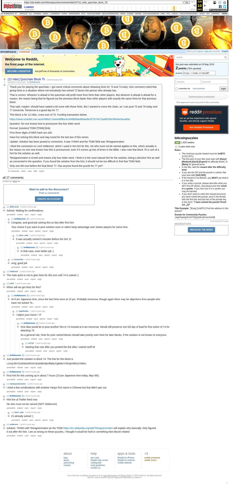

# [12 mbtc] Quizchain Block 75

[Original thread](https://www.reddit.com/r/bitcoinpuzzles/comments/bk2207/12_mbtc_quizchain_block_75/). The `sourceUrl` of the [quizchain/75](../../../src/collections/quizchain/75.ts) record and the source of its question and the funding transaction, with the solution the author edited in. The WIF of block 74 is printed here by the author. The post went up on May 3, 2019, at 00:09:06 UTC, 7 minutes before the block time of its funding transaction. Its last edit is stamped 01:52:33 UTC on May 18, 2019, so the transcript shows the post as it stood after the claim.

## Historical provenance

The Wayback Machine holds one capture of the `old.reddit.com` URL and one of the `www.reddit.com` URL. Provenance rests on the [old.reddit.com capture](https://web.archive.org/web/20230610232913/https://old.reddit.com/r/bitcoinpuzzles/comments/bk2207/12_mbtc_quizchain_block_75/), stamped June 10, 2023, 23:29:13 UTC, whose HTML carries the post, which matches the transcript below word for word. It renders 17 comments, and each matches the Arctic Shift record of the same ID by author and text. Only the markdown of links and lists renders differently. The capture was read on September 27, 2026. `archive_content: confirmed` on that basis.

The [Arctic Shift](https://arctic-shift.photon-reddit.com/) Reddit archive, read the same day, lists the same 17 comments. The transcript takes authors, text and scores from it and nests the comments as the capture does.

The record names none of the commenters: nothing on the chain ties a claim to a name.

## Transcript

> Thank you for playing the quizchain. I got some critical comments about releasing hints for 73 and 74 early. One comment noted that giving hints in a situation where not everybody has solved 72 favors the person who already has.
>
> That is correct. Whoever is ahead in the quizchain will profit more from hints than other players. But whoever is ahead is ahead for a reason, the reason being that he figured out the previous block faster than other players with exactly the same hints for that previous block.
>
> That said, maybe I should have waited a bit more with those hints. But I wanted to move the chain, so I can post 75 and 76 today and 77 tomorrow. Tomorrow is a good day for 77.
>
> This block is for 12 mbtc, cross sum of 75. Funding transaction below.
>
> https://www.smartbit.com.au/tx/886a71eeeeddf8ac61ef48b0faedb5ae8e257674472aaf9259e3f444e5aca60a
>
> Question: No one knows how to pronounce this four letter word.
>
> Format: [solution] TOMI [TOMI] [link]
>
> FIrst three digits of MD5 hash are a30.
>
> Have fun solving this block and stay tuned for the last two of this series.
>
> Update: Solution has been posted to comments. It was YHWH and the TOMI field was Tetragrammaton.
>
> I liked the connection to Lord Voldemort, which I used in the hint for this. He who must not be named applies to this, which actually is the reason no one now knows how this is pronounced, even if it comes up lots of times in the Bible. I also note that block 76 is sort of a hint for the solution as well.
>
> Tetragrammaton is Greek and means only four letter word. I think it is the most natural hint for the solution, being a decisive hint as well as connected to the question. If you found the solution from the hint, it should not be too difficult to find that TOMI field.
>
> Only one left now before the final block 77. Has anyone found the puzzle for 77 yet?

## Comments

**u/JDScreesh**, 2 points:

> Solved. Waiting for confirmations.

**u/AoiNakamoto**, 1 point, reply to u/JDScreesh:

> Congrats, and good job solving this so fast after first hint.
>
> Your choice if you want to post solution soon or rather keep advantage over slower players for some time.

**u/silver_anth**, 1 point, reply to u/AoiNakamoto:

> It was actually solved 6 minutes before the hint :D

**u/AoiNakamoto**, 1 point, reply to u/silver_anth:

> In that case, even better job :)

**u/mooncritic**, 1 point, reply to u/JDScreesh:

> omg, good job

**u/reddeneer**, 1 point:

> The main point is not to give hints for this one until 74 is solved :)

**u/LiaVl**, 1 point:

> When will we get hints for this?

**u/AoiNakamoto**, 1 point, reply to u/LiaVl:

> At 8 am Japanese time, since the last hints were at 10 pm. Probably tomorrow, though again there may be objections from people who have not solved 74...

**u/mapl3sn0w**, 1 point, reply to u/AoiNakamoto:

> I object your honor ! :P

**u/AoiNakamoto**, 2 points, reply to u/mapl3sn0w:

> One idea would be to post another hint to 74 instead at 8 am tomorrow. Would still preserve one full day of lead for first solver of 74 for attacking 75.
>
> As a general rule, hints for prior solved blocks should take priority over hints for later blocks, if the solution is not known to everyone.

**u/rs1712**, 1 point, reply to u/AoiNakamoto:

> Starting that now after you posted the link after i solved stuff lol

**u/AoiNakamoto**, 1 point:

> Just posted the solution to block 74. The link for this block is
>
> L1myU8V1SzKbAvW51KcEaA6EvfpmffqNuTgMdmY45XpH99VyYMAm

**u/AoiNakamoto**, 1 point:

> First hint for this coming up in about 7 hours (10 pm Japanese time today, May 5th).

**u/martypyouknowme**, 1 point:

> I tried a few combinations with Andrew Yang's first name in Chinese but that didn't pan out.

**u/AoiNakamoto**, 1 point:

> Hint live at Twitter feed now.
>
> He who must not be named
> (NOT Voldemort)

**u/silver_anth**, 1 point, reply to u/AoiNakamoto:

> it's already solved :)

**u/reddeneer**, 1 point:

> solution: YHWH with Tetragrammaton as the TOMI [https://en.wikipedia.org/wiki/Tetragrammaton](https://en.wikipedia.org/wiki/Tetragrammaton) will explain why basically. Only figured it out after the hint. I am so wrong on these puzzles, I thought it would be hodl or something else bitcoin related

## Screenshot

The screenshot is a render of the archive capture, not of the live page, so it carries the Wayback banner at the top. The "4 years ago" stamps are relative to the capture, June 10, 2023. Capture method and limits: [source archive](../README.md).
