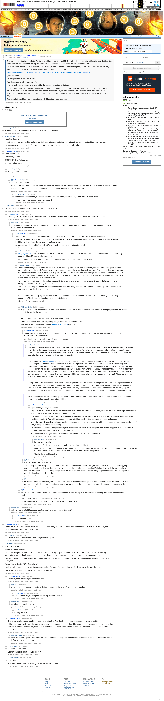

# [76 mbtc] Quizchain Block 76

[Original thread](https://www.reddit.com/r/bitcoinpuzzles/comments/bk27y7/76_mbtc_quizchain_block_76/). The `sourceUrl` of the [quizchain/76](../../../src/collections/quizchain/76.ts) record and the source of two of its hints and the funding transaction, with the solution the author edited in. The post went up on May 3, 2019, at 00:26:01 UTC, 17 minutes before the block time of its funding transaction. Its last edit is stamped 23:47:44 UTC on May 6, 2019, so the transcript shows the post as it stood after the claim.

## Historical provenance

The Wayback Machine holds one capture of the `old.reddit.com` URL and one of the `www.reddit.com` URL. Provenance rests on the [old.reddit.com capture](https://web.archive.org/web/20230611173532/https://old.reddit.com/r/bitcoinpuzzles/comments/bk27y7/76_mbtc_quizchain_block_76/), stamped June 11, 2023, 17:35:32 UTC, whose HTML carries the post, which matches the transcript below word for word. It renders 34 comments, and each matches the Arctic Shift record of the same ID by author and text. Only the markdown of links and lists renders differently. The capture was read on September 27, 2026. `archive_content: confirmed` on that basis.

The [Arctic Shift](https://arctic-shift.photon-reddit.com/) Reddit archive, read the same day, lists the same 34 comments. The transcript takes authors, text and scores from it and nests the comments as the capture does.

The record names none of the commenters: nothing on the chain ties a claim to a name.

## Transcript

> Thank you for playing the quizchain. This is the last block before the final 77. The link to the last block is not from this one, but from the unsolved block 44. I hope that solving this block will bring back my memory about the solution to block 44.
>
> Since the cross sum of 76 would be another unlucky 13, this block has its number as the prize, 76 mbtc. Should be not too difficult, maybe the smart and talented wizards working on it can solve it without hint.
>
> https://www.smartbit.com.au/tx/aa77bbcc7c12b67f56962676dac401caf29ff68791a4f1a669ba0b32bbb835ab
>
> Question: Jesus
>
> Format: [solution] TOMI [TOMI] [link]
>
> First three digits of MD5 hash are 3d5.
>
> Have fun solving this block and stay tuned for the last puzzle, written by Satoshi.
>
> Update: Solved and prize claimed. Solution was Easter, TOMI field was Second Life. This was rather easy once you realized where exactly the hint was in the Wattpad story. And it does stand out there, as the winner pointed out in comments below, where he described his solving process. Congrats to the winner and thank you for the feedback on how it was solved. Thank you to everyone playing.
>
> One block left now. I feel my memory about block 44 gradually coming back...

## Comments

**u/whatupyo02**, 2 points:

> So uhhh...you got anymore words you would like to add to the question?

**u/BrainForceOne**, 2 points:

> I love this Quizchain.
>
> Just give one single word as hint and you can find many interessting stories in the internet you never imagined that they even exist.
>
> But unfortunately the MD5 hash of "Isukiri TOMI Not Daitenku Taro Jurai" doesn't start with 3d5...

**u/AoiNakamoto**, 2 points:

> Hint live now. It is:
>
> Hint already posted
>
> SOMEWHERE in Wattpad story
>
> can't remember where

**u/whatupyo02**, 1 point, reply to u/AoiNakamoto:

> Thought you said no hint.
> :(

**u/AoiNakamoto**, 2 points, reply to u/whatupyo02:

> Yes, that is what I said.
>
> Changed my mind and announced that two hours in advance because someone posted the solution to 75. While I try to announce hints in advance, I do not feel that is something that I can not change under changing circumstances.

**u/whatupyo02**, 1 point, reply to u/AoiNakamoto:

> Understandable to change, but people have different timezones, so giving only 2 hour notice is pretty rough.
>
> 8+ hours would help people that are sleeping =)

**u/puzzleponky**, 1 point:

> Will there be a hint for this one later today at 10pm Japanese time?

**u/AoiNakamoto**, 1 point, reply to u/puzzleponky:

> Probably not, I will prefer to give a second hint to 75 in that time slot instead. Maybe if someone posts the solution to 75 soon...

**u/Byadcha**, 1 point, reply to u/AoiNakamoto:

> 75 was obvious and has been solved without hints. This question is imho vague. I like the TOMI idea, but why would you make it Time Of Miserable Iterations for us?

**u/AoiNakamoto**, 2 points, reply to u/Byadcha:

> `That is certainly not my intention. I always try to find the TOMI field that makes things the easiest for human players.
>
> There are two things determining TOMI fields. One, it should be a decisive hint to the solution. Two, with multiple such hints available, it should be the shortest and the one that comes to mind first.
>
> It is quite possible that I fail to find the best TOMI field. It is certainly not my intention to fail.

**u/Byadcha**, 2 points, reply to u/AoiNakamoto:

> [u/Crypto\_Rachel](https://www.reddit.com/user/Crypto_Rachel/) makes clear what I wanted to say. I think that questions should be more concrete and at the same time not obviously googlable, block 75 is an excellent example.
>
> We appreciate your work and understand that making a good puzzle maybe harder than to solve it.

**u/Crypto_Rachel**, 1 point, reply to u/AoiNakamoto:

> I totally understand your intentions, but for the TOMI we have to guess the Hint and the solution, and then iterate through all possible solutions in different formats ie \[abc Abc ABC\] as well as doing that for the TOMI (hard to keep track of) so with just that, Assuming you know the tomi but not the format, if you have 10 possible solutions ( which isn't many I go through way too many and don't find it :( ) 10 x( 3\*3) = 90 possibilities by hand (if each solution is 1 word) and tomi being 1 word. For each word added powers come into play. Then you have that for every idea that comes to mind.
>
> Remember for every 1 idea you think of as a possibility there are millions of other possible ideas. Of course that is part of the fun /lottery / puzzle that makes it so great and fair.
>
> This one is Totally vague 1 Name that leads to the Bibles, how ever many there are. But I understand it is a big block. And That is fair for a very hard puzzle, that may need a clue to be solved.
>
> None the Less I have really enjoyed the quizchain despite everything. I have had fun. Learned New stuff (always great :) ) I really appreciate it. Thank you and I look forward to the next chain. :)
>
> edit math :( to late not thinking lol

**u/Crypto_Rachel**, 2 points, reply to u/Crypto_Rachel:

> A good Way to make more resilient to bots would be to make the \[TOMI\] field an actual cipher, you could change ciphers and the cipher decoded would be the actual hint.
>
> ex. \[Solution\] TOMI vjcpm aqw hqt rquvkpi vjg swkbejckp \[link\]
>
> which translates to Thank you for posting the Quizchain (with a ceasars +2 shift)
>
> Though you would want harder ciphers [https://www.dcode.fr](https://www.dcode.fr/) has a lot

**u/AoiNakamoto**, 2 points, reply to u/Crypto_Rachel:

> Thank you for that idea. Not sure right now about it. There is already one critical answer. But any idea for improving brute force blocking is welcome. I will think about it.
>
> And thank you for the kind words in the cipher solution :)

**u/Crypto_Rachel**, 1 point, reply to u/AoiNakamoto:

> Your right and as these blocks were meant to be hard I believe you did a good job. they were :) . I also do believe that they have gotten better. One of the biggest things that has blocked me was formatting. Formatting is of course one really daunting thing you try many forms and then move on, there were times where myself and many other people were missing out due to capitalization. And once an idea is tried the brain discards it and you rarely go back to it.
>
> I agree with both u/BrainForceOne and u/reddeneer. Though it is possible to script anything the idea behind the cipher was a solid unchanging string (ie the translation wouldn't matter since the cipher would be best to hash less chance for errors in hash) That translation would be a clue to the solution which could have high entropy but still be easy enough to guess based on the question and decoded cipher, making the solution hard to brute but easy to guess. With a harder solution we would definitely need format \[abc# Abc# ABC#\] , but with high entropy on the solution would make word list bruting take longer. While someone can always script this using a word list would be more infeasible, There only option would be building up a list with there guesses for the script. Which you will never be able to defend against, as anything can be scripted.
>
> Though I agree with reddeneer it would make deciphering hard for people who don't know ciphers, even with all the cipher decoders out there. :) It was just a thought. Just having the two fields, makes the choices increase exponentially with every idea and the amount of words in both the solution and tomi field. My math above with only 1 word each position which increases quickly with every separate solution and tomi idea. Where as if the tomi and solution were one and of the same solution I think there would be less combinations.
>
> Don't want to sound like I'm complaining. I am definitely not, I have enjoyed it, and just would like it to be a little less of a head basher for everyone, going through 1000's of possibilities.

**u/AoiNakamoto**, 2 points, reply to u/Crypto_Rachel:

> Again, thank you for your feedback.
>
> I agree that it is desirable to have a deterministic solution for the TOMI field. For example, if you solved 42 the words "quotation marks" would come to mind easily, so that was a good TOMI field.
>
> Also recall blocks 38 and 39. There I had a method for determinating the BFUB field exactly from the solution (second letter of each word in the solution). That adds just enough complexity to block cracking lists and close to no cost for human players.
>
> Would be easily defeated by adding the method in question to your cracking script, but adding that means extra work and needs a bit of time, slowing down script brute forcing.
>
> Your original idea would just require solving two independent puzzles to claim one prize. That already happens in all cases where a previous block is not solved yet when I post a new one.
>
> But it got me thinking again about this and I have some new ideas I want to try in the next run...

**u/Crypto_Rachel**, 1 point, reply to u/AoiNakamoto:

> I did like those blocks :)
>
> I agree but for the harder puzzles I'd gladly solve a cipher for a hint ;)
>
> But as Reddeneer said it does favor people who know ciphers and honestly you are doing a good job, and I like how you laid out the quizchain linking puzzles. Technically makes it one big puzzle with little sub puzzles.
>
> Thanks I have had fun with it

**u/BrainForceOne**, 2 points, reply to u/Crypto_Rachel:

> It would be verry easy to script that.
>
> Another way could be that you create an online hash with delayed output. For example you could take as user input "[solution] [link]". Inside the the online hash you will add a secret key. Input for the hash is then "[secret key] [solution] [link]". With the built in delay you can slow down the BFs. After finishing the Quizchain the secret key can be revealed and everything is transparent. Disadvantage is the centralisation of the special online hash.

**u/reddeneer**, 1 point, reply to u/Crypto_Rachel:

> no please, I would be completely lost if that happens. TOMI is already hard enough. may also be subject to new mistakes, like in your example: the cipher has all lowercase but the translation not. besides the last ones were all solved by humans and it took a while

**u/AoiNakamoto**, 2 points, reply to u/Crypto_Rachel:

> This is a bit difficult to solve without hint. It is supposed to be difficult, having a 76 mbtc reward and being the last one before the final block.
>
> Block 77 does not need a TOMI field, so I don't use one.
>
> On the other hand, you need to FIND the puzzle before you can solve it...

**u/silver_anth**, 1 point, reply to u/AoiNakamoto:

> Will there be a hint at 10pm Japanese time now? or is it time for an 8am hint?

**u/AoiNakamoto**, 1 point, reply to u/silver_anth:

> 10 pm Japanese time...

**u/AoiNakamoto**, 1 point:

> Hint for this block coming up around 10 pm Japanese time today, in about two hours. I am not scheduling it, plan to just tweet myself, so the timing may be off by a minute or two.

**u/rs1712**, 1 point, reply to u/AoiNakamoto:

> Guess im staying awake then, i was going to goto sleep lol

**u/mooncritic**, 1 point:

> Solved! Thank you :)
>
> Edited to discuss solution:
>
> I tried everything I could think of related to Jesus, from many religious phrases to Bitcoin Jesus. I even skimmed the Wattpad story recently for any clues, but it wasn't apparent to me until the latest hint referencing the Wattpad story, so I took another look!
>
> This time, I realized that there was always a page that stuck out, about "Second Life", which I didn't understand. But connect that with Jesus, and...
>
> The solution is "Easter TOMI Second Life"!
>
> I had even tried various terms related to the resurrection of Jesus before but the last hint finally led me to the specific phrase.
>
> That was a lot of fun and pretty difficult. Thanks, AoiNakamoto!

**u/AoiNakamoto**, 2 points, reply to u/mooncritic:

> Congrats, good job solving so fast after this hint....

**u/rs1712**, 1 point, reply to u/AoiNakamoto:

> Gawd... i tried the second life stuff a while back.... guessing these two fields together is getting painful

**u/AoiNakamoto**, 2 points, reply to u/rs1712:

> Thank you for playing and good job coming close without hint.

**u/silver_anth**, 1 point, reply to u/AoiNakamoto:

> How is your amnesia now? :D

**u/AoiNakamoto**, 3 points, reply to u/silver_anth:

> Getting better :)

**u/AoiNakamoto**, 2 points, reply to u/mooncritic:

> Thank you for playing and good job finding the solution first. Also thank you for your feedback on how you solved it.
>
> I think it gets narrowed down a lot once you recognize that chapter 2 is the decisive hint for this. Easter was not long ago (I tried to time this to publish block 76 at Easter, but did not quite make it). Anyway, Jesus is most famous for his Second Life, and Easter is what celebrates this.

**u/Crypto_Rachel**, 1 point, reply to u/AoiNakamoto:

> Yeah this one was good. I was close with second coming, but forgot you had the second life chapter too :) I fell asleep like 2 hours before. Ce est la vie. Thanks

**u/JDScreesh**, 1 point, reply to u/mooncritic:

> > Easter TOMI Second Life
>
> Great! Congratulations for solving this! =D

**u/BrainForceOne**, 1 point, reply to u/mooncritic:

> Congrats!
>
> This was the only block I had the right TOMI but not the solution.

## Screenshot

The screenshot is a render of the archive capture, not of the live page, so it carries the Wayback banner at the top. The "4 years ago" stamps are relative to the capture, June 11, 2023. Capture method and limits: [source archive](../README.md).
