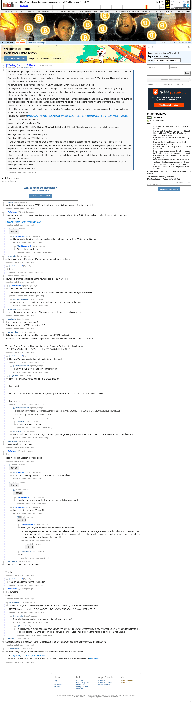

# [77 mbtc] Quizchain2 Block 1

[Original thread](https://www.reddit.com/r/bitcoinpuzzles/comments/bn5ucg/77_mbtc_quizchain2_block_1/). The `sourceUrl` of the [quizchain2/1](../../../src/collections/quizchain2/1.ts) record and the source of its question, format, link, hash digits and both hints, with the funding transaction and the solution the author edited in. The full winning string is in a player's comment. The post went up on May 11, 2019, at 00:16:54 UTC, 4 minutes before the block time of its funding transaction. Its last edit is stamped 01:39:25 UTC on May 14, 2019, so the transcript shows the post as it stood after the claim.

## Historical provenance

Provenance rests on the [old.reddit.com capture](https://web.archive.org/web/20230611191855/https://old.reddit.com/r/bitcoinpuzzles/comments/bn5ucg/77_mbtc_quizchain2_block_1/), stamped June 11, 2023, 19:18:55 UTC, whose HTML carries the post, which matches the transcript below word for word. It renders 33 comments, and each matches the Arctic Shift record of the same ID by author and text, except that by 2023 the account behind one of them, u/MegaBit01, was deleted, so the capture shows its author as `[deleted]`. Only the markdown of links, lists and superscripts renders differently. The capture was read on October 1, 2026. `archive_content: confirmed` on that basis.

The [Arctic Shift](https://arctic-shift.photon-reddit.com/) Reddit archive, read the same day, lists 42 comments, nine more than the capture carries with an ID: all nine deleted. The transcript takes every comment, its author, text and score from Arctic Shift and nests them as the capture does. Nine of them are deleted comments, kept below as `[deleted]`.

The record names none of the commenters: nothing on the chain ties a claim to a name.

## Transcript

> Thank you for playing the quizchain. The first run to block 77 is over. My original plan was to close with a 777 mbtc block in 77 and then close the experiment. I reconsidered for two reasons.
>
> One was that there were way too many mistakes. I did not feel comfortable with posting a large 777 mbtc reward final block with my record of messing up everything in sight.
>
> And I was right. I even managed to make YET ANOTHER STUPID MISTAKE in the final block 77.
>
> Posting this block now immediately after discovering the mistake before I have the chance to just stop the whole thing in disgust.
>
> The other reason was that I found it way too much fun doing this experiment and want to continue a bit more. I already have some ideas for specific block numbers of the second run.
>
> This block has a prize of 77 mbtc. My original plan was 7 mbtc, but I changed that in reaction to block 56 of the first run turning out to be another failed block. And I decided to change the prize for the next block in this second run to 77 mbtc every time that happens.
>
> I fully intend that to be zero times for the second run. But one never knows.
>
> Since this turned out to be a big block, let's do a slightly difficult challenge. And try to make it as easy as possible for human players with recent new ideas.
>
> Funding transaction:
> https://www.smartbit.com.au/tx/d79b97700a9a55b346c38820c1194cda0fe73ca1b831ae63cfb2e16e446eb90b
>
> Question: A rather famous naMe.
>
> Format: [solution] TOMI [TOMI] [link]
>
> Use L2e6gPSXnq7KJBfkoD7cHGVZuhRUDARJz2Cc9JcSNLsKRZhH552F
> (private key of block 76) as a link for this block.
>
> FIrst three digits of MD5 hash are 33c.
>
> First digit of MD5 hash of solution only is 4.
>
> First digit of MD5 hash of TOMI field only is e.
>
> Have fun with this block. Another big prize block coming up next in block 2, because of the mistake in block 77 of the first run.
>
> Update: Solved fast after second hint. Congrats to the winner of this big block and thank you to everyone for playing. As the winner has explained in comments, solution was U2 (a rather famous band name). And it was derived from the hint by reading M upside down and then W as UU, which is one step away from the solution. TOMI field was just "upside down".
>
> I think it is an interesting coincidence that this name can actually be reduced to one single letter and that said letter has an upside down partner in the alphabet.
>
> Stay tuned for block 5 coming up at 10 pm Japanese time today and please vote in the Twitter poll on which time is best for you for posting hints and new blocks.
>
> One other big block open now...

## Comments

**u/Agelais**, 4 points:

> Maybe few digits of solution and TOMI hash will post, cause its huge amount of variants possible...

**u/AoiNakamoto**, 2 points:

> If you are new to the quizchain experiment, there is an overview available at my Twitter feed explaining what the quizchain is and how to claim prizes
>
> https://mobile.twitter.com/NakamotoAoi

**[deleted]**, reply to u/AoiNakamoto:

> [deleted]

**u/AoiNakamoto**, 1 point, reply to a deleted comment:

> I know, worked until recently. Wattpad must have changed something. Trying to fix this now...

**u/AoiNakamoto**, 3 points, reply to u/AoiNakamoto:

> Fixed, should work now.

**u/silver_anth**, 2 points:

> is the capital M in naMe intended? Just want to rule out any mistakes :)

**u/AoiNakamoto**, 1 point, reply to u/silver_anth:

> It is.

**u/MegaBit01**, 2 points:

> How about another hint replacing the now useless block 2 hint? ;))))))

**u/AoiNakamoto**, 1 point, reply to u/MegaBit01:

> Thank you for your feedback.
>
> That would have meant doing it without prior announcement, so I decided against that idea.

**u/martypyouknowme**, 3 points, reply to u/AoiNakamoto:

> I think the second digit for the solution hash and TOMI hash would be better.

**u/mapl3sn0w**, 1 point:

> Keep up the awesome good sense of humour and keep the puzzle chain going ! :P

**u/mapl3sn0w**, 1 point:

> How's your memory coming along ?
> Got any more of dem TOMI hash digits ? :P

**u/martypyouknowme**, 1 point:

> Got a bit excited with these two. Hash for solution and TOMI mathced.
>
> Pokemon TOMI Metamon L2e6gPSXnq7KJBfkoD7cHGVZuhRUDARJz2Cc9JcSNLsKRZhH552F
>
> Thomas George Johnston TOMI Member of the Canadian Parliament for Lambton West L2e6gPSXnq7KJBfkoD7cHGVZuhRUDARJz2Cc9JcSNLsKRZhH552F

**u/AoiNakamoto**, 2 points, reply to u/martypyouknowme:

> No, new Wattpad chapter has nothing to do with this block...

**u/martypyouknowme**, 1 point, reply to u/AoiNakamoto:

> Thank you. I've moved on to some other thoughts.

**u/Quantris**, 1 point, reply to u/martypyouknowme:

> Nice, I tried various things along both of those lines too
>
> I also tried
>
> Dorian Nakamoto TOMI Voldemort L2e6gPSXnq7KJBfkoD7cHGVZuhRUDARJz2Cc9JcSNLsKRZhH552F
>
> But no dice

**u/martypyouknowme**, 1 point, reply to u/Quantris:

> > Mountbatten Windsor TOMI Meghan Merkle L2e6gPSXnq7KJBfkoD7cHGVZuhRUDARJz2Cc9JcSNLsKRZhH552F
> >
> > Some along this line didn't work as well.

**u/Agelais**, 1 point, reply to u/martypyouknowme:

> Had same idea with Archie

**u/Agelais**, 1 point, reply to u/Quantris:

> Dorain Nakamoto TOMI pseudonymized eponym L2e6gPSXnq7KJBfkoD7cHGVZuhRUDARJz2Cc9JcSNLsKRZhH552F - dead end

**u/DaGreatCake**, 1 point:

> Yessss quizchain2, thanks!!!!

**u/AoiNakamoto**, 1 point:

> Hint:
>
> Uses method of a recent previous block.

**[deleted]**, reply to u/AoiNakamoto:

> [deleted]

**u/AoiNakamoto**, 1 point, reply to a deleted comment:

> One in the ten between 67 and 76.

**[deleted]**, reply to u/AoiNakamoto:

> [deleted]

**u/AoiNakamoto**, 1 point, reply to a deleted comment:

> Thank you for your feedback and for playing the quizchain.
>
> I know that you requested that, but I decided to leave the hint more open at that stage. Please note that it is not your request but my decision that determines how much I narrow things down with a hint. I did narrow it down to one block a bit later, leaving people the chance to find the solution with the lesser hint.

**[deleted]**, reply to u/AoiNakamoto:

> [deleted]

**[deleted]**, reply to a deleted comment:

> [deleted]

**u/mooncritic**, 1 point, reply to a deleted comment:

> lol

**[deleted]**, reply to a deleted comment:

> [deleted]

**u/AoiNakamoto**, 1 point, reply to a deleted comment:

> Explained at overview available at my Twitter feed @NakamotoAoi.

**[deleted]**, reply to u/AoiNakamoto:

> [deleted]

**[deleted]**, reply to u/AoiNakamoto:

> [deleted]

**u/AoiNakamoto**, 1 point, reply to a deleted comment:

> Next hint coming up tomorrow 8 am Japanese time (Tuesday).

**u/tomnjerry334**, 1 point:

> Is the TAG "TOMI" required for hashing?
>
> Thanks

**u/AoiNakamoto**, 1 point, reply to u/tomnjerry334:

> Yes, as noted in the format explanation.

**u/AoiNakamoto**, 1 point:

> Hint number 2:
>
> block 69

**u/Randomiser**, 5 points, reply to u/AoiNakamoto:

> Solved, thank you! I'd tried things with block 69 before, but now I got it after narrowing things down.
>
> U2 TOMI upside down L2e6gPSXnq7KJBfkoD7cHGVZuhRUDARJz2Cc9JcSNLsKRZhH552F

**u/mooncritic**, 1 point, reply to u/Randomiser:

> Nice job! Can you explain how you arrived at U2 from the clues?

**u/Randomiser**, 4 points, reply to u/mooncritic:

> I'd initially tried a bunch of names starting with "W", but that didn't work. Another way to say W is "double U" or "2 U's". I think that's the intended logic to reach the solution. This one was tricky because I was expecting the name to be a person, not a band.

**[deleted]**, reply to u/AoiNakamoto:

> [deleted]

**u/JDScreesh**, 1 point:

> Congratulations to the solver. I think I was close, but it didn't start with 33c. I wonder which was the solution =D

**u/TotesMessenger**, 1 point:

> I'm a bot, _bleep_, _bloop_. Someone has linked to this thread from another place on reddit:
>
> - [/r/grycoin] [\[77 mbtc\] Quizchain2 Block 1](https://www.reddit.com/r/Grycoin/comments/br81nc/77_mbtc_quizchain2_block_1/)
>
> _^(If you follow any of the above links, please respect the rules of reddit and don't vote in the other threads.) ^\([Info](/r/TotesMessenger) ^/ ^[Contact](/message/compose?to=/r/TotesMessenger))_

## Screenshot

The screenshot is a render of the archive capture, not of the live page, so it carries the Wayback banner at the top. The "4 years ago" stamps are relative to the capture, June 11, 2023. Capture method and limits: [source archive](../README.md).
