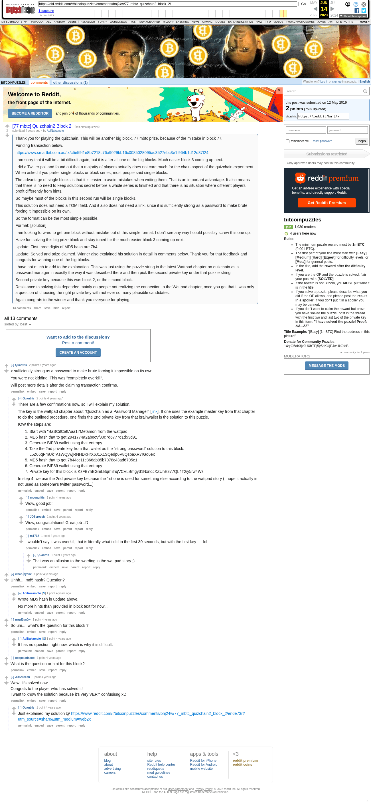

# [77 mbtc] Quizchain2 Block 2

[Original thread](https://www.reddit.com/r/bitcoinpuzzles/comments/bnj24w/77_mbtc_quizchain2_block_2/). The `sourceUrl` of the [quizchain2/2](../../../src/collections/quizchain2/2.ts) record and the source of its format and hash digits, with the funding transaction and the author's account of the solution. The whole method, from the Wattpad master string through both MD5 hashes to the block key, is in a player's comment the author's update points to. The post went up on May 12, 2019, at 00:29:15 UTC, 5 seconds before the block time of its funding transaction. Its last edit is stamped 05:30:44 UTC on May 12, 2019, so the transcript shows the post as it stood after the claim.

## Historical provenance

Provenance rests on the [old.reddit.com capture](https://web.archive.org/web/20230614212241/https://old.reddit.com/r/bitcoinpuzzles/comments/bnj24w/77_mbtc_quizchain2_block_2/), stamped June 14, 2023, 21:22:41 UTC, whose HTML carries the post, which matches the transcript below word for word. It renders 13 comments, and each matches the Arctic Shift record of the same ID by author and text. Only the markdown of links, lists and superscripts renders differently. The capture was read on October 1, 2026. `archive_content: confirmed` on that basis.

The [Arctic Shift](https://arctic-shift.photon-reddit.com/) Reddit archive, read the same day, lists 16 comments, three more than the capture carries with an ID: all three deleted. The transcript takes every comment, its author, text and score from Arctic Shift and nests them as the capture does. Three of them are deleted comments, kept below as `[deleted]`.

The record names none of the commenters: nothing on the chain ties a claim to a name.

## Transcript

> Thank you for playing the quizchain. This will be another big block, 77 mbtc prize, because of the mistake in block 77.
>
> Funding transaction below.
>
> https://www.smartbit.com.au/tx/c5e59f1e8b7218c76a9029bb16c0085028095ac3527ebc3e1f964b1d12d87f24
>
> I am sorry that it will be a bit difficult again, but it is after all one of the big blocks. Much easier block 3 coming up next.
>
> I did a Twitter poll and found out that a majority of players actually does not care much for the chain aspect of the quizchain experiment. When asked if you prefer single blocks or block series, most people said single blocks.
>
> The advantage of single blocks is that it is easier to avoid mistakes when writing them. That is an important advantage. It also means that there is no need to keep solutions secret before a whole series is finished and that there is no situation where different players profit differently from hints.
>
> So maybe most of the blocks in this second run will be single blocks.
>
> This solution does not need a TOMI field. And it also does not need a link, since it is sufficiently strong as a password to make brute forcing it impossible on its own.
>
> So the format can be the most simple possible.
>
> Format: [solution]
>
> I am looking forward to get one block without mistake out of this simple format. I don't see any way I could possibly screw this one up.
>
> Have fun solving this big prize block and stay tuned for the much easier block 3 coming up next.
>
> Update: First three digits of MD5 hash are 7b4.
>
> Update: Solved and prize claimed. Winner also explained his solution in detail in comments below. Thank you for that feedback and congrats for winning one of the big blocks.
>
> I have not much to add to the explanation. This was just using the puzzle string in the latest Wattpad chapter on quizchain as a password manager in exactly the way it was described there and then pick the second private key under that puzzle string.
>
> Second private key because this was block 2, or the second block.
>
> Resistance to solving this depended mainly on people not realizing the connection to the Wattpad chapter, once you got that it was only a question of choosing the right private key with not ever so many plausible candidates.
>
> Again congrats to the winner and thank you everyone for playing.

## Comments

**u/Quantris**, 2 points:

> > sufficiently strong as a password to make brute forcing it impossible on its own.
>
> You were not kidding. This was "completely overkill".
>
> Will post more details after the claiming transaction confirms.

**u/Quantris**, 2 points, reply to u/Quantris:

> There are a few confirmations now, so I will explain my solution.
>
> The key is the wattpad chapter about "Quizchain as a Password Manager" \[[link](https://www.wattpad.com/730790756-second-quizchain-as-a-password-manager)\]. If one uses the example master key from that chapter to do the outlined procedure, one finds the 2nd private key from that brainwallet is the solution to this puzzle.
>
> IOW the steps are:
>
> 1. Start with "BaSCifCatfAaa1i"Metamon from the wattpad
> 2. MD5 hash that to get 2941774a2abec9f30c7d6777d1d53d91
> 3. Generate BIP39 wallet using that entropy
> 4. Take the 2nd private key from that wallet as the "strong password" solution to this block: L5Z66qPmUkTAsWQywjRNHDxHrX6J1X1SQedp6V8QsbaXR7rGd6ex
> 5. MD5 hash that to get 7b44cc11c866ab85b7078c43ad6795e1
> 6. Generate BIP39 wallet using that entropy
> 7. Private key for this block is KzFB7hBGmLBqm8nqVCVLBmgyd1NxnoJXZUhE377QL4T2iy5rw4Wz
>
> In step 4, we use the 2nd private key because the 1st one is used for something else according to the wattpad story (I hope it actually is not used as someone's twitter password...)

**u/mooncritic**, 1 point, reply to u/Quantris:

> Wow, good job!

**u/JDScreesh**, 1 point, reply to u/Quantris:

> Wow, congratulations! Great job =D

**u/rs1712**, 1 point, reply to u/Quantris:

> I wouldn't say it was overkill, that is literally what i did in the first 30 seconds, but with the first key -_- lol

**u/Quantris**, 1 point, reply to u/rs1712:

> That was an allusion to the wording in the wattpad story ;)

**u/whatupyo02**, 1 point:

> Uhhh.....md5 hash? Question?

**u/AoiNakamoto**, 1 point, reply to u/whatupyo02:

> Wrote MD5 hash in update above.
>
> No more hints than provided in block text for now...

**[deleted]**, reply to u/whatupyo02:

> [deleted]

**u/mapl3sn0w**, 1 point:

> So um.... what's the question for this block ?

**u/AoiNakamoto**, 1 point, reply to u/mapl3sn0w:

> It has no question right now, which is why it is difficult.

**u/ooxpolarisxoo**, 1 point:

> What is the question or hint for this block?

**u/JDScreesh**, 1 point:

> Wow! It's solved now.
> Congrats to the player who has solved it!
> I want to know the solution because it's very VERY confusisng xD

**u/Quantris**, 1 point, reply to u/JDScreesh:

> Just explained my solution @ [https://www.reddit.com/r/bitcoinpuzzles/comments/bnj24w/77\_mbtc\_quizchain2\_block\_2/en6e73r?utm\_source=share&utm\_medium=web2x](https://www.reddit.com/r/bitcoinpuzzles/comments/bnj24w/77_mbtc_quizchain2_block_2/en6e73r?utm_source=share&utm_medium=web2x)

**[deleted]**:

> [deleted]

**[deleted]**:

> [deleted]

## Screenshot

The screenshot is a render of the archive capture, not of the live page, so it carries the Wayback banner at the top. The "4 years ago" stamps are relative to the capture, June 14, 2023. Capture method and limits: [source archive](../README.md).
