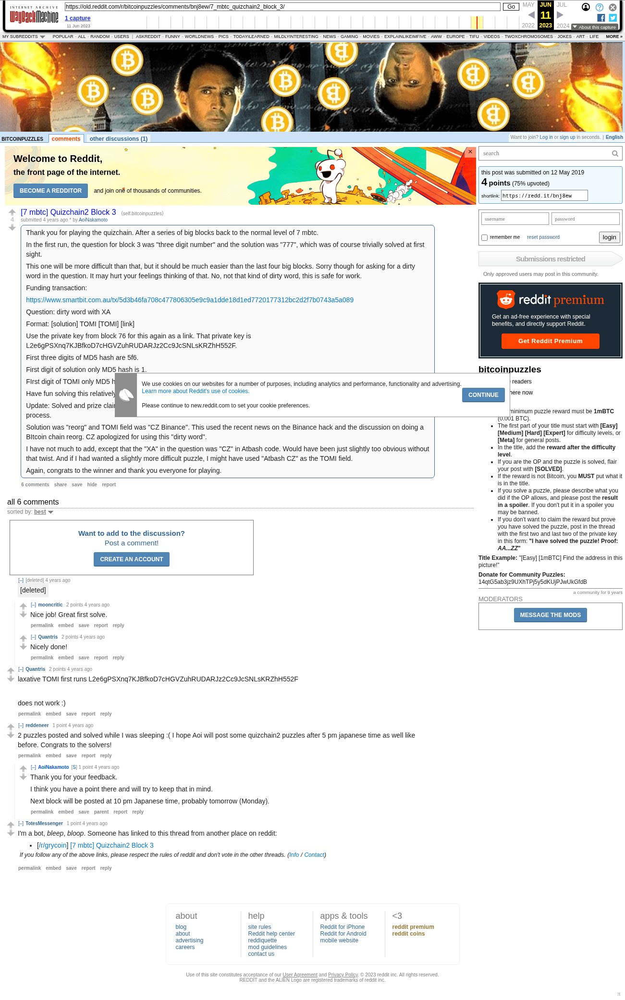

# [7 mbtc] Quizchain2 Block 3

[Original thread](https://www.reddit.com/r/bitcoinpuzzles/comments/bnj8ew/7_mbtc_quizchain2_block_3/). The `sourceUrl` of the [quizchain2/3](../../../src/collections/quizchain2/3.ts) record and the source of its question, format, link and hash digits, with the funding transaction and the solution and TOMI field the author edited in. The full winning string is in a player's comment. The post went up on May 12, 2019, at 00:47:36 UTC, 2 minutes after the block time of its funding transaction. Its last edit is stamped 05:36:10 UTC on May 12, 2019, so the transcript shows the post as it stood after the claim.

## Historical provenance

Provenance rests on the [old.reddit.com capture](https://web.archive.org/web/20230611192249/https://old.reddit.com/r/bitcoinpuzzles/comments/bnj8ew/7_mbtc_quizchain2_block_3/), stamped June 11, 2023, 19:22:49 UTC, whose HTML carries the post, which matches the transcript below word for word. It renders 6 comments, and each matches the Arctic Shift record of the same ID by author and text. Only the markdown of links, lists and superscripts renders differently. The capture was read on October 1, 2026. `archive_content: confirmed` on that basis.

The [Arctic Shift](https://arctic-shift.photon-reddit.com/) Reddit archive, read the same day, lists 8 comments, two more than the capture carries with an ID: two by u/Pr0m3th3on. The transcript takes every comment, its author, text and score from Arctic Shift and nests them as the capture does.

The record names none of the commenters: nothing on the chain ties a claim to a name.

## Transcript

> Thank you for playing the quizchain. After a series of big blocks back to the normal level of 7 mbtc.
>
> In the first run, the question for block 3 was "three digit number" and the solution was "777", which was of course trivially solved at first sight.
>
> This one will be more difficult than that, but it should be much easier than the last four big blocks. Sorry though for asking for a dirty word in the question. It may hurt your feelings thinking of that. No, not that kind of dirty word, this is safe for work.
>
> Funding transaction:
>
> https://www.smartbit.com.au/tx/5d3b46fa708c477806305e9c9a1dde18d1ed7720177312bc2d2f7b0743a5a089
>
> Question: dirty word with XA
>
> Format: [solution] TOMI [TOMI] [link]
>
> Use the private key from block 76 for this again as a link. That private key is
> L2e6gPSXnq7KJBfkoD7cHGVZuhRUDARJz2Cc9JcSNLsKRZhH552F.
>
> First three digits of MD5 hash are 5f6.
>
> First digit of solution only MD5 hash is 1.
>
> FIrst digit of TOMI only MD5 hash is 0.
>
> Have fun solving this relatively easy block and thank you for playing.
>
> Update: Solved and prize claimed. Congrats to the winner and thank you also for the detailed feedback on the solution and the solving process.
>
> Solution was "reorg" and TOMI field was "CZ Binance". This used the recent news on the Binance hack and the discussion on doing a BItcoin chain reorg. CZ apologized for using this "dirty word".
>
> I have not much to add, except that the "XA" in the question was "CZ" in Atbash code. Would have been just slightly too obvious without that twist. And if I had wanted a slightly more difficult puzzle, I might have used "Atbash CZ" as the TOMI field.
>
> Again, congrats to the winner and thank you everyone for playing.

## Comments

**u/Quantris**, 2 points:

> laxative TOMI first runs L2e6gPSXnq7KJBfkoD7cHGVZuhRUDARJz2Cc9JcSNLsKRZhH552F
>
> does not work :)

**u/reddeneer**, 1 point:

> 2 puzzles posted and solved while I was sleeping :( I hope Aoi will post some quizchain2 puzzles after 5 pm japanese time as well like before. Congrats to the solvers!

**u/AoiNakamoto**, 1 point, reply to u/reddeneer:

> Thank you for your feedback.
>
> I think you have a point there and will try to keep that in mind.
>
> Next block will be posted at 10 pm Japanese time, probably tomorrow (Monday).

**u/TotesMessenger**, 1 point:

> I'm a bot, _bleep_, _bloop_. Someone has linked to this thread from another place on reddit:
>
> - [/r/grycoin] [\[7 mbtc\] Quizchain2 Block 3](https://www.reddit.com/r/Grycoin/comments/br8261/7_mbtc_quizchain2_block_3/)
>
> _^(If you follow any of the above links, please respect the rules of reddit and don't vote in the other threads.) ^\([Info](/r/TotesMessenger) ^/ ^[Contact](/message/compose?to=/r/TotesMessenger))_

**u/Pr0m3th3on**, 4 points:

> VICTORY IS MINE
>
> The solve that I decided going with was: "reorg TOMI CZ Binance L2e6gPSXnq7KJBfkoD7cHGVZuhRUDARJz2Cc9JcSNLsKRZhH552F"
>
> This was for a few reasons. First, I knew it wasn't a "dirty word" in the traditional sense from this: " No, not that kind of dirty word, this is safe for work." Second, I knew it was going to be related to the crypto community because of this reference: "It may hurt your feelings thinking of that." With this information, I remembered an article I read recently about the CEO of Binance, who apologized for using the "dirty word" reorg. Plugging it into an MD5 converter, it spits out an MD5 hash starting with 1. At this point, I know the TOMI was going to be something related to him, so I ran a few different ideas through. Eventually, I decided to try to run his twitter handle through, CZ Binance, and to my surprise, everything was going to plan! Now, armed with my completed solve, I ran that through the MD5 generator, and I actually freaked out when it spit out 5f6 as the first three digits lmao. From there, I followed the rest of the instructions for claiming my prize, which ended up taking me more time to figure out than it took to solve the problem. I had to set up an emergency wallet because my bitcoin wallet was installed at home, not on my work laptop. I clearly must have gotten lucky lol. Cheers to Aoi Nakamoto for setting this up, it was my first puzzle and really enjoyable!

**u/mooncritic**, 2 points, reply to u/Pr0m3th3on:

> Nice job! Great first solve.

**u/Pr0m3th3on**, 1 point, reply to u/mooncritic:

> Thanks!

**u/Quantris**, 2 points, reply to u/Pr0m3th3on:

> Nicely done!

## Screenshot

The screenshot is a render of the archive capture, not of the live page, so it carries the Wayback banner at the top. The "4 years ago" stamps are relative to the capture, June 11, 2023. Capture method and limits: [source archive](../README.md).
