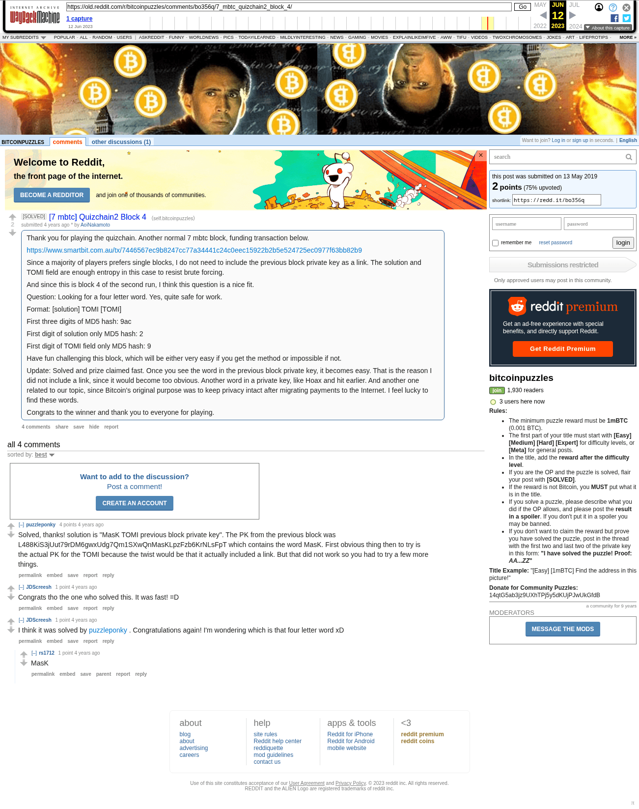

# [7 mbtc] Quizchain2 Block 4

[Original thread](https://www.reddit.com/r/bitcoinpuzzles/comments/bo356q/7_mbtc_quizchain2_block_4/). The `sourceUrl` of the [quizchain2/4](../../../src/collections/quizchain2/4.ts) record and the source of its question, format and hash digits, with the funding transaction and the author's update. The full string and the block 3 key it takes `MasK` from are in the winner's comment. The post went up on May 13, 2019, at 12:58:34 UTC, 25 minutes after the block time of its funding transaction. Its last edit is stamped 22:58:59 UTC on May 13, 2019, so the transcript shows the post as it stood after the claim.

## Historical provenance

Provenance rests on the [old.reddit.com capture](https://web.archive.org/web/20230612110845/https://old.reddit.com/r/bitcoinpuzzles/comments/bo356q/7_mbtc_quizchain2_block_4/), stamped June 12, 2023, 11:08:45 UTC, whose HTML carries the post, which matches the transcript below word for word. It renders 4 comments, and each matches the Arctic Shift record of the same ID by author and text. Only the markdown of links, lists and superscripts renders differently. The capture was read on October 1, 2026. `archive_content: confirmed` on that basis.

The [Arctic Shift](https://arctic-shift.photon-reddit.com/) Reddit archive, read the same day, lists the same 4 comments. The transcript takes every comment, its author, text and score from Arctic Shift and nests them as the capture does.

The record names none of the commenters: nothing on the chain ties a claim to a name.

## Transcript

> Thank you for playing the quizchain. Another normal 7 mbtc block, funding transaction below.
>
> https://www.smartbit.com.au/tx/7446567ec9b8247cc77a34441c24c0eec15922b2b5e524725ec0977f63bb82b9
>
> Since a majority of players prefers single blocks, I do not need to include the previous block private key as a link. The solution and TOMI field are enough entropy in this case to resist brute forcing.
>
> And since this is block 4 of the second run, I think this question is a nice fit.
>
> Question: Looking for a four letter word. Yes, quite safe for work.
>
> Format: [solution] TOMI [TOMI]
>
> First three digits of MD5 hash: 9ac
>
> First digit of solution only MD5 hash: 2
>
> First digit of TOMI field only MD5 hash: 9
>
> Have fun challenging this block, which will be either very easy if you get the method or impossible if not.
>
> Update: Solved and prize claimed fast. Once you see the word in the previous block private key, it becomes easy. That is the reason I did not include a link, since it would become too obvious. Another word in a private key, like Hoax and hit earlier. And another one related to our topic, since Bitcoin's original purpose was to keep privacy intact after migrating payments to the Internet. I feel lucky to find these words.
>
> Congrats to the winner and thank you to everyone for playing.

## Comments

**u/puzzleponky**, 4 points:

> Solved, thanks! solution is "MasK TOMI previous block private key". The PK from the previous block was L488KiS3jUut79rDM6gwxUdg7Qm1SXwQnMasKLpzFzb6KrNLsFpT which contains the word MasK. First obvious thing then to try is the actual PK for the TOMI because the twist would be that it actually included a link. But that did not work so you had to try a few more things.

**u/JDScreesh**, 1 point:

> Congrats tho the one who solved this. It was fast! =D

**u/JDScreesh**, 1 point:

> I think it was solved by [puzzleponky](https://www.reddit.com/user/puzzleponky) . Congratulations again! I'm wondering which is that four letter word xD

**u/rs1712**, 1 point, reply to u/JDScreesh:

> MasK

## Screenshot

The screenshot is a render of the archive capture, not of the live page, so it carries the Wayback banner at the top. The "4 years ago" stamps are relative to the capture, June 12, 2023. Capture method and limits: [source archive](../README.md).
