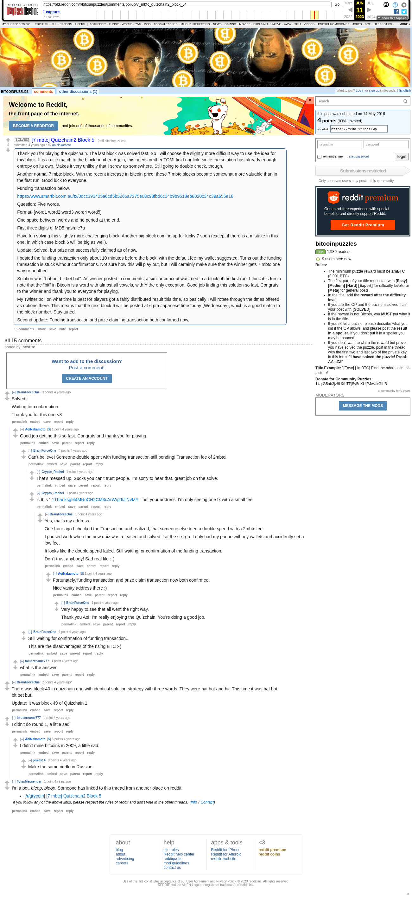

# [7 mbtc] Quizchain2 Block 5

[Original thread](https://www.reddit.com/r/bitcoinpuzzles/comments/boil0p/7_mbtc_quizchain2_block_5/). The `sourceUrl` of the [quizchain2/5](../../../src/collections/quizchain2/5.ts) record and the source of its question, format and hash digits, with the funding transaction and the solution the author edited in. The comments follow the stuck funding transaction and the claim that waited on it. The post went up on May 14, 2019, at 12:56:39 UTC, 9 hours before the block time of its funding transaction. Its last edit is stamped 07:22:02 UTC on May 15, 2019, so the transcript shows the post as it stood after the claim.

## Historical provenance

Provenance rests on the [old.reddit.com capture](https://web.archive.org/web/20230611190824/https://old.reddit.com/r/bitcoinpuzzles/comments/boil0p/7_mbtc_quizchain2_block_5/), stamped June 11, 2023, 19:08:24 UTC, whose HTML carries the post, which matches the transcript below word for word. It renders 15 comments, and each matches the Arctic Shift record of the same ID by author and text. Only the markdown of links, lists and superscripts renders differently. The capture was read on October 1, 2026. `archive_content: confirmed` on that basis.

The [Arctic Shift](https://arctic-shift.photon-reddit.com/) Reddit archive, read the same day, lists the same 15 comments. The transcript takes every comment, its author, text and score from Arctic Shift and nests them as the capture does.

The record names none of the commenters. u/BrainForceOne says the address the claim pays, `1Thanksg9t4MRoCH2CM3cArWq26JiNvMY`, is theirs, and the claim is the only spend of the prize.

## Transcript

> Thank you for playing the quizchain. The last block was solved fast. So I will choose the slightly more difficult way to use the idea for this block. It is a nice match to the block number. Again, this needs neither TOMI field nor link, since the solution has already enough entropy on its own. Makes it very unlikely that I screw up somewhere. Still going to double check, though.
>
> Another normal 7 mbtc block. With the recent increase in bitcoin price, these 7 mbtc blocks become somewhat more valuable than in the first run. Good luck to everyone.
>
> Funding transaction below.
>
> https://www.smartbit.com.au/tx/0dcc393425a6cd5b5266a7275e08c98fbd6c14b9b9518eb8020c34c39a655e18
>
> Question: Five words.
>
> Format: [word1 word2 word3 word4 word5]
>
> One space between words and no period at the end.
>
> First three digits of MD5 hash: e7a
>
> Have fun solving this slightly more challenging block. Another big block coming up for lucky 7 soon (except if there is a mistake in this one, in which case block 6 will be big as well).
>
> Update: Solved, but prize not successfully claimed as of now.
>
> I posted the funding transaction only about 10 minutes before the block, with the default fee my wallet suggested. Turns out the funding transaction is stuck without confirmations. Not sure how this will play out, but I will certainly make sure that the winner gets 7 mbtc one way or another.
>
> Solution was "bat bot bit bet but". As winner posted in comments, a similar concept was tried in a block of the first run. I think it is fun to note that the "bit" in Bitcoin is a word with almost all vowels, with Y the only exception. Good job finding this solution so fast. Congrats to the winner and thank you to everyone for playing.
>
> My Twitter poll on what time is best for players got a fairly distributed result this time, so basically I will rotate through the times offered as options there. This means that the next block 6 will be posted at 6 pm Japanese time today (Wednesday), which is a good match to the block number. Stay tuned.
>
> Second update: Funding transaction and prize claiming transaction both confirmed now.

## Comments

**u/BrainForceOne**, 3 points:

> Solved!
>
> Waiting for confirmation.
>
> Thank you for this one <3

**u/AoiNakamoto**, 1 point, reply to u/BrainForceOne:

> Good job getting this so fast. Congrats and thank you for playing.

**u/BrainForceOne**, 5 points, reply to u/AoiNakamoto:

> Can't believe!
> Someone double spent with funding transaction still pending!
> Transaction fee of 2mbtc!

**u/Crypto_Rachel**, 1 point, reply to u/BrainForceOne:

> That's messed up, Sucks you can't trust people. I'm sorry to hear that. great job on the solve.

**u/Crypto_Rachel**, 1 point, reply to u/BrainForceOne:

> is this " [1Thanksg9t4MRoCH2CM3cArWq26JiNvMY](https://www.blockchain.com/btc/address/1Thanksg9t4MRoCH2CM3cArWq26JiNvMY) " not your address. I'm only seeing one tx with a small fee

**u/BrainForceOne**, 1 point, reply to u/Crypto_Rachel:

> Yes, that's my address.
>
> One hour ago I checked the Transaction and realized, that someone else tried a double spend with a 2mbtc fee.
>
> I paused work when the new quiz was released and solved it at the sixt go. I only had my phone with my wallets and accidently set a low fee.
>
> It looks like the double spend failed. Still waiting for confirmation of the funding transaction.
>
> Don't trust anybody! Sad real life :-(

**u/AoiNakamoto**, 1 point, reply to u/BrainForceOne:

> Fortunately, funding transaction and prize claim transaction now both confirmed.
>
> Nice vanity address there :)

**u/BrainForceOne**, 1 point, reply to u/AoiNakamoto:

> Very happy to see that all went the right way.
>
> Thank you Aoi. I'm really enjoying the Quizchain. You're doing a good job.

**u/BrainForceOne**, 1 point, reply to u/AoiNakamoto:

> Still waiting for confirmation of funding transaction...
>
> This are the disadvantages of the rising BTC :-(

**u/lolusername777**, 1 point, reply to u/BrainForceOne:

> what is the answer

**u/BrainForceOne**, 2 points:

> There was block 40 in quizchain one with identical solution strategy with three words. They were hat hot and hit. This time it was bat bot bit bet but.
>
> Update: It was block 49 of Quizchain 1

**u/lolusername777**, 1 point:

> I didn't do round 1, a little sad

**u/AoiNakamoto**, 2 points, reply to u/lolusername777:

> I didn't mine bitcoins in 2009, a little sad.

**u/jewes14**, 0 points, reply to u/AoiNakamoto:

> Make the same riddle in Russian

**u/TotesMessenger**, 1 point:

> I'm a bot, _bleep_, _bloop_. Someone has linked to this thread from another place on reddit:
>
> - [/r/grycoin] [\[7 mbtc\] Quizchain2 Block 5](https://www.reddit.com/r/Grycoin/comments/br82ml/7_mbtc_quizchain2_block_5/)
>
> _^(If you follow any of the above links, please respect the rules of reddit and don't vote in the other threads.) ^\([Info](/r/TotesMessenger) ^/ ^[Contact](/message/compose?to=/r/TotesMessenger))_

## Screenshot

The screenshot is a render of the archive capture, not of the live page, so it carries the Wayback banner at the top. The "4 years ago" stamps are relative to the capture, June 11, 2023. Capture method and limits: [source archive](../README.md).
