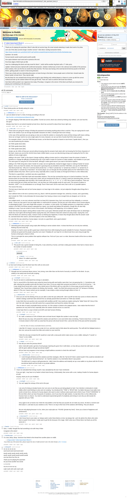

# [7 mbtc] Quizchain2 Block 6

[Original thread](https://www.reddit.com/r/bitcoinpuzzles/comments/boviny/7_mbtc_quizchain2_block_6/). The `sourceUrl` of the [quizchain2/6](../../../src/collections/quizchain2/6.ts) record and the source of its question, format and hash digits, with the funding transaction and the method the author edited in. Nobody in the thread prints the six words or the key; the author printed the key in the block 8 post. The post went up on May 15, 2019, at 08:59:21 UTC, 9 hours after the block time of its funding transaction. Its last edit is stamped 22:54:37 UTC on May 15, 2019, so the transcript shows the post as it stood after the claim.

## Historical provenance

Provenance rests on the [old.reddit.com capture](https://web.archive.org/web/20230611231414/https://old.reddit.com/r/bitcoinpuzzles/comments/boviny/7_mbtc_quizchain2_block_6/), stamped June 11, 2023, 23:14:14 UTC, whose HTML carries the post, which matches the transcript below word for word. It renders 19 comments, and each matches the Arctic Shift record of the same ID by author and text. Only the markdown of links, lists and superscripts renders differently. The capture was read on October 1, 2026. `archive_content: confirmed` on that basis.

The [Arctic Shift](https://arctic-shift.photon-reddit.com/) Reddit archive, read the same day, lists 20 comments, one more than the capture carries with an ID: one by u/tarje. The transcript takes every comment, its author, text and score from Arctic Shift and nests them as the capture does.

The record names none of the commenters: nothing on the chain ties a claim to a name.

## Transcript

> Thank you for playing the quizchain. Block 5 also did not survive long, the smart wizards attacking it made short work of my idea.
>
> Let's see if this idea survives longer. Another normal 7 mbtc block, funding transaction below.
>
> https://www.smartbit.com.au/tx/834218257ca87ad263c4ce6a64f32ab34424bd20c03c225cf5c25d28eb9e1dae
>
> Question: Six words.
>
> Format: [word1 word2 word3 word4 word5 word6]
>
> One space between each word and no period at the end.
>
> First three digits of MD5 hash are fb8.
>
> Have fun challenging this block and stay tuned for block 7, which will be another big block with a 77 mbtc prize.
>
> Update: Solved and prize claimed with confirmed transaction. Solution method was to look in the coleman tool wordlist of the previous block solution, then use the first six words from that word list. The hoax was having a five word bat bot bit bet but puzzle in the block before, getting people to search in that wrong direction.
>
> There was a lively and very interesting discussion on brute forcing in this block. Some people seem to think that I should make the blocks harder to brute force. They may be right.
>
> But this block for one resisted brute forcing well enough to give thinking only method players a chance to come up with the correct method and look up the solution before the bots get the bits. That's all I want to achieve with brute force blocks.
>
> Next block will be posted 2 pm Japanese time today (Thursday). Congrats to the winner of this block and thank you everyone for playing and contributing to the discussion.

## Comments

**u/rs1712**, 6 points:

> These kinda puzzles are literally asking for scrips

**u/AoiNakamoto**, 1 point, reply to u/rs1712:

> Last one (block 5) had 71.4 bits of entropy according to this tool
>
> http://rumkin.com/tools/password/passchk.php
>
> so I thought skipping TOMI field and link was justified. Turned out correct, block was solved by thinking only method. Let's see how this one goes.
>
> Already clear that it is not solved instantly by brute force, block has survived for about three hours right now.

**u/silver_anth**, 6 points, reply to u/AoiNakamoto:

> These tools are giving the entropy of finding the password not knowing anything about what it could be. They are saying that for each letter in the solution if you ran through all possible characters for letter, it would give that much entropy.
>
> In the case of the quizchain you are giving us clues as to what the solution is, knowing this means all that entropy stuff means nothing. Since we no longer need to try every single option for every character, we can use lists of words that fit the clues you give.
>
> For example in block 1 once the TOMI field was known, as the block the question is based on was known ("upside down"), then you can start bruteforcing the solution.
>
> AA TOMI upside down [link]
>
> AB TOMI upside down [link]
>
> AC TOMI upside down [link]
>
> Scripts can do 1000x of these per second without knowing what the answers hash starts with, but knowing the first three characters of the hash, means you can do this 16*16*16 times faster (4096x faster), as you can skip deriving entropy and creating the first PK, then address of every single option.
>
> Adding in the word "TOMI" to this doesn't change anything, adding a known word to a string doesn't mean the answer is harder to bruteforce or change the difficulty of bruteforcing at all, it just makes it easier for humans to make mistakes, and mistakes on your part. The same goes for using the PK of the last block, although it makes good sense if you want to link blocks together.
>
> Adding in the TOMI string does make it harder for scripts, but not significantly. Instead its bigger impact is making it harder for human players. Once you have the solution, the real puzzle is guessing how you decided to word the TOMI field. Lets say the TOMI field is "last block private key". Why isn't it "previous block private key", or "block X private key" or "private key of block X" or "private key of previous block" or "private key of last block".
> No human player can run through all of the possible options for the TOMI field for every possible solution they have, there is just too many, especially when a script can easily run through all of these in a few milliseconds.
>
> This block is a good block. Last block was also a good block.
>
> Both of them had no TOMI field. Both had reasonable solutions. This one has survived this long as it is hard to bruteforce. From the previous block we have the idea of using every vowel, and you introduced the idea of "y" being a vowel (an interesting idea), and now we know how to potentially solve this block. Get 6 words with one of "a", "o", "i", "e", "u", "y". BUT this is hard to bruteforce. There are so many words that are similar and have these. Lets say there are 1000 possible words for each word. The amount of options is therefore. 1000^6 = 1e+18 combinations to run through. Even if there were 100 for each word, that is still 1e+12 possible options.
>
> The moral of the story.
>
> The best way to beat bots and not hurt human players is to have logic to the solution, not just subjective thoughts about things like in block 77 :),
>
> have sufficient hints in the text or previous texts (e.g. block 2 with the password manager hint, solved by a human, and a good idea),
>
> don't include the TOMI, it only eliminates the human player from having a chance once enough hints are dropped, as it is far too subjective
>
> use multiple words, or one very unknown word that is at least 9/10 characters long. Don't use words just from wikipedia, or common words. I know you may want to use just single letters or small words for answers, but this just can't work without cost to human players, or advantaging scripts. If you want single letter answers, or numbers, or short words. Put multiple questions in a single block, and the solution is the MD5 of all these answers separated by a space, you would need atleast 5/6 questions, though this can also help scripting in a way, if you are certain of some of the answers. But thinking is still happening, so its a balance I guess.
>
> These will help human players solving without scripts if this is your goal. Otherwise people with scripts will always have an advantage. I would very much agree with borTeg223 below saying that only 10% of blocks if that were solved not using scripts. Saying that, even when the blocks are solved by scripts, it doesn't mean no thinking has happened, it means they thought about what the answer could be, narrowed down their search, and tried all options in the most efficient way.
>
> E: Looks like this was solved by a human player, nice job on a good block, and a good solution!

**u/AoiNakamoto**, 0 points, reply to u/silver_anth:

> Interesting point about people using scripts after thinking to narrow solution down. It shows that there are not only two methods, thinking only and script only.
>
> Anyway, it is hard to come up with a good way to block brute force while keeping the puzzle solvable for humans. Password cracking methods are good and the people using them are smart. Probably all I can hope for is to block brute force users long enough that humans at least get a chance to think.
>
> This is in principle the same problem that captcha software has. Find out if your user is a robot. Becomes harder all the time as robots get smarter.

**u/silver_anth**, 3 points, reply to u/AoiNakamoto:

> This puzzle was a great example of doing this, it was solved by a human, and had a really good solution. Bots had no chance due to the number of words involved

**u/tarje**, 1 point, reply to u/silver_anth:

> This still can't be called a puzzle, though.

**u/Quantris**, 1 point, reply to u/tarje:

> \*ahem\* It's called a quizchain

**u/reddeneer**, 1 point, reply to u/AoiNakamoto:

> ai, how much entropy must this block have then with an extra word

**u/AoiNakamoto**, 0 points, reply to u/reddeneer:

> Strength test tool mentioned above returns "very strong, more often than not this level of security is overkill" for this block. So yes, unlikely to be easily brute forced with scripting.

**u/borTeg223**, 3 points, reply to u/AoiNakamoto:

> You do not seem to understand how entropy is calculated...
>
> Fact is: around 90% of the blocks were solved by brute forcing with word and/or name lists (I am not guessing this ;) ). Sometimes only after reducing the possible words with the help of your hints. Or do you really think someone just thinks of "oh, let's try hit hat hut...". No. It was simply brute forced with a script. I also solved some of the blocks with my script (this is a throw away account) and then later "explained" how I found these solutions by thinking. But honestly... really? You think that someone just tried "U2" because of thinking about it? (This one I havent solved, just an example). It was simply a script running through millions of tries :D

**u/BrainForceOne**, 2 points, reply to u/borTeg223:

> Once you are into the thinking of Aoi you are able to solve the quiz without BF. I don't use BF but had only sucess on blocks where the solution strategy could have been derived from an already passed block and where no TOMI was needed.
>
> A also think there are puzzlers very successful with wordlists and BF. How would you explain solving the "failed" block 56? (Sorry if this istn't the truth. Maybe you tried with words from a passed block and found the solution this way).
>
> I like the idea of nearly unsolvable blocks and hints. Or if the solution is linked to the wattpad stories. I also realize that this kind of questions are very hard to find, especially when the solution should not be on a word list.
>
> I realy hope there is a way to break out de BFs and start humans thinking.

**u/borTeg223**, 4 points, reply to u/BrainForceOne:

> As I said: a maximum of 10% of blocks were not brute forced. Maybe this number is even too high.
>
> Block 56 was very easy: AOI posted the solution and said there is one word which does not belong. Trivial to brute force :) In fact I was 6 minutes slower to find it with my script than the person who brute forced it first. Look at the time of the post and the transaction.
>
> > I like the idea of nearly unsolvable blocks and hints.
>
> I also like it! It means I can use my script, let it run, and dont need to think about the weird puzzles. The stuff with the Wattpad stories is also nice: just put the words from titles and content on your word list.
>
> I think the only way to break the BF would be to start with a real puzzle which make sense or are a riddle. Asking for "5 words" or "Jesus" is not a riddle.

**u/suhailvs**, 1 point, reply to u/BrainForceOne:

> how did you solve the previous block?
>
> when i tried with words i got lots of word groups matching the given first 3 md5 letters.
> so how did you check the md5 hash's to match with the given address through iancoleman bip39?
>
> did you have any programs to test entropy to bip39 address converter to check the md5 hash?

**u/BrainForceOne**, 2 points, reply to u/suhailvs:

> I went through all blocks and the solutions and their strategies. After the "hat hot hit" block i asked myself, if this could be extended to all vowels and found "bat bet bit bot but". So I had the solution in my mind before block 5 was posted.
>
> The MD5 tool I'm using is md5-generator.de. I didn't check the address and instantly set up a new wallet on my phone with the PK from iancoleman bip39 and sent funds to my private address.

**u/AoiNakamoto**, 1 point, reply to u/borTeg223:

> I have not calculated that entropy myself, it was calculated by the tool I have mentioned.
>
> If you are right, I may have to try harder to block brute forcing. Unfortunately, that comes with a cost, making it harder for human players as well.
>
> Anyway, thank you for your feedback.

**u/borTeg223**, 3 points, reply to u/AoiNakamoto:

> You can't apply the entropy of this tool to this quiz.
>
> I am sorry for being so brutaly honest, but I am sorry to see that you are being played so hard. Your intention is obviously to create riddles which need thinking to solve and not scripting. You introduced the "TOMI" or "BFUB" field. You failed. Because it just adds more words to brute force, whereas for human players who want to solve it without script would need to think of your "EXACT WORDING" of the tomi field, which can have thousands of variations, even if you have the right solution. A script does this in a few milliseconds. Humans have no chance. You need to understand exponential growth of complexity and entropy to see why you did exactly the opposite with your TOMI.
>
> Sorry again to be so honest: but I think the real problem is the fact that your puzzles do not make any sense. Sit down a moment and think about it. Look back at your solutions so far. There is no way to find most of the solutions with thinking. They are absurd.
>
> We are only playing because it is fun, when your script spits out: "FOUND: \[private key here\]". Gives you a boost of happiness and achievement.

**u/lolusername777**, 2 points, reply to u/AoiNakamoto:

> I don't know how to use script, so l always wait to solve these blocks on time, but always fail , and l do admire the others who solve them so quick.To be honest, l really want to get the btc because of its magic. Didn't solve any of these block, but thank you all the same,Aoi :)

**u/Quantris**, 2 points:

> Darn, I \*really\* thought this had something to do with Harry Potter
>
> Congrats to the solver!

**u/TotesMessenger**, 1 point:

> I'm a bot, _bleep_, _bloop_. Someone has linked to this thread from another place on reddit:
>
> - [/r/grycoin] [\[7 mbtc\] Quizchain2 Block 6](https://www.reddit.com/r/Grycoin/comments/br82ru/7_mbtc_quizchain2_block_6/)
>
> _^(If you follow any of the above links, please respect the rules of reddit and don't vote in the other threads.) ^\([Info](/r/TotesMessenger) ^/ ^[Contact](/message/compose?to=/r/TotesMessenger))_

**u/whatupyo02**, 1 point:

> six six six six six six
> word word word word word word
>
> words words words words words words
> word1 word2 word3 word4 word5 word6
> one two three four five six
>
> Thank you for playing the quizchain
> Do you know another two words
>
> 1 2 3 4 5 6
>
> ma mo mi me mu my
>
> math moth mith meth muth myth

## Screenshot

The screenshot is a render of the archive capture, not of the live page, so it carries the Wayback banner at the top. The "4 years ago" stamps are relative to the capture, June 11, 2023. Capture method and limits: [source archive](../README.md).
