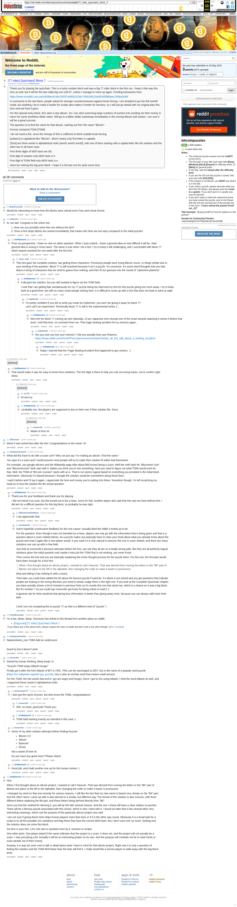

# [77 mbtc] Quizchain2 Block 7

[Original thread](https://www.reddit.com/r/bitcoinpuzzles/comments/bp8jlh/77_mbtc_quizchain2_block_7/). The `sourceUrl` of the [quizchain2/7](../../../src/collections/quizchain2/7.ts) record and the source of its question, format, hash digits and the author's hint, with the funding transaction. The full winning string is in a player's comment the author confirmed in a reply. The post went up on May 16, 2019, at 05:01:49 UTC, 6 hours after the block time of its funding transaction. Arctic Shift records no edit.

## Historical provenance

Provenance rests on the [old.reddit.com capture](https://web.archive.org/web/20230611194611/https://old.reddit.com/r/bitcoinpuzzles/comments/bp8jlh/77_mbtc_quizchain2_block_7/), stamped June 11, 2023, 19:46:11 UTC, whose HTML carries the post, which matches the transcript below word for word. It renders 27 comments, and each matches the Arctic Shift record of the same ID by author and text. Only the markdown of links, lists and superscripts renders differently. The capture was read on October 1, 2026. `archive_content: confirmed` on that basis.

The [Arctic Shift](https://arctic-shift.photon-reddit.com/) Reddit archive, read the same day, lists 34 comments, seven more than the capture carries with an ID: four deleted, and three by u/Pr0m3th3on and u/AoiNakamoto. The transcript takes every comment, its author, text and score from Arctic Shift and nests them as the capture does. Four of them are deleted comments, kept below as `[deleted]`.

The record names none of the commenters: nothing on the chain ties a claim to a name.

## Transcript

> Thank you for playing the quizchain. This is a lucky number block and was a big 77 mbtc block in the first run. I keep it that way this time as well, but it will be the last really big one until 67, unless I manage to mess up again. Funding transaction here:
>
> https://www.smartbit.com.au/tx/fe9bec614bc203f37ed5fd15236c75581bf012e83fc3f3ffdfaeac7858a2e8f9
>
> In comments to the last block, people asked for stronger countermeasures against brute forcing. I am tempted to go into full overkill mode, but anything I do to make it harder for scripts also makes it harder for humans, so I will just go ahead with my original plan this time and see how it goes.
>
> For this special lucky block, let's start a new altcoin. So I can start scamming large numbers of suckers into sending me their money in return for some worthless idiotic token. Will go to a billion dollar marketcap immediately in the coming Bitcoin bull market. I am sure it will be a great success.
>
> The question is to find the name for that altcoin, starting out from the name "Bitcoin".
>
> Format: [solution] TOMI [TOMI]
>
> I do not need a link, since the entropy of this is sufficient to block outside brute forcing.
>
> [solution] is capitalized like "Bitcoin", which means only first letter in capitals.
>
> [Tomi] are three words in alphabetical order [word1 word2 word3], with one of them starting with a capital letter like the solution and the other two in all lower case.
>
> First three digits of MD5 hash are df1.
>
> First digit of solution only MD5 hash is 5.
>
> First digit of TOMI field only MD5 hash is e.
>
> Have fun solving this big prize block. I hope it is the last one for quite some time.

## Comments

**u/BrainForceOne**, 2 points:

> Would be interesting to know how the blocks were solved even if tey were brute forced.

**u/reddeneer**, 2 points:

> Ai, too late. Congrats to the solver but:
>
> 1. How can you possibly solve this one without the hint?
> 2. Once a hint drops blocks are solved immediately, that means the hints are too easy compared to the initial puzzles

**u/AoiNakamoto**, 0 points, reply to u/reddeneer:

> From my perspective, I have no clue on either question. When I post a block, I have a general idea on how difficult it will be. Said general idea is wrong in most cases. The same is true when I do a hint. I try to keep it still challenging, and I succeeded with block 77 which stayed unsolved for one week after the first hint

**u/silver_anth**, 2 points, reply to u/AoiNakamoto:

> This hint gave the complete solution, bar getting three characters. Previously people were trying Bitcoin Xxxxx, or things similar due to your wording of the question. Block 77 is still unsolved because it isn't a puzzle. It's nonsense. It's some weird thoughts that you had about a string of characters that we need to guess from nothing, and then fit our guesses into the mould of "ciphertext plaintext".

**u/AoiNakamoto**, 1 point, reply to u/silver_anth:

> It did give the solution, but you still needed to figure out the TOMI field.
>
> I note that I am getting flak simultanously for my 77 puzzle being too hard and my hint for this puzzle giving too much away. I try to keep both at a good level, but with so many smart people solving here, it is difficult to come up with a hint that does not lead to solve at sight.

**u/mapl3sn0w**, 2 points, reply to u/AoiNakamoto:

> I'm pretty confident if you tell us what you mean by Ciphertext, you won't be giving it away for block 77.
> Let's call it an experiment. Technically block 77 is still in the experimental series 1...

**u/AoiNakamoto**, 0 points, reply to u/mapl3sn0w:

> Next hint for block 77 coming up next Saturday, 10 pm Japanese time (except one of the smart wizards attacking it solves it before that time). Until that time, no comment from me. That tragic boating accident hit my memory again...

**u/mapl3sn0w**, 2 points, reply to u/AoiNakamoto:

> Are you sure you lost your memory ?
> Did you actually lose your firearms:
> https://www.reddit.com/r/OutOfTheLoop/comments/4uks81/whats_all_this_talk_about_a_boating_accident/

**u/AoiNakamoto**, 1 point, reply to u/mapl3sn0w:

> Today I learned that the Tragic Boating Accident first happened to gun owners. :)

**[deleted]**, reply to u/reddeneer:

> [deleted]

**u/JDScreesh**, 1 point:

> Wow! It was solved fast after the hint. Congratulations to the solver =D

**u/martypyouknowme**, 1 point:

> What did this have to do with a scam coin? Why not just say “I’m making an altcoin. Find the name.”
>
> You says it’s a scam and I would assume most people will try to make their solution fit within that framework.
>
> For example, you google altcoins and the Wikipedia page talks about BitConnect being a scam. Well the md5 hash for “Bitconnect coin” and “Bitconnectcoin” both start with 5. Makes you think you’re into something. Next you need to figure out what TOMI would work for that. Well, the TOMI of “Bit coin connect” starts with an e. That to me seems logical based on everything you provided in the initial block information. Obviously I’m biased because I thought the solution would be somewhere along those lines.
>
> I said it before and I’ll say it again. I appreciate the time and money you’re putting into these. Sometime though, I’m left scratching my head as to how the solution fits the actual question.

**u/AoiNakamoto**, 0 points, reply to u/martypyouknowme:

> Thank you for your feedback and thank you for playing.
>
> I did not intend it as such, but this turned out to be a Hoax. Sorry for that. Another player also said that this was too hard without hint. I did aim for a difficult question for this big block, so probably he was right.

**u/BitCoinForAVetInNeed**, 1 point, reply to u/AoiNakamoto:

> I can appreciate that.

**u/puzzleponky**, 1 point, reply to u/AoiNakamoto:

> Some hopefully constructive feedback for this one cause I actually liked the riddle it ended up to be.
>
> For the question: Even though it was not intended as a Hoax, players can only go with the information that is being given and that is a question about a scam related altcoin. As a puzzle maker you basically have to clear your head about what you already know about the puzzle and read it again like a new player would. It you read it it is only natural to assume this one is scam related, and there are many solutions one can up with in that field.
>
> Just look at mooncritic's previous attempts before the hint, you see they all are on a totally wrong path. But they are all perfectly logical solutions given the initial question and maybe it was just the TOMI that is not working, you never know.
>
> Then comes the hint and you are basically explaining the entire thought process for the puzzle there. For this one, the first part would have been enough for a first hint:
>
> > When I first thought about an altcoin project, I wanted to call it Hascoin. That was derived from moving the letters in the "Bit" part of Bitcoin one place to the left in the alphabet, then changing the order to make it easier to pronounce.
>
> (that and telling it has nothing to with a scam)
>
> Then later you could have added the bit about the famous puzzle if need be. If a block is not solved and you get questions that indicate people are looking in the wrong direction you need to slowly nudge them in the right one. If you look at the Complete Quizchain chapter you have actually shown a lot of restraint in previous hints so it's mostly this one that stood out, which is a shame as it was a big block. But it's number 7 so you could say mooncritic got lucky for being online to read it :)
>
> A general rule for hints would be that giving less information is better than giving away more, because you can always add more hints later.
>
> ( And I am not comparing this to puzzle 77 as that is a different kind of "puzzle" )

**u/AoiNakamoto**, 1 point, reply to u/puzzleponky:

> Thank you for your feedback. I think you have a point and I should have kept more info back on that hint. And that is a good general rule there.

**u/TotesMessenger**, 1 point:

> I'm a bot, _bleep_, _bloop_. Someone has linked to this thread from another place on reddit:
>
> - [/r/grycoin] [\[77 mbtc\] Quizchain2 Block 7](https://www.reddit.com/r/Grycoin/comments/br82x7/77_mbtc_quizchain2_block_7/)
>
> _^(If you follow any of the above links, please respect the rules of reddit and don't vote in the other threads.) ^\([Info](/r/TotesMessenger) ^/ ^[Contact](/message/compose?to=/r/TotesMessenger))_

**u/martypyouknowme**, 1 point:

> NakamotoAoi\_coin TOMI Add an underscore
>
> Good try but it doesn't work

**u/mooncritic**, 1 point:

> Solved by human thinking. Beep boop! :D
>
> "Grycoin TOMI angry Atbash hungry"
>
> Finally got it after the hint! Atbash of BIT is YRG. YRG can be rearranged to GRY. Gry is the name of a popular word puzzle ([https://en.wikipedia.org/wiki/-gry\_puzzle](https://en.wikipedia.org/wiki/-gry_puzzle)). Gry is also an archaic word that means small amount.
>
> For the TOMI, the two words that end in -gry are angry and hungry. Since I got to Gry using Atbash, I tried the word Atbash as well, and I organized these words in alphabetical order.

**u/lolusername777**, 3 points, reply to u/mooncritic:

> I also got the name Grycoin, but dont know the TOMI, congratulations!

**u/mooncritic**, 1 point, reply to u/lolusername777:

> Ahh, so close, good job! Thank you.

**u/AoiNakamoto**, -1 points, reply to u/lolusername777:

> TOMI field working exactly as intended in this case :)

**u/mooncritic**, 2 points, reply to u/mooncritic:

> Some of my other solution attempts before finding Grycoin:
>
> - Bitcoin 2.0
> - Altcoin
> - Bytecoin
> - Aicoin
>
> Not a waste of time sir.
>
> Do you have any good ones? Please share!

**u/AoiNakamoto**, 1 point, reply to u/mooncritic:

> Good job, and chalk another one up for the human solvers :)

**u/AoiNakamoto**, 0 points:

> Hint:
>
> When I first thought about an altcoin project, I wanted to call it Hascoin. That was derived from moving the letters in the "Bit" part of Bitcoin one place to the left in the alphabet, then changing the order to make it easier to pronounce.
>
> I changed my mind on that one recently for various reasons. I still like the fact that my new name is based very closely on the "Bit" part. And the other name I came up with is also derived in a similar, but different way. The format of the solution is also Xxxcoin, with three different letters replacing the BIt part, and these letters being derived directly from "Bit".
>
> Once you find the method for deriving it, you will be left with several choices. And the one I chose will have a clear relation to puzzles. There will be a famous puzzle associated with this choice, which is why I went with it. I found out later that it has several other very interesting meanings, which suit the purpose of this particular altcoin project very well.
>
> I am not sure if giving these hints helps human players more than bots or if it is the other way round. Obviously it is a trivial task for a script to try all the possible Xxx variations and flag those that have the correct MD5 hash. But I don't care ever so much. Getting only the solution does not solve this block.
>
> So here is your hint. Let's see who is assisted more by it, humans or scripts.
>
> One other point. One player asked if the name indicates that the project is a scam. It does not, and the project will not actually be a scam. I was just joking a bit. Actually it will be an interesting project on its own. And the purpose will certainly not be to raise funds or scam people out of their money.
>
> Anyway, it is way too soon now to talk in detail about what I have in mind for that altcoin project. Right now it is only a question of finding the solution and the TOMI field faster than the bots will find it. I really would like a human player to walk away with this big block prize.

**u/Pr0m3th3on**, 1 point:

> Can our next clue be a second digit for the solution and TOMI hash? I have a bunch of solutions, but I don’t know if they’re on the right track

**u/AoiNakamoto**, 1 point, reply to u/Pr0m3th3on:

> That would make it way too easy to brute force solutions. The first digit is there to help you rule out wrong tracks, not to confirm right ideas.

**u/Pr0m3th3on**, 1 point, reply to u/AoiNakamoto:

> I can understand that I guess

**[deleted]**, reply to u/AoiNakamoto:

> [deleted]

**u/rs1712**, 3 points, reply to a deleted comment:

> lol nice try

**u/AoiNakamoto**, 1 point, reply to a deleted comment:

> I probably can, but players are supposed to test on their own if their solution fits. Sorry.

**[deleted]**, reply to u/AoiNakamoto:

> [deleted]

**u/mooncritic**, 2 points, reply to a deleted comment:

> Waste of time sir

**[deleted]**:

> [deleted]

## Screenshot

The screenshot is a render of the archive capture, not of the live page, so it carries the Wayback banner at the top. The "4 years ago" stamps are relative to the capture, June 11, 2023. Capture method and limits: [source archive](../README.md).
