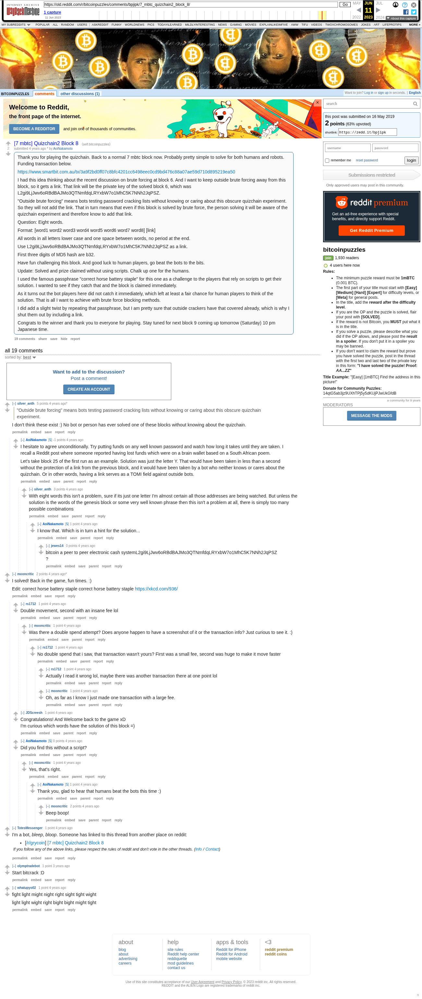

# [7 mbtc] Quizchain2 Block 8

[Original thread](https://www.reddit.com/r/bitcoinpuzzles/comments/bpjipk/7_mbtc_quizchain2_block_8/). The `sourceUrl` of the [quizchain2/8](../../../src/collections/quizchain2/8.ts) record and the source of its question, format, link and hash digits, with the funding transaction, the block 6 key as the link and the solution the author edited in. The full phrase is in the winner's comment. The post went up on May 16, 2019, at 23:05:30 UTC, 11 hours after the block time of its funding transaction. Its last edit is stamped 05:46:15 UTC on May 17, 2019, so the transcript shows the post as it stood after the claim.

## Historical provenance

Provenance rests on the [old.reddit.com capture](https://web.archive.org/web/20230611211021/https://old.reddit.com/r/bitcoinpuzzles/comments/bpjipk/7_mbtc_quizchain2_block_8/), stamped June 11, 2023, 21:10:21 UTC, whose HTML carries the post, which matches the transcript below word for word. It renders 19 comments, and each matches the Arctic Shift record of the same ID by author and text. Only the markdown of links, lists and superscripts renders differently. The capture was read on October 1, 2026. `archive_content: confirmed` on that basis.

The [Arctic Shift](https://arctic-shift.photon-reddit.com/) Reddit archive, read the same day, lists the same 19 comments. The transcript takes every comment, its author, text and score from Arctic Shift and nests them as the capture does.

The record names none of the commenters: nothing on the chain ties a claim to a name.

## Transcript

> Thank you for playing the quizchain. Back to a normal 7 mbtc block now. Probably pretty simple to solve for both humans and robots. Funding transaction below.
>
> https://www.smartbit.com.au/tx/3a9f2bd0ff07c8bfc4201cc6498eec0cd9bd476c88a07ae59d710d895219ea50
>
> I had this idea thinking about the recent discussion on brute forcing at block 6. And I want to keep outside brute forcing away from this block, so it gets a link. That link will be the private key of the solved block 6, which was L2gi9LjJwv6oRBdBAJMo3QTNmfdqLRYxbW7o1MhC5K7NNh2JqPSZ.
>
> "Outside brute forcing" means bots testing password cracking lists without knowing or caring about this obscure quizchain experiment. So they will not add the link. That in turn means that even if this block is solved by brute force, the person solving it will be aware of the quizchain experiment and therefore know to add that link.
>
> Question: Eight words.
>
> Format: [word1 word2 word3 word4 word5 word6 word7 word8] [link]
>
> All words in all letters lower case and one space between words, no period at the end.
>
> Use L2gi9LjJwv6oRBdBAJMo3QTNmfdqLRYxbW7o1MhC5K7NNh2JqPSZ as a link.
>
> First three digits of MD5 hash are b32.
>
> Have fun challenging this block. And good luck to human players, go beat the bots to the bits.
>
> Update: Solved and prize claimed without using scripts. Chalk up one for the humans.
>
> I used the famous passphrase "correct horse battery staple" for this one as a challenge to the players that rely on scripts to get their solution. I wanted to see if they catch that and the block is claimed immediately.
>
> As it turns out the bot players here did not catch it immediately, which left at least a fair chance for human players to think of the solution. That is all I want to achieve with brute force blocking methods.
>
> I did add a slight twist by repeating that passphrase, but I am pretty sure that outside crackers have that covered already, which is why I shut them out by including a link.
>
> Congrats to the winner and thank you to everyone for playing. Stay tuned for next block 9 coming up tomorrow (Saturday) 10 pm Japanese time.

## Comments

**u/silver_anth**, 6 points:

> > "Outside brute forcing" means bots testing password cracking lists without knowing or caring about this obscure quizchain experiment.
>
> I don't think these exist :) No bot or person has ever solved one of these blocks without knowing about the quizchain.

**u/AoiNakamoto**, -1 points, reply to u/silver_anth:

> I hesitate to agree unconditionally. Try putting funds on any well known password and watch how long it takes until they are taken. I recall a Reddit post where someone reported having lost funds which were on a brain wallet based on a South African poem.
>
> Let's take block 25 of the first run as an example. Solution was just the letter Y. That would have been taken in less than a second without the protection of a link from the previous block, and it would have been taken by a bot who neither knows or cares about the quizchain. Or in other words, having a link serves as a TOMI field against outside bots.

**u/silver_anth**, 3 points, reply to u/AoiNakamoto:

> With eight words this isn't a problem, sure if its just one letter I'm almost certain all those addresses are being watched. But unless the solution is the words of the genesis block or some very well known phrase then this isn't a problem at all, there is simply too many possible combinations

**u/AoiNakamoto**, 1 point, reply to u/silver_anth:

> I know that. Which is in turn a hint for the solution...

**u/jewes14**, 0 points, reply to u/AoiNakamoto:

> bitcoin a peer to peer electronic cash systemL2gi9LjJwv6oRBdBAJMo3QTNmfdqLRYxbW7o1MhC5K7NNh2JqPSZ
> ?

**u/mooncritic**, 2 points:

> I solved! Back in the game, fun times. :)
>
> Edit: correct horse battery staple correct horse battery staple [https://xkcd.com/936/](https://xkcd.com/936/)

**u/rs1712**, 1 point, reply to u/mooncritic:

> Double movement, second with an insane fee lol

**u/mooncritic**, 1 point, reply to u/rs1712:

> Was there a double spend attempt? Does anyone happen to have a screenshot of it or the transaction info? Just curious to see it. :)

**u/rs1712**, 1 point, reply to u/mooncritic:

> No double spend that i saw, that transaction wasn't yours? First was a small fee, second was huge to make it move faster

**u/rs1712**, 1 point, reply to u/rs1712:

> Actually I read it wrong lol, maybe there was another transaction there at one point lol

**u/mooncritic**, 1 point, reply to u/rs1712:

> Oh, as far as I know I just made one transaction with a large fee.

**u/JDScreesh**, 1 point, reply to u/mooncritic:

> Congratulations! And Welcome back to the game xD
> I'm curious which words have the solution of this block =)

**u/AoiNakamoto**, 0 points, reply to u/mooncritic:

> Did you find this without a script?

**u/mooncritic**, 1 point, reply to u/AoiNakamoto:

> Yes, that's right.

**u/AoiNakamoto**, 1 point, reply to u/mooncritic:

> Thank you, glad to hear that humans beat the bots this time :)

**u/mooncritic**, 2 points, reply to u/AoiNakamoto:

> Beep boop!

**u/TotesMessenger**, 1 point:

> I'm a bot, _bleep_, _bloop_. Someone has linked to this thread from another place on reddit:
>
> - [/r/grycoin] [\[7 mbtc\] Quizchain2 Block 8](https://www.reddit.com/r/Grycoin/comments/br8340/7_mbtc_quizchain2_block_8/)
>
> _^(If you follow any of the above links, please respect the rules of reddit and don't vote in the other threads.) ^\([Info](/r/TotesMessenger) ^/ ^[Contact](/message/compose?to=/r/TotesMessenger))_

**u/olymptradebot**, 1 point:

> Start bitcrack :D

**u/whatupyo02**, 1 point:

> fight light might night right sight tight wight
>
> light light wight right bight bight might tight

## Screenshot

The screenshot is a render of the archive capture, not of the live page, so it carries the Wayback banner at the top. The "4 years ago" stamps are relative to the capture, June 11, 2023. Capture method and limits: [source archive](../README.md).
