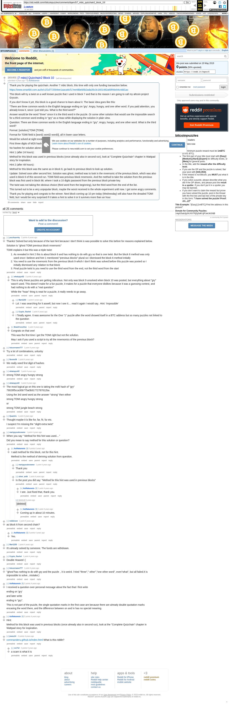

# [7 mbtc] Quizchain2 Block 10

[Original thread](https://www.reddit.com/r/bitcoinpuzzles/comments/bqerv5/7_mbtc_quizchain2_block_10/). The `sourceUrl` of the [quizchain2/10](../../../src/collections/quizchain2/10.ts) record and the source of its question, format, hash digits and both hints, with the funding transaction and the solution the author edited in. The full winning string is in the winner's comment. The post went up on May 19, 2019, at 09:03:47 UTC, 29 hours after the block time of its funding transaction. Its last edit is stamped 04:29:17 UTC on May 22, 2019, so the transcript shows the post as it stood after the claim.

## Historical provenance

Provenance rests on the [old.reddit.com capture](https://web.archive.org/web/20230611215917/https://old.reddit.com/r/bitcoinpuzzles/comments/bqerv5/7_mbtc_quizchain2_block_10/), stamped June 11, 2023, 21:59:17 UTC, whose HTML carries the post, which matches the transcript below word for word. It renders 25 comments, and each matches the Arctic Shift record of the same ID by author and text. Only the markdown of links, lists and superscripts renders differently. The capture was read on October 1, 2026. `archive_content: confirmed` on that basis.

The [Arctic Shift](https://arctic-shift.photon-reddit.com/) Reddit archive, read the same day, lists 32 comments, seven more than the capture carries with an ID: all seven deleted. The transcript takes every comment, its author, text and score from Arctic Shift and nests them as the capture does. Seven of them are deleted comments, kept below as `[deleted]`.

The record names none of the commenters: nothing on the chain ties a claim to a name.

## Transcript

> Thank you for playing the quizchain. Another 7 mbtc block, this time with only one funding transaction below.
>
> https://www.smartbit.com.au/tx/c1f1d772594ee1aaca6cf17ee48beb5b2ada35c3c1601482a69f46e94c4dd1ac
>
> This block will try a twist on a well known puzzle that I used in block 7 and that is the reason I am going to call my altcoin project Grycoin.
>
> If you don't know it yet, this block is a good chance to learn about it. The basic idea goes like this:
>
> "There are three common words in the English language ending on 'gry'. Angry, hungry, and one other word. If you paid attention, you already know it, since I just told you. What is the third word?"
>
> Answer would be the word "three" since it is the third word in the puzzle. Or some other solution that would use the impossible search for a third common word ending in "gry" as a Hoax while displaying the solution in plain view.
>
> Question: There are three common words in the English language ending in "gry". Angry, hungry, and one other word. What is the third word?
>
> Format: [solution] TOMI [TOMI]
>
> Format for TOMI field is [word1 word2 word3], all in lower case letters.
>
> Would be solved at sight except for the slight extra twist that I included.
>
> First three digits of MD5 hash are a5b.
>
> No hashes for solution alone or TOMI field alone, since this easy block would be brute forced too easily with that information.
>
> Hint 1 (after 24 hours):
>
> Method for this block was used in previous blocks (once already also in second run), look at "Complete Quizchain" chapter in Wattpad story for inspiration.
>
> Hint 2 (after 48 hours):
>
> Method for this block was the same as in block 6, go back to previous block to look up solution.
>
> Update: Solved soon after second hint. Solution was ghost, method was to look in the mnemonic of the previous block, which was also used in block 6 of this second run. TOMI field was previous block mnemonic. And the method to take the solution from the previous block was first used in block 68, where I took a 10 digits password from the previous block private key.
>
> The twist was not taking the obvious choice (third word from the beginning), but the third word from the end of the list.
>
> This turned out to be a very unpopular block, maybe the worst received in the whole experiment until now. I got some angry comments.
>
> Thank you for playing and congrats to the winner. Next block coming up 10 pm today (Wednesday) will also have the dreaded TOMI field, but I would be very surprised if it takes a hint to solve it or it survives more than an hour.

## Comments

**u/puzzleponky**, 2 points:

> Thanks! Solved but only because of the last hint because I don't think is was possible to solve this before for reasons explained below.
>
> Solution is "ghost TOMI previous block mnemonic"
>
> TOMI explains it but this was a triple twist:
>
> 1. As revealed in hint 2 this is about block 6 and has nothing to do with gry so that is one twist. But the block 6 method was only used once I believe and hint 1 mentioned "previous blocks" plural so I dismissed the block 6 method initially
> 2. You need to use the mnemonic from the previous block 9 which I don't think was solved before this puzzle was posted so I initially dismissed any relation to that block
> 3. Final puzzle twist is you need to use the third word from the end, not the third word from the start

**u/whatupyo02**, 3 points, reply to u/puzzleponky:

> This is why these puzzles are getting ridiculous. Not only was block 9 unsolved when block 10 was posted, but everything about "gry" wasn't used. This doesn't make for a fun puzzle, it makes for a puzzle that everyone dislikes because it was a guessing contest, and had nothing to do with a "real question"
>
> While the "hoax" thing is neat for a puzzle, it really needs to go away.

**u/Mart1250**, 1 point, reply to u/whatupyo02:

> Lol. I was searching for it aswell, but now i see it.... read it again I would say.. Hint: 'impossible'

**u/Crypto_Rachel**, 1 point, reply to u/whatupyo02:

> I Totally agree. It was awesome for the One "1" puzzle after the word showed itself in a BTC address but so many puzzles not linked to the question

**[deleted]**, reply to u/whatupyo02:

> [deleted]

**u/BrainForceOne**, 1 point, reply to u/puzzleponky:

> Congrats on that one!
>
> This was the first time i got the TOMI right but not the solution.
>
> May I ask if you used a script to try all the mnemonics of the previous block?

**u/lolusername777**, 1 point:

> Try a lot of combinations, unlucky

**u/Noomr06**, 1 point:

> We really need first digit of hashes

**u/whatupyo02**, 1 point:

> strong TOMI angry hungry strong

**u/whatupyo02**, 1 point:

> The most logical go on this one is taking the md5 hash of "gry"
> 79026f5cca30b775a0b91772787612ba
>
> Using the 3rd seed word as the answer "strong" then either
>
> strong TOMI angry hungry strong
>
> or
>
> strong TOMI jungle beach strong

**u/Quantris**, 1 point:

> Thought maybe it is like for, far, fir, fur etc.
>
> I suspect I'm missing the "slight extra twist"

**u/martypyouknowme**, 1 point:

> When you say " Method for this hint was used...."
>
> Did you mean to say method for this solution or question?

**u/AoiNakamoto**, 0 points, reply to u/martypyouknowme:

> I said method for this block, not for this hint.
>
> Method is the method of deriving solution from question.

**u/martypyouknowme**, 1 point, reply to u/AoiNakamoto:

> Thank you

**u/silver_anth**, 1 point, reply to u/AoiNakamoto:

> In the post you did say: "Method for this hint was used in previous blocks"

**u/AoiNakamoto**, 1 point, reply to u/silver_anth:

> I see. Just fixed that, thank you.

**[deleted]**, reply to u/AoiNakamoto:

> [deleted]

**u/AoiNakamoto**, 1 point, reply to a deleted comment:

> Coming up in about 10 minutes.

**u/reddeneer**, 1 point:

> as block 6 from second chain?

**u/AoiNakamoto**, 0 points, reply to u/reddeneer:

> Yes.

**u/Mart1250**, 1 point:

> It's already solved by someone. The funds are withdrawn.

**u/Crypto_Rachel**, 1 point:

> Double Hoaxed :(

**u/lolusername777**, 1 point:

> "ghost"has nothing to do with gry and the puzzle，it is weird. l tried "three"," other","one other word", even"what", but all failed.It is impossible to solve...mistake:)

**u/AoiNakamoto**, 0 points:

> I received a question over personal message about the fact that I first write
>
> ending on 'gry'
>
> and later write
>
> ending in "gry".
>
> This is not part of the puzzle, the single quotation marks in the first case are because there are already double quotation marks encasing the word there, and the difference between on and in has no special meaning.

**u/AoiNakamoto**, 0 points:

> Hint:
>
> Method for this block was used in previous blocks (once already also in second run), look at the "Complete Quizchain" chapter in Wattpad story for inspiration.

**[deleted]**, reply to u/AoiNakamoto:

> [deleted]

**u/jewes14**, -3 points:

> [commanderu.github.io/index.html](https://commanderu.github.io/index.html) What is this riddle?

**u/rs1712**, 2 points, reply to u/jewes14:

> a scam is what it is

**[deleted]**:

> [deleted]

**[deleted]**:

> [deleted]

**[deleted]**:

> [deleted]

**[deleted]**:

> [deleted]

## Screenshot

The screenshot is a render of the archive capture, not of the live page, so it carries the Wayback banner at the top. The "4 years ago" stamps are relative to the capture, June 11, 2023. Capture method and limits: [source archive](../README.md).
