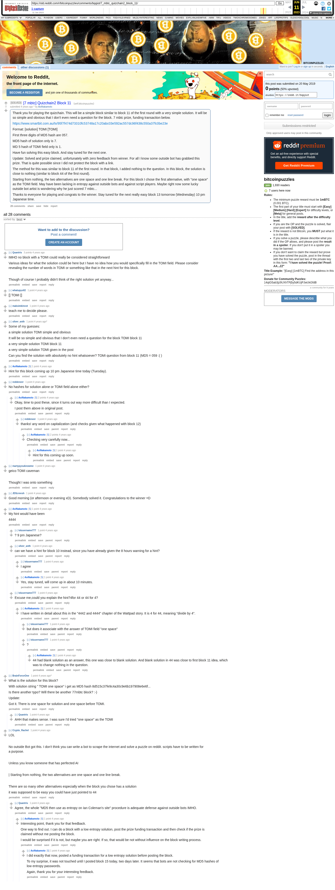

# [7 mbtc] Quizchain2 Block 11

[Original thread](https://www.reddit.com/r/bitcoinpuzzles/comments/bqqiot/7_mbtc_quizchain2_block_11/). The `sourceUrl` of the [quizchain2/11](../../../src/collections/quizchain2/11.ts) record and the source of its format, hash digits and funding transaction, with the solution the author edited in after the claim. The spacing of the winning string, one space for the solution and one before TOMI, is in u/BrainForceOne's comment. The post went up on May 20, 2019, at 03:56:31 UTC, 15 hours after the block time of its funding transaction. Its last edit is stamped 13:19:24 UTC on May 21, 2019, so the transcript shows the post as it stood after the claim.

## Historical provenance

Provenance rests on the [old.reddit.com capture](https://web.archive.org/web/20230611193159/https://old.reddit.com/r/bitcoinpuzzles/comments/bqqiot/7_mbtc_quizchain2_block_11/), stamped June 11, 2023, 19:31:59 UTC, whose HTML carries the post, which matches the transcript below word for word. It renders 28 comments, and each matches the Arctic Shift record of the same ID by author and text. Only the markdown of links, lists and superscripts renders differently. The capture was read on October 1, 2026. `archive_content: confirmed` on that basis.

The [Arctic Shift](https://arctic-shift.photon-reddit.com/) Reddit archive, read the same day, lists 32 comments, four more than the capture carries with an ID: all four deleted. The transcript takes every comment, its author, text and score from Arctic Shift and nests them as the capture does. The [pullpush](https://pullpush.io/) Reddit archive gives the same post text, time and edit stamp, and the same 32 comments with the same authors, times, scores and parents. Their bodies differ only in how the empty `&#x200B;` paragraph in three comments is escaped, and the transcript leaves those empty paragraphs out. The deleted comments are kept below as `[deleted]`.

The record names none of the commenters: nothing on the chain ties a claim to a name.

## Transcript

> Thank you for playing the quizchain. This will be a simple block similar to block 11 of the first round with a very simple solution. It will be so simple and obvious that I don't even need a question for the block. 7 mbtc prize, funding transaction below.
>
> https://www.smartbit.com.au/tx/95f7f474d73310fc53748a17c20abc03e592ac557dc96f438c550a37fc0be23e
>
> Format: [solution] TOMI [TOMI]
>
> FIrst three digits of MD5 hash are 057.
>
> MD5 hash of solution only is 7.
>
> MD 5 hash of TOMI field only is 1.
>
> Have fun solving this easy block. And stay tuned for the next one.
>
> Update: Solved and prize claimed, unfortunately with zero feedback from winner. For all I know some outside bot has grabbed this prize. That is quite possible since I did not protect the block with a link.
>
> The method for this was similar to block 11 of the first round. In that block, I added nothing to the question. In this block, the solution is close to nothing (similar to block 44 of the first round).
>
> Starting from nothing, the two alternatives are one space and one line break. For this block I chose the first alternative, with "one space" as the TOMI field. May have been lacking in entropy against outside bots and against script players. Maybe right now some lucky outside bot artist is wondering why he just scored 7 mbtc...
>
> Thanks to everyone for playing and congrats to the winner. Stay tuned for the next really easy block 13 tomorrow (Wednesday) 10 pm Japanese time.

## Comments

**u/Quantris**, 3 points:

> IMHO no block with a TOMI could really be considered straightforward
>
> Various ideas for what the solution could be here but I have no idea how you would specifically fill in the TOMI field. Please consider revealing the number of words in TOMI or something like that in the next hint for this block.
>
> Though of course I probably didn't think of the right solution yet anyway...

**u/whatupyo02**, 1 point:

> \[\] TOMI \[\]

**u/maksimkinvot**, 1 point:

> teach me to decide please.

**u/silver_anth**, 1 point:

> Some of my guesses:
>
> a simple solution TOMI simple and obvious
>
> It will be so simple and obvious that I don't even need a question for the block TOMI block 11
>
> a very simple solution TOMI block 11
>
> a very simple solution TOMI given in the post
>
> Can you find the solution with absolutely no hint whatsoever? TOMI question from block 11 (MD5 = 059 :( )

**u/AoiNakamoto**, 1 point:

> Hint for this block coming up 10 pm Japanese time today (Tuesday).

**u/reddeneer**, 1 point:

> No hashes for solution alone or TOMI field alone either?

**u/AoiNakamoto**, 2 points, reply to u/reddeneer:

> Okay, time to post these, since it turns out way more difficult than I expected.
>
> I post them above in original post.

**u/reddeneer**, 1 point, reply to u/AoiNakamoto:

> thanks! any word on capitalization (and checks given what happened with block 12)

**u/AoiNakamoto**, 2 points, reply to u/reddeneer:

> Checking very carefully now...

**u/AoiNakamoto**, 1 point, reply to u/AoiNakamoto:

> Hint for this coming up soon.

**[deleted]**, reply to u/AoiNakamoto:

> [deleted]

**u/martypyouknowme**, 1 point:

> geico TOMI caveman
>
> Thought I was onto something

**u/JDScreesh**, 1 point:

> Good morning (or afternoon or evening xD). Somebody solved it. Congratulations to the winner =D

**u/AoiNakamoto**, 1 point:

> My hint would have been
>
> 4444

**u/lolusername777**, 1 point, reply to u/AoiNakamoto:

> ? 9 pm Japanese?

**u/silver_anth**, 1 point, reply to u/AoiNakamoto:

> can we have a hint for block 10 instead, since you have already given the 8 hours warning for a hint?

**u/lolusername777**, 1 point, reply to u/silver_anth:

> I agree

**u/AoiNakamoto**, 1 point, reply to u/silver_anth:

> Yes, stay tuned, will come up in about 10 minutes.

**u/lolusername777**, 1 point, reply to u/AoiNakamoto:

> Excuse me,could you explain the hint?4for 44 or 44 for 4?

**u/AoiNakamoto**, 1 point, reply to u/lolusername777:

> I have written in detail about this in the "4442 and 4444" chapter of the Wattpad story. It is 4 for 44, meaning "divide by 4".

**u/lolusername777**, 1 point, reply to u/AoiNakamoto:

> but does it associate with the answer of TOMI field "one space"

**u/lolusername777**, 1 point, reply to u/AoiNakamoto:

> ?

**u/AoiNakamoto**, 1 point, reply to u/lolusername777:

> 44 had blank solution as an answer, this one was close to blank solution. And blank solution in 44 was close to first block 11 idea, which was to change nothing in the question.

**u/BrainForceOne**, 1 point:

> What is the solution for this block?
>
> With solution string " TOMI one space" i get as MD5 hash 8d515c37fe9c4a30c9e6b197908e6e6f...
>
> Is there another typo? Will there be another 77mbtc block? :-)
>
> Update:
>
> Got it. There is one space for solution and one space before TOMI.

**u/Quantris**, 1 point, reply to u/BrainForceOne:

> AHH that makes sense. I was sure I'd tried "one space" as the TOMI

**u/Crypto_Rachel**, 1 point:

> LOL
>
> No outside Bot got this. I don't think you can write a bot to scrape the internet and solve a puzzle on reddit. scripts have to be written for a purpose.
>
> Unless you know someone that has perfected AI
>
> | Starting from nothing, the two alternatives are one space and one line break.
>
> There are so many other alternatives especially when the block you chose has a solution
>
> it was supposed to be easy you could have just pointed to 44

**u/Quantris**, 1 point, reply to u/Crypto_Rachel:

> Agree, the whole "MD5 then use as entropy on Ian Coleman's site" procedure is adequate defense against outside bots IMHO.

**u/AoiNakamoto**, 1 point, reply to u/Quantris:

> Interesting point, thank you for that feedback.
>
> One way to find out. I can do a block with a low entropy solution, post the prize funding transaction and then check if the prize is claimed without me posting the block.
>
> I would be surprised if it is not, but maybe you are right. If so, that would be not without influence on the block writing process.

**[deleted]**, reply to u/AoiNakamoto:

> [deleted]

**u/AoiNakamoto**, 1 point, reply to u/AoiNakamoto:

> I did exactly that now, posted a funding transaction for a low entropy solution before posting the block.
>
> To my surprise, it was not touched until I posted block 15 today, two days later. It seems that bots are not checking for MD5 hashes of low entropy passwords.
>
> Again, thank you for your interesting feedback.

**[deleted]**:

> [deleted]

**[deleted]**:

> [deleted]

## Screenshot

The screenshot is a render of the archive capture, not of the live page, so it carries the Wayback banner at the top. The "4 years ago" stamps are relative to the capture, June 11, 2023. Capture method and limits: [source archive](../README.md).
