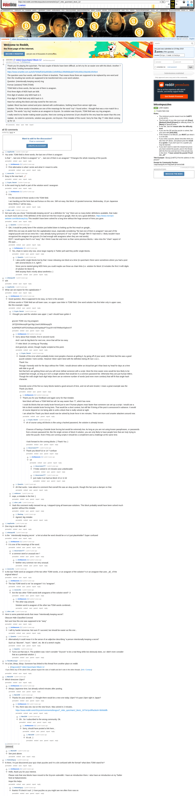

# [7 mbtc] Quizchain2 Block 12

[Original thread](https://www.reddit.com/r/bitcoinpuzzles/comments/br2rys/7_mbtc_quizchain2_block_12/). The `sourceUrl` of the [quizchain2/12](../../../src/collections/quizchain2/12.ts) record and the source of its question, format, hash digits and both updates, with the author's hints in the comments. The capitalization hint in one of those replies was wrong, and the second update says so. u/Crypto_Rachel's comment prints the winning string, the address and the WIF. The entropy hash is not printed: the record reconstructs it from the corrected solution, and it derives that WIF. The post went up on May 20, 2019, at 23:08:52 UTC, eleven hours after the block time of its funding transaction. Its last edit is stamped 08:55:00 UTC on May 21, 2019, so the transcript shows the post as it stood after the claim.

## Historical provenance

Provenance rests on the [old.reddit.com capture](https://web.archive.org/web/20230611175459/https://old.reddit.com/r/bitcoinpuzzles/comments/br2rys/7_mbtc_quizchain2_block_12/), stamped June 11, 2023, 17:54:59 UTC, whose HTML carries the post, which matches the transcript below word for word. It renders 50 comments, and each matches the Arctic Shift record of the same ID by author and text. Only the markdown of links, lists and superscripts renders differently. The capture was read on October 1, 2026. `archive_content: confirmed` on that basis.

The [Arctic Shift](https://arctic-shift.photon-reddit.com/) Reddit archive, read the same day, lists 52 comments, two more than the capture carries with an ID: all two deleted. The transcript takes every comment, its author, text and score from Arctic Shift and nests them as the capture does. The [pullpush](https://pullpush.io/) Reddit archive gives the same post text, time and edit stamp, and the same 52 comments with the same authors, times, scores and parents. Their bodies differ only in how the empty `&#x200B;` paragraph in three comments is escaped, and the transcript leaves those empty paragraphs out. The deleted comments are kept below as `[deleted]`.

The record names none of the commenters: nothing on the chain ties a claim to a name.

## Transcript

> Thank you for playing the quizchain. The last couple of blocks have been difficult, so let's try for an easier one with this block. Another 7 mbtc block, funding transaction below.
>
> https://www.smartbit.com.au/tx/b7939af53e5a465d8e12efef65ba13f9d96bbab87045c83fa11fda34b16545e4
>
> The question uses four words, with three of them in brackets. That means those three are supposed to be replaced by one word and then the resulting two words are supposed to be transformed into a one word solution.
>
> Question: (intentionally keeping secret) ring
>
> Format: [solution] TOMI [TOMI]
>
> TOMI field is three words, the last one of them is anagram.
>
> First three digits of MD5 hash are b08.
>
> First digit of solution only MD5 hash is 0.
>
> First digit of TOMI field only MD5 hash is 3.
>
> Have fun solving this block and stay tuned for the next one.
>
> Update: Block has been solved and prize claimed with confirmations. Nothing heard from winner right now.
>
> Solution: The three words in brackets are one of the meanings for the word "coy" I found online. I thought that was a nice match for a puzzle. The words "coy ring" resolve as an anagram to Grycoin. So solution was Grycoin, TOMI field was coy ring anagram.
>
> I really need to try harder making easier puzzles. Next one coming up tomorrow 10 pm should for the very least be easier than this one.
>
> Update:. As noted in comments, solution was grycoin, not Grycoin. First mistake of this round. Sorry for that. Big 77 mbtc block coming up for 14.

## Comments

**u/mapl3sn0w**, 3 points:

> You write: TOMI field is three words, the last one of them is anagram
>
> Is that "... last one of them is anagram" or "... last one of them is an anagram" ?Changes the whole meaning of the puzzle.

**u/AoiNakamoto**, 2 points, reply to u/mapl3sn0w:

> First alternative is what I wrote and what it I meant to write.

**u/mooncritic**, 2 points:

> Easy is the new hard. 📈

**u/Crypto_Rachel**, 2 points:

> Is the word ring by itself or part of the solution word / anangram

**[deleted]**, reply to u/Crypto_Rachel:

> [deleted]

**u/AoiNakamoto**, 2 points, reply to u/Crypto_Rachel:

> It is.
>
> It is the second of three words in the TOMI field.
>
> I am handing out the hints fast and furious on this one. Still not easy. But block 13 (posted tomorrow, Wednesday, 10 pm Japanese time) REALLY will be easy...

**u/silver_anth**, 2 points:

> Not sure why you chose "intentionally keeping secret" as a definition for "coy" there are so many better definitions available, that make so much more sense. If the definition of the word isn't the first result on google, then its not a good definition. https://www.merriam-webster.com/dictionary/coy This wouldn't have been solved for a long time without the huge amount of hints you gave.

**u/Quantris**, 2 points, reply to u/silver_anth:

> IDK, it would be pretty lame if the solution just boiled down to looking up the first result on google...
>
> IMHO this one was ok aside from the capitalization issue, especially considering "the last one of them is anagram" was part of the original puzzle and not an extra hint. I was already trying synonyms of "coy" myself. Though TBH if I had tried it, I likely wouldn't have recognized the anagram into grycoin (I'm bad enough with anagrams when they are real words)
> EDIT: I would agree that it's not "easy". But I think it was fair and more so than some previous blocks. I also miss the "chain" aspect of this quiz....

**u/AoiNakamoto**, 1 point, reply to u/Quantris:

> Yes, chain in name only now, since large majority in Twitter poll said they prefer single blocks.

**u/Quantris**, 1 point, reply to u/AoiNakamoto:

> I also prefer single blocks but by that I mean releasing one block at a time (in quizchain1 there were sometimes where you had a post with several blocks in it, right?)
>
> Since you've started giving MD5 hints you could maybe use those as chain links (i.e. solution for block 10 includes the first 3 md5 digits of solution for block 9).
> Well anyway that's mostly about aesthetics :)

**u/whatupyo02**, 1 point:

> w0t

**u/mapl3sn0w**, 1 point:

> What can we expect for the capitalization ?

**u/AoiNakamoto**, 0 points, reply to u/mapl3sn0w:

> Good question, this is supposed to be easy, so here is the answer.
>
> All three words in TOMI field are all lower case, no upper case letter in TOMI field. One word solution has first letter only in upper case, like this example: Upper.

**u/Crypto_Rachel**, 1 point, reply to u/AoiNakamoto:

> I thought you said the solution was upper :( sad I should have gotten it
>
> grycoin TOMI coy ring anagram
>
> 187Q5XNNezeyBYgwY8gL2swXUWtWvwyqZ6
>
> KzWPBGPJsFFDXGRawczb5XqsMauPTXzpJ5YrXkTRNfwchSpkmrXT

**u/AoiNakamoto**, 2 points, reply to u/Crypto_Rachel:

> Sorry about that mistake, first in second round.
>
> And I cant do big block for next one, since that will be too easy.
>
> 77 mbtc block 14 coming up Thursday.
>
> And good job, winner, though maybe scripted at this point.

**u/Crypto_Rachel**, 1 point, reply to u/AoiNakamoto:

> Outside of the error which probably broke most peoples chances at getting it, by going off of your word, I did think that this was a good puzzle solution / tomi combo. However Silver said it best with the definition being off, but i.i.w.i.i..
>
> Thank You
>
> Though I honestly wish for the days without the TOMI, I would almost rather an Actual bot get it than beat my head for days at a time with little to go off.
> Not that bot's are getting these and you will never defeat someone with a script. Most the time easier ones would be less likely to be scripted fast enough, as long as it isn't a single solution that would be in a common password list. Otherwise they are just human killers. Though the md5 single hash digit helps there are an extreme number of words (and even more combos) that will fit that single hash character.
>
> Honestly some of the first so many blocks lasted a good amount of time, and not all were bruted, I mean a great example was the Thank you block.

**u/AoiNakamoto**, 3 points, reply to u/Crypto_Rachel:

> Thank you for your feedback and again sorry for that mistake.
>
> Next block will have a TOMI field but will. be way easier than 77, which has none.
>
> I could do blocks that are easily brute forced just to see if human players react faster than someone can set up a script. I would use a link to block outside brute forcing bots. That would be a short contest, but still fair if timing of the post is announced in advance. It would of course depend on me being able to write a block that is really solved at sight.
>
> I am afraid the Thank you block would now be solved by brute force in ten minutes. There are more and smarter attackers around now.

**u/Crypto_Rachel**, 1 point, reply to u/AoiNakamoto:

> oh of course using old blocks is like using a hacked password, the solution is already known.
>
> Chances of having a Outside brute forcing bot would be extremely low. As long as you are not using known passphrases, or passwords from a known password list, like the single version of block 8 solution, you are only likely to have people here that are truly trying to solve the puzzle. Even if they are running scripts it should be a compliment and a challenge at the same time.
>
> I look forward to the coming blocks :) Thank You :)

**u/lolusername777**, 1 point, reply to u/AoiNakamoto:

> Thank you block?13 or 14 ? confuse

**u/AoiNakamoto**, 1 point, reply to u/lolusername777:

> 14

**u/lolusername777**, 1 point, reply to u/AoiNakamoto:

> 77mbtc solved in 10 minutes
> wow unbelievable

**u/lolusername777**, 1 point, reply to u/AoiNakamoto:

> just make it as hard as block 10 or 11 lol

**u/Quantris**, 1 point, reply to u/Crypto_Rachel:

> Ah that sucks. I was about to comment that overall this was an okay puzzle, though this fact puts a damper on that.

**u/reddeneer**, 1 point, reply to u/AoiNakamoto:

> oops, a mistake in the hint :)

**u/silver_anth**, 1 point, reply to u/AoiNakamoto:

> Yeah this comment really messed me up, I stopped trying all lowercase solutions. This block probably would have been solved much quicker without this mistake

**u/Maxibag**, 1 point, reply to u/silver_anth:

> Agreed, big mistake.

**u/mapl3sn0w**, 1 point:

> One ring to rule them all !

**u/whatupyo02**, 1 point:

> Is the \` intentionally keeping secret \` a hint at what the word should be or is it just placeholder? Super confused

**u/AoiNakamoto**, 2 points, reply to u/whatupyo02:

> It is one of the meanings of the word.

**u/lolusername777**, 1 point, reply to u/AoiNakamoto:

> a common word or unusual one？

**u/AoiNakamoto**, 2 points, reply to u/lolusername777:

> Neither very common nor very unusual.

**u/mooncritic**, 1 point:

> Is the last TOMI word an anagram of the two other TOMI words, or an anagram of the solution? Is it an anagram that uses \_all\_ of the original letters?

**u/AoiNakamoto**, 2 points, reply to u/mooncritic:

> The last TOMI word is not "an anagram" it is "anagram".

**u/mooncritic**, 1 point, reply to u/AoiNakamoto:

> Are the two other TOMI words both anagrams of the solution word? :3

**u/AoiNakamoto**, 2 points, reply to u/mooncritic:

> The other way around.
>
> Solution word is anagram of the other two TOMI words combined...

**u/silver_anth**, 1 point:

> Here is some potential words that mean "intentionally keeping secret":
>
> Obscure
> Hide
> Classified
> Conceal
>
> Not sure how this one was supposed to be "easy"

**u/AoiNakamoto**, 2 points, reply to u/silver_anth:

> I will try harder tomorrow. Not sure if I succeed, but should be easier as this one...

**u/Quantris**, 1 point, reply to u/silver_anth:

> Alternatively it could mean it in the sense of an adjective describing "a person intentionally keeping a secret"
>
> Such as "discreet", "mum", "silent", etc. Bit of a stretch maybe.

**u/Quantris**, 1 point, reply to u/Quantris:

> Turns out that was it. The problem was I don't consider "Grycoin" to be a real thing while Aoi obviously does, so I didn't even consider that as a potential solution :)

**u/TotesMessenger**, 1 point:

> I'm a bot, _bleep_, _bloop_. Someone has linked to this thread from another place on reddit:
>
> - [/r/grycoin] [\[7 mbtc\] Quizchain2 Block 12](https://www.reddit.com/r/Grycoin/comments/br83xh/7_mbtc_quizchain2_block_12/)
>
> _^(If you follow any of the above links, please respect the rules of reddit and don't vote in the other threads.) ^\([Info](/r/TotesMessenger) ^/ ^[Contact](/message/compose?to=/r/TotesMessenger))_

**u/Mart1250**, 1 point:

> Which timezone 10pm?

**u/AoiNakamoto**, 2 points, reply to u/Mart1250:

> Always Japanese time, but already solved minutes after posting.

**u/Mart1250**, 1 point, reply to u/AoiNakamoto:

> Thanks for your answer! :) I thought there would be a new one today 10pm? It's past 10pm right in Japan?

**u/AoiNakamoto**, 1 point, reply to u/Mart1250:

> Yes, there was one, but on the new forum. Was solved in 2 minutes.
>
> https://www.reddit.com/r/Grycoin/comments/brogvu/7_mbtc_quizchain2_block_13/?st=jvz8fha3&sh=3b56ddfb

**u/Mart1250**, 1 point, reply to u/AoiNakamoto:

> Oh.. So I subscribed to the wrong community. Ok.

**u/AoiNakamoto**, 1 point, reply to u/Mart1250:

> Sorry, should have posted a link here...

**u/Mart1250**, 1 point, reply to u/AoiNakamoto:

> It's ok. :)

**u/thatmathguyy**, 1 point:

> hi there, I'm just discovered your quiz chain puzzles and I'm a bit confused with the format? what does TOMI stand for?

**u/AoiNakamoto**, 1 point, reply to u/thatmathguyy:

> Hello, thank you for your interest.
>
> Please note that new blocks have moved to the Grycoin subreddit. I have an introduction there. I also have an introduction at my Twitter feed at NakamotoAoi.
>
> Hope this helps.

**u/thatmathguyy**, 1 point, reply to u/AoiNakamoto:

> thanks! I'll check it out! :)
> I love puzzles so you might see me often from now on

**[deleted]**:

> [deleted]

**u/Mart1250**, 1 point, reply to a deleted comment:

> See post above.

## Screenshot

The screenshot is a render of the archive capture, not of the live page, so it carries the Wayback banner at the top. The "4 years ago" stamps are relative to the capture, June 11, 2023. Capture method and limits: [source archive](../README.md).
