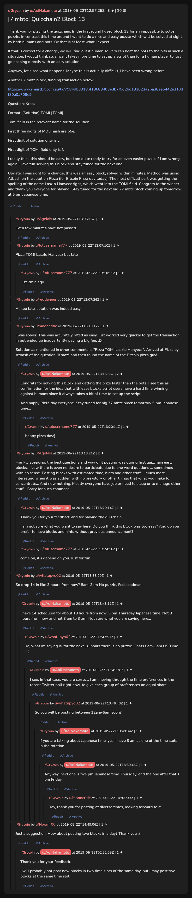

# [7 mbtc] Quizchain2 Block 13

[Original thread](https://www.reddit.com/r/Grycoin/comments/brogvu/7_mbtc_quizchain2_block_13/). The `sourceUrl` of the [quizchain2/13](../../../src/collections/quizchain2/13.ts) record and the source of its question, format, hash digits and funding transaction, with the solution the author edited in. The full winning string is in u/mooncritic's comment. This is the first block the author posted on r/Grycoin instead of r/bitcoinpuzzles. The post went up on May 22, 2019, at 12:57:25 UTC, 30 hours after the block time of its funding transaction. Its last edit is stamped 13:17:27 UTC the same day, so the transcript shows the post as it stood after the claim.

## Historical provenance

No capture found. On October 1, 2026 the Wayback Machine index listed one capture of the thread, of the `www.reddit.com` URL, June 11, 2023, 21:08:04 UTC, and none of the `old.reddit.com` URL. Its `id_` body is Reddit's app shell titled "Reddit - Dive into anything", with neither the post nor a comment in its HTML. The archive.today timemaps for the `www.reddit.com`, `old.reddit.com` and bare `reddit.com` URLs answered 404. MemGator answered "No snapshots" for all three, but it gave the same answer for the block 11 thread, whose Wayback capture exists, so it settles nothing here.

The transcript below comes from the [Arctic Shift](https://arctic-shift.photon-reddit.com/) Reddit archive: the post record and the comment tree for `brogvu`, read on October 1, 2026. The [pullpush](https://pullpush.io/) Reddit archive, read the same day, gives the same post text, time and edit stamp, and the same 20 comments with the same authors, times, scores and parents.

The record names none of the commenters: nothing on the chain ties a claim to a name.

## Transcript

> Thank you for playing the quizchain. In the first round I used block 13 for an impossible to solve puzzle. In contrast this time around I want to do a nice and easy puzzle which will be solved at sight by both humans and bots. Or that is at least what I expect.
>
> If that is correct for a change, we will find out if human solvers can beat the bots to the bits in such a situation. I would think so, since it takes more time to set up a script than for a human player to just go hashing directly with an easy solution.
>
> Anyway, let's see what happens. Maybe this is actually difficult, I have been wrong before.
>
> Another 7 mbtc block, funding transaction below.
>
> https://www.smartbit.com.au/tx/7984db3918bf18688403e3b7f5d2bd133023a2ba38ea5442e310df80a0a708e5
>
> Question: Kraaz
>
> Format: [Solution] TOMI [TOMI]
>
> Tomi field is the relevant name for the solution.
>
> First three digits of MD5 hash are b5e.
>
> First digit of solution only is c.
>
> First digit of TOMI field only is f.
>
> I really think this should be easy, but I am quite ready to try for an even easier puzzle if I am wrong again. Have fun solving this block and stay tuned for the next one.
>
> Update: I was right for a change, this was an easy block, solved within minutes. Method was using Atbash on the solution Pizza (for Bitcoin Pizza day today). The most difficult part was getting the spelling of the name Laszlo Hanyecz right, which went into the TOMI field. Congrats to the winner and thank you everyone for playing. Stay tuned for the next big 77 mbtc block coming up tomorrow at 5 pm Japanese time.

## Comments

**u/Agelais**, 1 point:

> Even few minutes have not passed.

**u/lolusername777**, 1 point:

> Pizza TOMI Laszlo Hanyecz
> but late

**u/lolusername777**, 1 point, reply to u/lolusername777:

> just 2min ago

**u/reddeneer**, 1 point:

> Ai, too late, solution was indeed easy

**u/mooncritic**, 1 point:

> I was solver. This was accurately rated as easy, just worked very quickly to get the transaction in but ended up inadvertently paying a big fee. :D
>
> Solution as mentioned in other comments is "Pizza TOMI Laszlo Hanyecz". Arrived at Pizza by Atbash of the question "Kraaz" and then found the name of the Bitcoin pizza guy!

**u/AoiNakamoto**, 2 points, reply to u/mooncritic:

> Congrats for solving this block and getting the prize faster than the bots. I see this as confirmation for the idea that with easy blocks script users have a hard time winning against humans since it always takes a bit of time to set up the script.
>
> And happy Pizza day everyone. Stay tuned for big 77 mbtc block tomorrow 5 pm Japanese time...

**u/lolusername777**, 1 point, reply to u/AoiNakamoto:

> happy pizza day:)

**u/Agelais**, 2 points:

> Frankly speaking, the best questions and way of it posting was during first quizchain early blocks... Now there is even no desire to participate due to one word quetions ... sometimes with no sense. Posting blocks with estimated time, hints and other stuff ... Much more interesting when it was sudden with no pre-story or other things that what you make to concentrate... And now nothing. Mostly everyone have job or need to sleep or to manage other stuff... Sorry for such comment.

**u/AoiNakamoto**, 1 point, reply to u/Agelais:

> Thank you for your feedback and for playing the quizchain.
>
> I am not sure what you want to say here. Do you think this block was too easy? And do you prefer to have blocks and hints without previous announcement?

**u/lolusername777**, 1 point, reply to u/Agelais:

> come on, it's depend on you. Just for fun

**u/whatupyo02**, 1 point:

> So drop 14 in like 3 hours from now? 8am-3am No puzzle, Feelsbadman.

**u/AoiNakamoto**, 1 point, reply to u/whatupyo02:

> I have 14 scheduled for about 18 hours from now, 5 pm Thursday Japanese time. Not 3 hours from now and not 8 am to 3 am. Not sure what you are saying here...

**u/whatupyo02**, 1 point, reply to u/AoiNakamoto:

> Ya, what Im saying is, for the next 18 hours there is no puzzle. Thats 8am-3am US Time =(

**u/AoiNakamoto**, 1 point, reply to u/whatupyo02:

> I see. In that case, you are correct. I am moving through the time preferences in the recent Twitter poll right now, to give each group of preferences an equal share.

**u/whatupyo02**, 1 point, reply to u/AoiNakamoto:

> So you will be posting between 12am-6am soon?

**u/AoiNakamoto**, 1 point, reply to u/whatupyo02:

> If you are talking about Japanese time, yes, I have 8 am as one of the time slots in the rotation.

**u/AoiNakamoto**, 1 point, reply to u/AoiNakamoto:

> Anyway, next one is five pm Japanese time Thursday, and the one after that 1 pm Friday.

**u/mooncritic**, 1 point, reply to u/AoiNakamoto:

> Yay, thank you for posting at diverse times, looking forward to it!

**u/Noomr06**, 1 point:

> Just a suggestion: How about posting two blocks in a day? Thank you :)

**u/AoiNakamoto**, 1 point, reply to u/Noomr06:

> Thank you for your feedback.
>
> I will probably not post new blocks in two time slots of the same day, but I may post two blocks at the same time slot.

## Screenshot

The screenshot is a render of the thread in Arctic Shift's ID lookup, not of Reddit, since no readable capture of the Reddit page exists. Capture method and limits: [source archive](../README.md).
