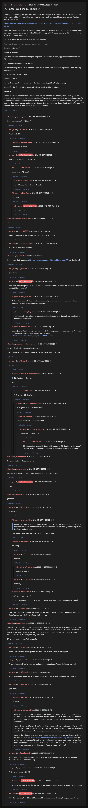

# [77 mbtc] Quizchain2 Block 14

[Original thread](https://www.reddit.com/r/Grycoin/comments/bs06rg/77_mbtc_quizchain2_block_14/). The `sourceUrl` of the [quizchain2/14](../../../src/collections/quizchain2/14.ts) record and the source of its question, format, hash digits, both hints and funding transaction, with the solution the author edited in. u/puzzleponky's comment gives the solution and how it was found. The post went up on May 23, 2019, at 07:58:14 UTC, 32 hours after the block time of its funding transaction. Its last edit is stamped 11:49:57 UTC on May 25, 2019, so the transcript shows the post as it stood after the claim.

## Historical provenance

No capture found. On October 1, 2026 the Wayback Machine index listed one capture of the thread, of the `www.reddit.com` URL, June 11, 2023, 20:11:57 UTC, and none of the `old.reddit.com` URL. Its `id_` body is Reddit's app shell titled "Reddit - Dive into anything", with neither the post nor a comment in its HTML. The archive.today timemaps for the `www.reddit.com`, `old.reddit.com` and bare `reddit.com` URLs answered 404. MemGator answered "No snapshots" for all three, but it gave the same answer for the block 11 thread, whose Wayback capture exists, so it settles nothing here.

The transcript below comes from the [Arctic Shift](https://arctic-shift.photon-reddit.com/) Reddit archive: the post record and the comment tree for `bs06rg`, read on October 1, 2026. The [pullpush](https://pullpush.io/) Reddit archive, read the same day, gives the same post text, time and edit stamp, and the same 48 comments with the same authors, times, scores and parents. Ten of them are deleted comments, kept below as `[deleted]`.

The record names none of the commenters: nothing on the chain ties a claim to a name.

## Transcript

> Thank you for playing the quizchain. This block has a big prize of 77 mbtc, since I made a mistake when giving a hint for block 12, a new way to screw up that has not happened before. Funding transaction below:
>
> https://www.smartbit.com.au/tx/377e5148989442048659eaa3dd6bcd7423e7f8ba3cd41433bc66f108e50f1e01
>
> It will not be as obvious as the previous block, since it is a big prize block. I still try to keep the block from being impossible to solve without hint. But I may fail in that purpose and this may require a hint to solve. Only one way to find out.
>
> I will also avoid the need for a TOMI field for this one.
>
> This block is obvious once you understand the method.
>
> Question: 14 from 7.
>
> Format: [solution]
>
> Hint: The solution is not something as simple as "2", which is already apparent from the lack of TOMI field.
>
> First three digits of MP5 hash are 5f8.
>
> Have fun solving this block. If it needs a hint, it will come after 24 hours, 5 pm tomorrow (Friday) Japanese time.
>
> Update: Correct is "MD5" hash.
>
> Update 2: Hint 1:
>
> Hint for this was already available at the time of posting at the Wattpad story.
>
> Update 3: Hint 2: I want this block solved now, decisive hint this time.
>
> Red seven.
>
> Update 4: Solved soon after this second hint. As indicated by the winner, who is totally not me, solution was the first and the last seven digits of the genesis block address, not counting the prefix 1. A1zP1eP7DivfNa.
> Congrats to the winner, who is definitely not me, and thank you everyone for playing. Next block coming up tomorrow (Sunday) 10 pm Japanese time. Also third hint for block 77 scheduled in about an hour today 10 pm Japanese time.

## Comments

**u/silver_anth**, 3 points:

> Is it meant to say "MP5 hash"?

**u/Mart1250**, 1 point, reply to u/silver_anth:

> Yeah probably.

**u/lolusername777**, 1 point, reply to u/Mart1250:

> probably a mistake.

**u/AoiNakamoto**, 1 point, reply to u/silver_anth:

> No, MD5 is correct, updated post.

**u/Mart1250**, 0 points, reply to u/AoiNakamoto:

> It still says MP5 here?

**u/Mart1250**, 1 point, reply to u/Mart1250:

> Nvm. Missed the update section. lol

**[deleted]**, reply to u/AoiNakamoto:

> [deleted]

**u/AoiNakamoto**, 1 point, reply to a deleted comment:

> Yes. Stay tuned...

**u/IvayloGeorgiev**, 1 point:

> 7<<1

**u/Mart1250**, 1 point, reply to u/IvayloGeorgiev:

> Do you suggests it has something to do with bit shifting?

**u/lolusername777**, 1 point, reply to u/IvayloGeorgiev:

> Could you explain it please?

**u/Mart1250**, 1 point:

> Is it normal that your page: [https://www.wattpad.com/stories/hintforblock77](https://www.wattpad.com/stories/hintforblock77) is a dead end?

**[deleted]**, reply to u/Mart1250:

> [deleted]

**u/AoiNakamoto**, 1 point, reply to u/Mart1250:

> Not sure what the problem is. Your link works for me. Have you tried the link at my Twitter feed at NakamotoAoi?

**u/Crypto_Rachel**, 1 point, reply to u/AoiNakamoto:

> Wattpad consistently has problems. Especially when you post something and everyone is hitting the site, server gets overwhelmed

**u/Crypto_Rachel**, 1 point, reply to u/Crypto_Rachel:

> I can't actually get all of the complete quizchain page ever due to it not loading the whole section/chapter

**u/Mart1250**, 1 point, reply to u/AoiNakamoto:

> It says (translated from my main language): This page seems to be missing ... Yeah your link works on twitter, then I see all the chapters. [https://www.wattpad.com/story/184148284-second](https://www.wattpad.com/story/184148284-second)

**u/martypyouknowme**, 1 point:

> 14 from 7 is 21. 21 chapters in the story.
>
> Tried 14 in every which way from the 7 in the genesis block address.

**[deleted]**, reply to u/martypyouknowme:

> [deleted]

**u/martypyouknowme**, 1 point, reply to a deleted comment:

> > 21 chapters in the story.
>
> Nope

**u/Mart1250**, 1 point, reply to u/martypyouknowme:

> ?? There are 21 chapters.

**u/martypyouknowme**, 1 point, reply to u/Mart1250:

> 21 chapters in the Wattpad story.

**u/Mart1250**, 1 point, reply to u/martypyouknowme:

> Yeah there are 21 chapters there?

**u/martypyouknowme**, 1 point, reply to u/Mart1250:

> What is your question?

**u/Mart1250**, 1 point, reply to u/martypyouknowme:

> XD, no one. Lol.. You said 'Nope' with regard to '21 chapters in the story.' So I said it are 21 chapters. You seem to deny that. Miscommunication?

**u/mooncritic**, 1 point:

> Quizchain is love, Quizchain is life

**u/silver_anth**, 1 point:

> Will there be another hint at 5pm Japanese time today for this?

**u/AoiNakamoto**, 1 point, reply to u/silver_anth:

> Yes.

**[deleted]**:

> [deleted]

**[deleted]**, reply to a deleted comment:

> [deleted]

**u/mooncritic**, 3 points, reply to a deleted comment:

> > MoonCritic could be clone of AoiNakamoto. Registered exactly at same time. Money was transferred few minutes after hint. Besides answer is typically something stupid, like Seven Atbash angry
>
> Well, good news then because I didn't solve this one. :D

**[deleted]**, reply to a deleted comment:

> [deleted]

**[deleted]**, reply to a deleted comment:

> [deleted]

**u/mooncritic**, 5 points, reply to a deleted comment:

> Waste of time sir

**[deleted]**, reply to a deleted comment:

> [deleted]

**u/Quantris**, 3 points, reply to a deleted comment:

> And the point would be?
>
> (actually you figured it out, we're all playing a trick on you here! You got grycoined)

**u/Quantris**, 2 points, reply to a deleted comment:

> Yup. The suspense is killing me. I feel like it's obvious what the hint is pointing at but still no luck figuring out what the solution is from that.

**u/puzzleponky**, 5 points:

> Solved, must be my lucky day :) Solution was A1zP1eP7DivfNa. last seven from the address 1A1zP1eP5QGefi2DMPTfTL5SLmv7DivfNa and first seven AFTER the 1, I was lucky to solve puzzle 16 an hour earlier which gave me the idea to do that. Had already tried the more obvious 1A1zP1e7DivfNa yesterday after hint 1.
>
> (And I am certainly not AoiNakamoto)

**u/Quantris**, 1 point, reply to u/puzzleponky:

> Nice! I wouldn't have thought to skip the 1 but makes sense in retrospect....

**u/mooncritic**, 2 points, reply to u/puzzleponky:

> Wow, nice solve! You're on a roll tonight. Congratulations, fellow definitely-not-Aoi.

**u/JDScreesh**, 1 point, reply to u/puzzleponky:

> Congratulations friend. I tried a lot of things with the genesis address except that xD

**[deleted]**, reply to u/puzzleponky:

> [deleted]

**[deleted]**, reply to a deleted comment:

> [deleted]

**u/mooncritic**, 3 points, reply to a deleted comment:

> If you feel confident that the winners are all fake accounts, then I don't know what I can say. I guess I can understand the skepticism from an outsider, as the solves may seem impossibly fast but many of us got quick through practice and being ready to react quickly.
>
> I guess if you want to and if you're capable, you can solve a puzzle yourself and you'll see that it's for real. If you're confident that it's all a scam, might as well not waste any more time here, right? Just move on, probably no one will convince you.
>
> Many of the winners here have also independently won external puzzles as well (here are a couple of mine: [https://www.mooncritic.com/puzzles/solving-puzzles/](https://www.mooncritic.com/puzzles/solving-puzzles/), and I'm pretty new here, some of the others are real pros that have a long history of solving much tougher puzzles). Do you think the whole Internet is a big scam of fake puzzles over several years, all to convince some Redditors that visit here?

**u/BrainForceOne**, 1 point, reply to u/puzzleponky:

> Congrats!
> I tried every possible variant with the genesis addreess except the solution. Should have tried one more... :-)

**u/lolusername777**, 1 point, reply to u/puzzleponky:

> Why skip 1,begin with A?

**u/AoiNakamoto**, 1 point, reply to u/lolusername777:

> Because the 1 is the prefix, not part of the address. Also to make it slightly less obvious.

**u/AoiNakamoto**, 2 points, reply to u/puzzleponky:

> Good job solving this difficult block. And thank you for confirming that you are not me :)

## Screenshot

The screenshot is a render of the thread in Arctic Shift's ID lookup, not of Reddit, since no readable capture of the Reddit page exists. Capture method and limits: [source archive](../README.md).
