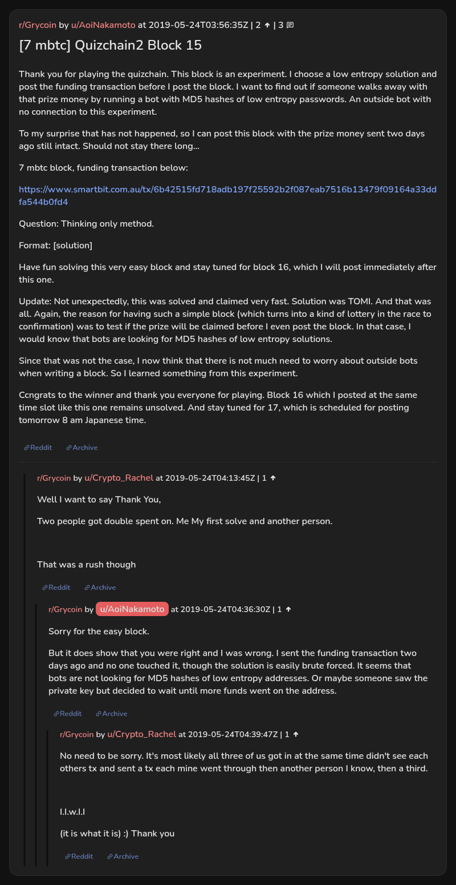

# [7 mbtc] Quizchain2 Block 15

[Original thread](https://www.reddit.com/r/Grycoin/comments/bscc8b/7_mbtc_quizchain2_block_15/). The `sourceUrl` of the [quizchain2/15](../../../src/collections/quizchain2/15.ts) record and the source of its question, format and funding transaction, with the solution the author edited in. The author funded the address two days before the post on purpose, to see whether a bot hashing low entropy passwords would sweep it first. The post went up on May 24, 2019, at 03:56:35 UTC, 48 hours after the block time of its funding transaction. Its last edit is stamped 05:16:20 UTC the same day, so the transcript shows the post as it stood after the claim.

## Historical provenance

No capture found. On October 1, 2026 the Wayback Machine index listed one capture of the thread, of the `www.reddit.com` URL, June 12, 2023, 13:56:17 UTC, and none of the `old.reddit.com` URL. Its `id_` body is Reddit's app shell titled "Reddit - Dive into anything", with neither the post nor a comment in its HTML. The archive.today timemaps for the `www.reddit.com`, `old.reddit.com` and bare `reddit.com` URLs answered 404. MemGator answered "No snapshots" for all three, but it gave the same answer for the block 11 thread, whose Wayback capture exists, so it settles nothing here.

The transcript below comes from the [Arctic Shift](https://arctic-shift.photon-reddit.com/) Reddit archive: the post record and the comment tree for `bscc8b`, read on October 1, 2026. The [pullpush](https://pullpush.io/) Reddit archive, read the same day, gives the same post text, time and edit stamp, and the same 3 comments with the same authors, times, scores and parents. Their bodies differ only in how the empty `&#x200B;` paragraph in two comments is escaped, and the transcript leaves those empty paragraphs out.

The record names none of the commenters: nothing on the chain ties a claim to a name.

## Transcript

> Thank you for playing the quizchain. This block is an experiment. I choose a low entropy solution and post the funding transaction before I post the block. I want to find out if someone walks away with that prize money by running a bot with MD5 hashes of low entropy passwords. An outside bot with no connection to this experiment.
>
> To my surprise that has not happened, so I can post this block with the prize money sent two days ago still intact. Should not stay there long...
>
> 7 mbtc block, funding transaction below:
>
> https://www.smartbit.com.au/tx/6b42515fd718adb197f25592b2f087eab7516b13479f09164a33ddfa544b0fd4
>
> Question: Thinking only method.
>
> Format: [solution]
>
> Have fun solving this very easy block and stay tuned for block 16, which I will post immediately after this one.
>
> Update: Not unexpectedly, this was solved and claimed very fast. Solution was TOMI. And that was all. Again, the reason for having such a simple block (which turns into a kind of lottery in the race to confirmation) was to test if the prize will be claimed before I even post the block. In that case, I would know that bots are looking for MD5 hashes of low entropy solutions.
>
> Since that was not the case, I now think that there is not much need to worry about outside bots when writing a block. So I learned something from this experiment.
>
> Ccngrats to the winner and thank you everyone for playing. Block 16 which I posted at the same time slot like this one remains unsolved. And stay tuned for 17, which is scheduled for posting tomorrow 8 am Japanese time.

## Comments

**u/Crypto_Rachel**, 1 point:

> Well I want to say Thank You,
>
> Two people got double spent on. Me My first solve and another person.
>
> That was a rush though

**u/AoiNakamoto**, 1 point, reply to u/Crypto_Rachel:

> Sorry for the easy block.
>
> But it does show that you were right and I was wrong. I sent the funding transaction two days ago and no one touched it, though the solution is easily brute forced. It seems that bots are not looking for MD5 hashes of low entropy addresses. Or maybe someone saw the private key but decided to wait until more funds went on the address.

**u/Crypto_Rachel**, 1 point, reply to u/AoiNakamoto:

> No need to be sorry. It's most likely all three of us got in at the same time didn't see each others tx and sent a tx each mine went through then another person I know, then a third.
>
> I.I.w.I.I
>
> (it is what it is) :) Thank you

## Screenshot

The screenshot is a render of the thread in Arctic Shift's ID lookup, not of Reddit, since no readable capture of the Reddit page exists. Capture method and limits: [source archive](../README.md).
