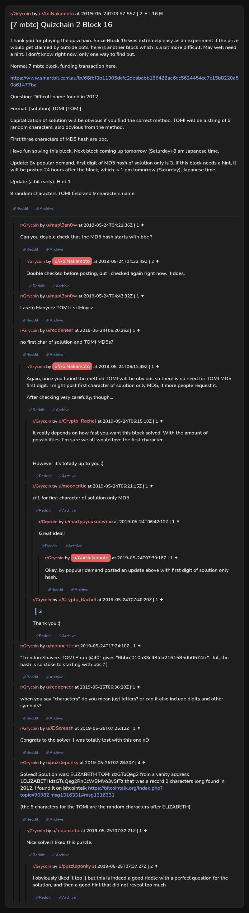

# [7 mbtc] Quizchain 2 Block 16

[Original thread](https://www.reddit.com/r/Grycoin/comments/bsccmw/7_mbtc_quizchain_2_block_16/). The `sourceUrl` of the [quizchain2/16](../../../src/collections/quizchain2/16.ts) record and the source of its question, format, hash digits, hint and funding transaction. The author never edited the solution in. It is in u/puzzleponky's comment, with the vanity address it comes from. The post went up on May 24, 2019, at 03:57:55 UTC, two hours after the block time of its funding transaction. Its last edit is stamped 03:46:02 UTC on May 25, 2019, three and a half hours before the claim, so the transcript shows the post as it stood while the block was open.

## Historical provenance

No capture found. On October 1, 2026 the Wayback Machine index listed one capture of the thread, of the `www.reddit.com` URL, June 11, 2023, 19:42:49 UTC, and none of the `old.reddit.com` URL. Its `id_` body is Reddit's app shell titled "Reddit - Dive into anything", with neither the post nor a comment in its HTML. The archive.today timemaps for the `www.reddit.com`, `old.reddit.com` and bare `reddit.com` URLs answered 404. MemGator answered "No snapshots" for all three, but it gave the same answer for the block 11 thread, whose Wayback capture exists, so it settles nothing here.

The transcript below comes from the [Arctic Shift](https://arctic-shift.photon-reddit.com/) Reddit archive: the post record and the comment tree for `bsccmw`, read on October 1, 2026. The [pullpush](https://pullpush.io/) Reddit archive, read the same day, gives the same post text, time and edit stamp, and the same 16 comments with the same authors, times, scores and parents. Their bodies differ only in how the empty `&#x200B;` paragraph in one comment is escaped, and the transcript leaves those empty paragraphs out.

The record names none of the commenters: nothing on the chain ties a claim to a name.

## Transcript

> Thank you for playing the quizchain. Since Block 15 was extremely easy as an experiment if the prize would get claimed by outside bots, here is another block which is a bit more difficult. May well need a hint. I don't know right now, only one way to find out.
>
> Normal 7 mbtc block, funding transaction here.
>
> https://www.smartbit.com.au/tx/66fbf3b11305dcfe2deababb186422ae6ec5624454ce7c15b8220a50a61477ba
>
> Question: Difficult name found in 2012.
>
> Format: [solution] TOMI [TOMI]
>
> Capitalization of solution will be obvious if you find the correct method. TOMI will be a string of 9 random characters, also obvious from the method.
>
> First three characters of MD5 hash are bbc.
>
> Have fun solving this block. Next block coming up tomorrow (Saturday) 8 am Japanese time.
>
> Update: By popular demand, first digit of MD5 hash of solution only is 3. If this block needs a hint, it will be posted 24 hours after the block, which is 1 pm tomorrow (Saturday), Japanese time.
>
> Update (a bit early): Hint 1
>
> 9 random characters TOMI field and 9 characters name.

## Comments

**u/mapl3sn0w**, 1 point:

> Can you double check that the MD5 hash starts with bbc ?

**u/AoiNakamoto**, 2 points, reply to u/mapl3sn0w:

> Double checked before posting, but I checked again right now. It does.

**u/mapl3sn0w**, 1 point:

> Laszlo Hanyecz TOMI LszlHnycz

**u/reddeneer**, 1 point:

> no first char of solution and TOMI MD5s?

**u/AoiNakamoto**, 1 point, reply to u/reddeneer:

> Again, once you found the method TOMI will be obvious so there is no need for TOMI MD5 first digit. I might post first character of solution only MD5, if more people request it.
>
> After checking very carefully, though...

**u/Crypto_Rachel**, 1 point, reply to u/AoiNakamoto:

> It really depends on how fast you want this block solved. With the amount of possibilities, I'm sure we all would love the first character.
>
> However it's totally up to you :)

**u/mooncritic**, 1 point, reply to u/AoiNakamoto:

> \+1 for first character of solution only MD5

**u/martypyouknowme**, 1 point, reply to u/mooncritic:

> Great idea!!

**u/AoiNakamoto**, 1 point, reply to u/martypyouknowme:

> Okay, by popular demand posted an update above with first digit of solution only hash.

**u/Crypto_Rachel**, 1 point, reply to u/AoiNakamoto:

> > 3
>
> Thank you :)

**u/mooncritic**, 1 point:

> "Trendon Shavers TOMI Pirate@40" gives "6bbcc010a33c43fcb2161585db0574fc".. lol, the hash is so close to starting with bbc :'(

**u/reddeneer**, 1 point:

> when you say "characters" do you mean just letters? or can it also include digits and other symbols?

**u/JDScreesh**, 1 point:

> Congrats to the solver. I was totally lost with this one xD

**u/puzzleponky**, 4 points:

> Solved! Solution was: ELiZABETH TOMI dzGTuQeg2 from a vanity address 1**ELiZABETH**dzGTuQeg2RnCcWBMVo3ySfTz that was a record 9 characters long found in 2012. I found it on bitcointalk [https://bitcointalk.org/index.php?topic=90982.msg1316331#msg1316331](https://bitcointalk.org/index.php?topic=90982.msg1316331#msg1316331)
>
> (the 9 characters for the TOMI are the random characters after ELiZABETH)

**u/mooncritic**, 1 point, reply to u/puzzleponky:

> Nice solve! I liked this puzzle.

**u/puzzleponky**, 2 points, reply to u/mooncritic:

> I obviously liked it too :) but this is indeed a good riddle with a perfect question for the solution, and then a good hint that did not reveal too much

## Screenshot

The screenshot is a render of the thread in Arctic Shift's ID lookup, not of Reddit, since no readable capture of the Reddit page exists. Capture method and limits: [source archive](../README.md).
