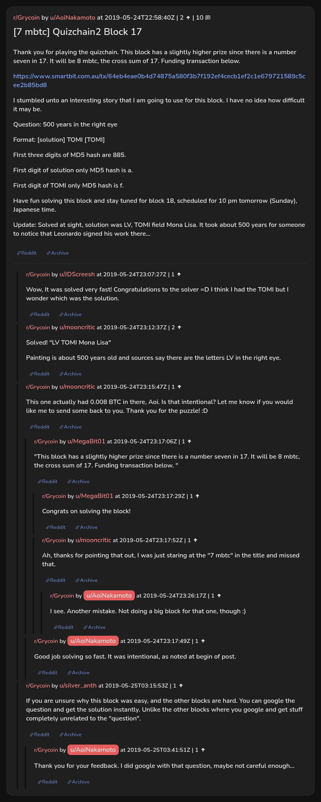

# [7 mbtc] Quizchain2 Block 17

[Original thread](https://www.reddit.com/r/Grycoin/comments/bsnke3/7_mbtc_quizchain2_block_17/). The `sourceUrl` of the [quizchain2/17](../../../src/collections/quizchain2/17.ts) record and the source of its question, format, hash digits and funding transaction, with the solution the author edited in. The full winning string is in u/mooncritic's comment. The post went up on May 24, 2019, at 22:58:40 UTC, ten and a half hours after the block time of its funding transaction. Its last edit is stamped 23:27:25 UTC the same day, so the transcript shows the post as it stood after the claim.

## Historical provenance

No capture found. On October 1, 2026 the Wayback Machine index listed one capture of the thread, of the `www.reddit.com` URL, June 11, 2023, 21:17:49 UTC, and none of the `old.reddit.com` URL. Its `id_` body is Reddit's app shell titled "Reddit - Dive into anything", with neither the post nor a comment in its HTML. The archive.today timemaps for the `www.reddit.com`, `old.reddit.com` and bare `reddit.com` URLs answered 404. MemGator answered "No snapshots" for all three, but it gave the same answer for the block 11 thread, whose Wayback capture exists, so it settles nothing here.

The transcript below comes from the [Arctic Shift](https://arctic-shift.photon-reddit.com/) Reddit archive: the post record and the comment tree for `bsnke3`, read on October 1, 2026. The [pullpush](https://pullpush.io/) Reddit archive, read the same day, gives the same post text, time and edit stamp, and the same 10 comments with the same authors, times, scores and parents.

The record names none of the commenters: nothing on the chain ties a claim to a name.

## Transcript

> Thank you for playing the quizchain. This block has a slightly higher prize since there is a number seven in 17. It will be 8 mbtc, the cross sum of 17. Funding transaction below.
>
> https://www.smartbit.com.au/tx/64eb4eae0b4d74875a580f3b7f192ef4cecb1ef2c1e679721589c5cee2b85bd8
>
> I stumbled unto an interesting story that I am going to use for this block. I have no idea how difficult it may be.
>
> Question: 500 years in the right eye
>
> Format: [solution] TOMI [TOMI]
>
> FIrst three digits of MD5 hash are 885.
>
> First digit of solution only MD5 hash is a.
>
> First digit of TOMI only MD5 hash is f.
>
> Have fun solving this block and stay tuned for block 18, scheduled for 10 pm tomorrow (Sunday), Japanese time.
>
> Update: Solved at sight, solution was LV, TOMI field Mona Lisa. It took about 500 years for someone to notice that Leonardo signed his work there...

## Comments

**u/JDScreesh**, 1 point:

> Wow, It was solved very fast! Congratulations to the solver =D I think I had the TOMI but I wonder which was the solution.

**u/mooncritic**, 2 points:

> Solved! "LV TOMI Mona Lisa"
>
> Painting is about 500 years old and sources say there are the letters LV in the right eye.

**u/mooncritic**, 1 point:

> This one actually had 0.008 BTC in there, Aoi. Is that intentional? Let me know if you would like me to send some back to you. Thank you for the puzzle! :D

**u/MegaBit01**, 1 point, reply to u/mooncritic:

> "This block has a slightly higher prize since there is a number seven in 17. It will be 8 mbtc, the cross sum of 17. Funding transaction below. "

**u/MegaBit01**, 1 point, reply to u/MegaBit01:

> Congrats on solving the block!

**u/mooncritic**, 1 point, reply to u/MegaBit01:

> Ah, thanks for pointing that out, I was just staring at the "7 mbtc" in the title and missed that.

**u/AoiNakamoto**, 1 point, reply to u/mooncritic:

> I see. Another mistake. Not doing a big block for that one, though :)

**u/AoiNakamoto**, 1 point, reply to u/mooncritic:

> Good job solving so fast. It was intentional, as noted at begin of post.

**u/silver_anth**, 1 point:

> If you are unsure why this block was easy, and the other blocks are hard. You can google the question and get the solution instantly. Unlike the other blocks where you google and get stuff completely unrelated to the "question".

**u/AoiNakamoto**, 1 point, reply to u/silver_anth:

> Thank you for your feedback. I did google with that question, maybe not careful enough...

## Screenshot

The screenshot is a render of the thread in Arctic Shift's ID lookup, not of Reddit, since no readable capture of the Reddit page exists. Capture method and limits: [source archive](../README.md).
