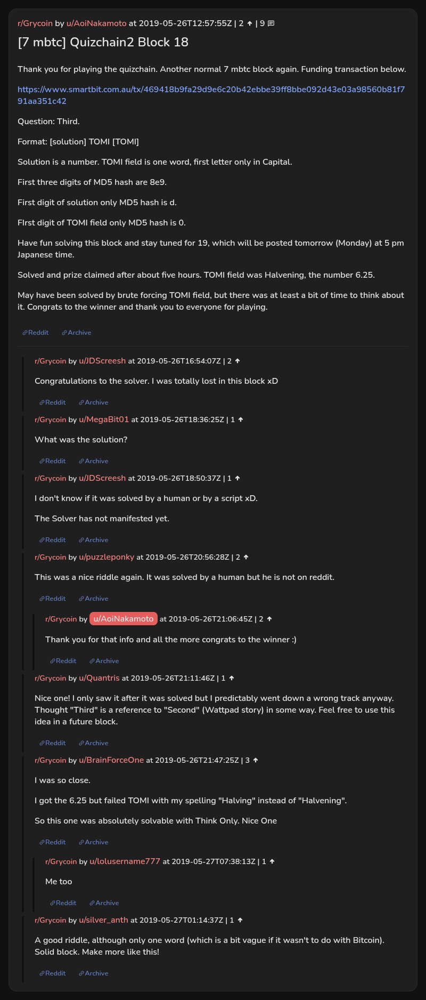

# [7 mbtc] Quizchain2 Block 18

[Original thread](https://www.reddit.com/r/Grycoin/comments/bt7mfm/7_mbtc_quizchain2_block_18/). The `sourceUrl` of the [quizchain2/18](../../../src/collections/quizchain2/18.ts) record and the source of its question, format, hash digits and funding transaction, with the solution the author added to the post. Nobody in the thread printed the whole string. The post went up on May 26, 2019, at 12:57:55 UTC, 25 hours after the block time of its funding transaction. Its last edit is stamped 20:50:19 UTC the same day, so the transcript shows the post as it stood after the claim.

## Historical provenance

No capture found. On October 1, 2026 the Wayback Machine index listed one capture of the thread, of the `www.reddit.com` URL, June 11, 2023, 21:39:49 UTC, and none of the `old.reddit.com` URL. Its `id_` body is Reddit's app shell titled "Reddit - Dive into anything", with neither the post nor a comment in its HTML. The archive.today timemaps for the `www.reddit.com`, `old.reddit.com` and bare `reddit.com` URLs answered 404. MemGator answered "No snapshots" for all three, but it gave the same answer for the block 11 thread, whose Wayback capture exists, so it settles nothing here.

The transcript below comes from the [Arctic Shift](https://arctic-shift.photon-reddit.com/) Reddit archive: the post record and the comment tree for `bt7mfm`, read on October 1, 2026. The [pullpush](https://pullpush.io/) Reddit archive, read the same day, gives the same post text, time and edit stamp, and the same 9 comments with the same authors, times, scores and parents.

The record names none of the commenters: nothing on the chain ties a claim to a name.

## Transcript

> Thank you for playing the quizchain. Another normal 7 mbtc block again. Funding transaction below.
>
> https://www.smartbit.com.au/tx/469418b9fa29d9e6c20b42ebbe39ff8bbe092d43e03a98560b81f791aa351c42
>
> Question: Third.
>
> Format: [solution] TOMI [TOMI]
>
> Solution is a number. TOMI field is one word, first letter only in Capital.
>
> First three digits of MD5 hash are 8e9.
>
> First digit of solution only MD5 hash is d.
>
> FIrst digit of TOMI field only MD5 hash is 0.
>
> Have fun solving this block and stay tuned for 19, which will be posted tomorrow (Monday) at 5 pm Japanese time.
>
> Solved and prize claimed after about five hours. TOMI field was Halvening, the number 6.25.
>
> May have been solved by brute forcing TOMI field, but there was at least a bit of time to think about it. Congrats to the winner and thank you to everyone for playing.

## Comments

**u/JDScreesh**, 2 points:

> Congratulations to the solver. I was totally lost in this block xD

**u/MegaBit01**, 1 point:

> What was the solution?

**u/JDScreesh**, 1 point:

> I don't know if it was solved by a human or by a script xD.
>
> The Solver has not manifested yet.

**u/puzzleponky**, 2 points:

> This was a nice riddle again. It was solved by a human but he is not on reddit.

**u/AoiNakamoto**, 2 points, reply to u/puzzleponky:

> Thank you for that info and all the more congrats to the winner :)

**u/Quantris**, 1 point:

> Nice one! I only saw it after it was solved but I predictably went down a wrong track anyway. Thought "Third" is a reference to "Second" (Wattpad story) in some way. Feel free to use this idea in a future block.

**u/BrainForceOne**, 3 points:

> I was so close.
>
> I got the 6.25 but failed TOMI with my spelling "Halving" instead of "Halvening".
>
> So this one was absolutely solvable with Think Only. Nice One

**u/lolusername777**, 1 point, reply to u/BrainForceOne:

> Me too

**u/silver_anth**, 1 point:

> A good riddle, although only one word (which is a bit vague if it wasn't to do with Bitcoin). Solid block. Make more like this!

## Screenshot

The screenshot is a render of the thread in Arctic Shift's ID lookup, not of Reddit, since no readable capture of the Reddit page exists. Capture method and limits: [source archive](../README.md).
