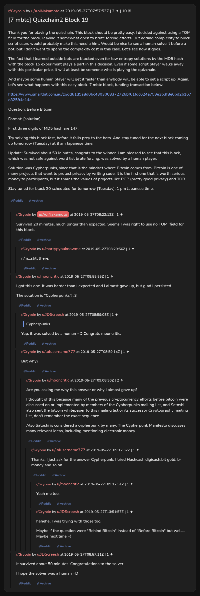

# [7 mbtc] Quizchain2 Block 19

[Original thread](https://www.reddit.com/r/Grycoin/comments/btjb8j/7_mbtc_quizchain2_block_19/). The `sourceUrl` of the [quizchain2/19](../../../src/collections/quizchain2/19.ts) record and the source of its question, format, hash digits and funding transaction, with the solution the author edited in. u/mooncritic's comment gives the same solution. The post went up on May 27, 2019, at 07:57:53 UTC, four hours after the block time of its funding transaction. Its last edit is stamped 10:43:27 UTC the same day, so the transcript shows the post as it stood after the claim.

## Historical provenance

No capture found. On October 1, 2026 the Wayback Machine index listed no capture of the thread under the `www.reddit.com`, `old.reddit.com` or bare `reddit.com` URL. The archive.today timemaps for the `www.reddit.com`, `old.reddit.com` and bare `reddit.com` URLs answered 404. MemGator answered "No snapshots" for all three, but it gave the same answer for the block 11 thread, whose Wayback capture exists, so it settles nothing here.

The transcript below comes from the [Arctic Shift](https://arctic-shift.photon-reddit.com/) Reddit archive: the post record and the comment tree for `btjb8j`, read on October 1, 2026. The [pullpush](https://pullpush.io/) Reddit archive, read the same day, gives the same post text, time and edit stamp, and the same 10 comments with the same authors, times, scores and parents.

The record names none of the commenters: nothing on the chain ties a claim to a name.

## Transcript

> Thank you for playing the quizchain. This block should be pretty easy. I decided against using a TOMI field for the block, leaving it somewhat open to brute forcing efforts. But adding complexity to block script users would probably make this need a hint. Would be nice to see a human solve it before a bot, but I don't want to spend the complexity cost in this case. Let's see how it goes.
>
> The fact that I learned outside bots are blocked even for low entropy solutions by the MD5 hash with the block 15 experiment plays a part in this decision. Even if some script player walks away with this particular prize, it will at least be someone who is playing the quizchain.
>
> And maybe some human player will get it faster than anybody will be able to set a script up. Again, let's see what happens with this easy block. 7 mbtc block, funding transaction below.
>
> https://www.smartbit.com.au/tx/dd61d9a8d06c4303008372726bf61fdc624a759e3b3f8e6bd2b167e82594e14e
>
> Question: Before Bitcoin
>
> Format: [solution]
>
> FIrst three digits of MD5 hash are 147.
>
> Try solving this block fast, before it falls prey to the bots. And stay tuned for the next block coming up tomorrow (Tuesday) at 8 am Japanese time.
>
> Update: Survived about 50 Minutes, congrats to the winner. I am pleased to see that this block, which was not safe against word list brute forcing, was solved by a human player.
>
> Solution was Cypherpunks, since that is the mindset where Bitcoin comes from. Bitcoin is one of many projects that want to protect privacy by writing code. It is the first one that is worth serious money to participants, but it shares the values of projects like PGP (pretty good privacy) and TOR.
>
> Stay tuned for block 20 scheduled for tomorrow (Tuesday), 1 pm Japanese time.

## Comments

**u/AoiNakamoto**, 1 point:

> Survived 20 minutes, much longer than expected. Seems I was right to use no TOMI field for this block.

**u/martypyouknowme**, 1 point, reply to u/AoiNakamoto:

> n/m...still there.

**u/mooncritic**, 1 point:

> I got this one. It was harder than I expected and I almost gave up, but glad I persisted.
>
> The solution is "Cypherpunks"! :3

**u/JDScreesh**, 1 point, reply to u/mooncritic:

> > Cypherpunks
>
> Yup, it was solved by a human =D Congrats mooncritic.

**u/lolusername777**, 1 point, reply to u/mooncritic:

> But why?

**u/mooncritic**, 2 points, reply to u/lolusername777:

> Are you asking me why this answer or why I almost gave up?
>
> I thought of this because many of the previous cryptocurrency efforts before bitcoin were discussed on or implemented by members of the Cypherpunks mailing list, and Satoshi also sent the bitcoin whitepaper to this mailing list or its successor Cryptography mailing list, don't remember the exact sequence.
>
> Also Satoshi is considered a cypherpunk by many. The Cypherpunk Manifesto discusses many relevant ideas, including mentioning electronic money.

**u/lolusername777**, 1 point, reply to u/mooncritic:

> Thanks, I just ask for the answer Cypherpunk.
> I tried Hashcash,digicash,bit gold, b-money and so on...

**u/mooncritic**, 1 point, reply to u/lolusername777:

> Yeah me too.

**u/JDScreesh**, 1 point, reply to u/lolusername777:

> hehehe, I was trying with those too.
>
> Maybe if the question were "Behind Bitcoin" instead of "Before Bitcoin" but well... Maybe next time =)

**u/JDScreesh**, 1 point:

> It survived about 50 minutes. Congratulations to the solver.
>
> I hope the solver was a human =D

## Screenshot

The screenshot is a render of the thread in Arctic Shift's ID lookup, not of Reddit, since no readable capture of the Reddit page exists. Capture method and limits: [source archive](../README.md).
