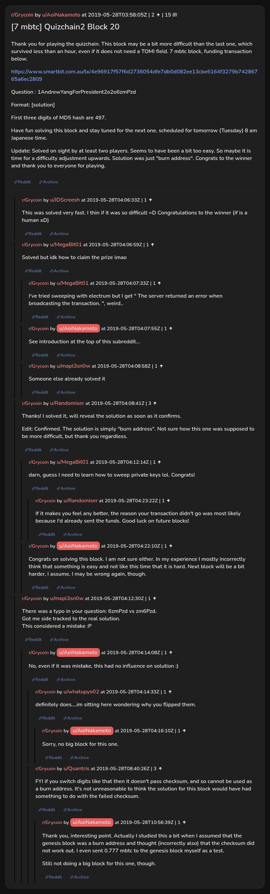

# [7 mbtc] Quizchain2 Block 20

[Original thread](https://www.reddit.com/r/Grycoin/comments/btveri/7_mbtc_quizchain2_block_20/). The `sourceUrl` of the [quizchain2/20](../../../src/collections/quizchain2/20.ts) record and the source of its question, format, hash digits and funding transaction, with the solution the author edited in. u/Randomiser's comment gives the same solution. The post went up on May 28, 2019, at 03:58:05 UTC, two hours and 41 minutes after the block time of its funding transaction. Its last edit is stamped 04:17:56 UTC the same day, so the transcript shows the post as it stood after the claim.

## Historical provenance

No capture found. On October 1, 2026 the Wayback Machine index listed no capture of the thread under the `www.reddit.com`, `old.reddit.com` or bare `reddit.com` URL. The archive.today timemaps for the `www.reddit.com`, `old.reddit.com` and bare `reddit.com` URLs answered 404. MemGator answered "No snapshots" for all three, but it gave the same answer for the block 11 thread, whose Wayback capture exists, so it settles nothing here.

The transcript below comes from the [Arctic Shift](https://arctic-shift.photon-reddit.com/) Reddit archive: the post record and the comment tree for `btveri`, read on October 1, 2026. The [pullpush](https://pullpush.io/) Reddit archive, read the same day, gives the same post text, time and edit stamp, and the same 15 comments with the same authors, times, scores and parents.

The record names none of the commenters: nothing on the chain ties a claim to a name.

## Transcript

> Thank you for playing the quizchain. This block may be a bit more difficult than the last one, which survived less than an hour, even if it does not need a TOMI field. 7 mbtc block, funding transaction below.
>
> https://www.smartbit.com.au/tx/4e96917f57f6d2736054dfe7db0d082ee13cbe6164f3279b74286765a6ec2809
>
> Question : 1AndrewYangForPresident2o2o6zmPzd
>
> Format: [solution]
>
> First three digits of MD5 hash are 497.
>
> Have fun solving this block and stay tuned for the next one, scheduled for tomorrow (Tuesday) 8 am Japanese time.
>
> Update: Solved on sight by at least two players. Seems to have been a bit too easy. So maybe it is time for a difficulty adjustment upwards. Solution was just "burn address". Congrats to the winner and thank you to everyone for playing.

## Comments

**u/JDScreesh**, 1 point:

> This was solved very fast. I thin if it was so difficult =D Congratulations to the winner (if is a human xD)

**u/MegaBit01**, 1 point:

> Solved but idk how to claim the prize lmao

**u/MegaBit01**, 1 point, reply to u/MegaBit01:

> I've tried sweeping with electrum but I get " The server returned an error when broadcasting the transaction. ", weird..

**u/AoiNakamoto**, 1 point, reply to u/MegaBit01:

> See introduction at the top of this subreddit...

**u/mapl3sn0w**, 1 point, reply to u/MegaBit01:

> Someone else already solved it

**u/Randomiser**, 3 points:

> Thanks! I solved it, will reveal the solution as soon as it confirms.
>
> Edit: Confirmed. The solution is simply "burn address". Not sure how this one was supposed to be more difficult, but thank you regardless.

**u/MegaBit01**, 1 point, reply to u/Randomiser:

> darn, guess I need to learn how to sweep private keys lol. Congrats!

**u/Randomiser**, 1 point, reply to u/MegaBit01:

> If it makes you feel any better, the reason your transaction didn't go was most likely because I'd already sent the funds. Good luck on future blocks!

**u/AoiNakamoto**, 1 point, reply to u/Randomiser:

> Congrats on solving this block. I am not sure either. In my experience I mostly incorrectly think that something is easy and not like this time that it is hard. Next block will be a bit harder, I assume. I may be wrong again, though.

**u/mapl3sn0w**, 1 point:

> There was a typo in your question: 6zmPzd vs zm6Pzd.
> Got me side tracked to the real solution.
> This considered a mistake :P

**u/AoiNakamoto**, 1 point, reply to u/mapl3sn0w:

> No, even if it was mistake, this had no influence on solution :)

**u/whatupyo02**, 1 point, reply to u/AoiNakamoto:

> definitely does....im sitting here wondering why you flipped them.

**u/AoiNakamoto**, 1 point, reply to u/whatupyo02:

> Sorry, no big block for this one.

**u/Quantris**, 3 points, reply to u/AoiNakamoto:

> FYI if you switch digits like that then it doesn't pass checksum, and so cannot be used as a burn address. It's not unreasonable to think the solution for this block would have had something to do with the failed checksum.

**u/AoiNakamoto**, 1 point, reply to u/Quantris:

> Thank you, interesting point. Actually I studied this a bit when I assumed that the genesis block was a burn address and thought (incorrectly also) that the checksum did not work out. I even sent 0.777 mbtc to the genesis block myself as a test.
>
> Still not doing a big block for this one, though.

## Screenshot

The screenshot is a render of the thread in Arctic Shift's ID lookup, not of Reddit, since no readable capture of the Reddit page exists. Capture method and limits: [source archive](../README.md).
