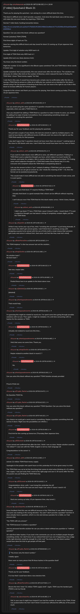

# [7 mbtc] Quizchain2 Block 21

[Original thread](https://www.reddit.com/r/Grycoin/comments/bu6umc/7_mbtc_quizchain2_block_21/). The `sourceUrl` of the [quizchain2/21](../../../src/collections/quizchain2/21.ts) record and the source of its question, format, hash digits, both hints and funding transaction, with the solution the author edited in. The full winning string is in u/silver_anth's comment. The post went up on May 28, 2019, at 22:58:15 UTC, eleven and a half hours after the block time of its funding transaction. Its last edit is stamped 23:59:28 UTC on May 29, 2019, so the transcript shows the post as it stood after the claim.

## Historical provenance

No capture found. On October 2, 2026 the Wayback Machine index listed one capture of the thread under the `www.reddit.com` URL, June 11, 2023, 23:16:56 UTC. Its `id_` body is Reddit's app shell titled "Reddit - Dive into anything", with neither the post nor a comment in its HTML. The one capture of the `old.reddit.com` URL, two seconds later, is a 302 redirect to a subreddit search for Grycoin. The archive.today timemaps for the `www.reddit.com`, `old.reddit.com` and bare `reddit.com` URLs answered 404. MemGator answered "No snapshots" for all three, but it gave the same answer for the block 11 thread, whose Wayback capture exists, so it settles nothing here.

The transcript below comes from the [Arctic Shift](https://arctic-shift.photon-reddit.com/) Reddit archive: the post record and the comment tree for `bu6umc`, read on October 2, 2026. The [pullpush](https://pullpush.io/) Reddit archive, read the same day, gives the same post text, time and edit stamp, and the same 31 comments with the same authors, times, scores and parents. Their bodies differ only in how pullpush escapes the empty `&#x200B;` paragraph in one comment and the quote marker that opens one comment, and the transcript leaves those empty paragraphs out. One of them is a deleted comment, kept below as `[deleted]`.

The record names none of the commenters: nothing on the chain ties a claim to a name.

## Transcript

> Thank you for playing the quizchain. I am aiming for a more difficult block this time.
>
> This block is difficult since I don't provide a question. And since the last block was a bit too easy, I will make this one even harder by requiring a TOMI field.
>
> Normal 7 mbtc block, funding transaction below.
>
> https://www.smartbit.com.au/tx/e7c7fa6c814f13602458d22ed9dec0c77a15296be304aab53aa6df3dcbfe6bee
>
> Question: Can you solve this block without any question?
>
> Format: [solution] TOMI [TOMI]
>
> FIrst three digits of hash are 72e.
>
> Have fun solving this difficult block and stay tuned for block 22 coming up 10 pm Japanese time tomorrow.
>
> Update: First digit of solution only MD5 hash is 9.
>
> First digit of TOMI field only MD5 hash is f.
>
> Update (first and very likely decisive hint):
>
> You know only the block number.
>
> Might the number 21 be significant in the Bitcoin space somehow? Oh, and TOMI field is three words in lower case.
>
> Update (solution): Not unexcpectedly, this was solved soon after the hint above. The solution was obviously 21 million (the limit on the number of bitcoins), which reduced the task to finding the TOMI field. I chose "fixed money supply" for that.
>
> I note that in this case, it would have become just a simple race to confirmation after the hint, so having a TOMI field to preserve a little bit of difficulty has worked out as intended for this block. I started using it for the purpose of blocking brute force, but I do reserve the right to use it like in this block to increase difficulty for human players.
>
> Congrats to the winner and thank you everyone for playing. Next block coming up today (Thursday), 10 pm Japanese time.

## Comments

**u/silver_anth**, 6 points:

> Can you avoid using the same questions? A question shouldn't have more than one answer, especially when you add a TOMI field to it.
>
> Also you shouldn't be adding a TOMI field to a question to make it harder to solve, you should be adding it to make it harder to bruteforce. Over complicating something simple and enjoyable is wrecking this quizchain

**u/AoiNakamoto**, 1 point, reply to u/silver_anth:

> Thank you for your feedback and for playing the quizchain.
>
> We just had a couple of easy blocks, the last one solved on sight by multiple players. I do want to have blocks with different levels of difficulty and I do reserve the right to use the TOMI field exactly for that purpose.
>
> I also don't agree that "a question should not have more than one answer". Looking back at the close to 100 blocks until now, I don't think that would have been true for many of them.

**u/silver_anth**, 3 points, reply to u/AoiNakamoto:

> If you want to make blocks more difficult to solve, ask different questions. Putting in a TOMI field is just a subjective thought you have, which makes it so much harder for humans, and easier for scripters. (this is exactly what has happened on block 77) Finding some weird subjective thought for a TOMI field makes these blocks bad, it is why everyone who complains about the TOMI field is complaining about it.
>
> Lets say the answer to this is "yes". instead of adding a TOMI field, just ask another question that we can get an answer to. Like "whats the meaning of life" = 42, then the format can be [solution1] [solution2].
>
> This would make it more difficult but not add in something that doesn't make sense, and is a pure guess.

**u/AoiNakamoto**, 0 points, reply to u/silver_anth:

> Are you sure that block 77 requires finding a TOMI field?
>
> Actually that block is a good example that a block can be difficult without requiring that.
>
> I can't discuss now if the TOMI field for this block makes sense. I think it does, though.

**u/silver_anth**, 2 points, reply to u/AoiNakamoto:

> I didn't say block 77 has a TOMI field, cause it doesn't really. I meant block 77 is just a subjective thought you had about a string of completely random digits, just like the TOMI fields

**u/Quantris**, 1 point, reply to u/silver_anth:

> While it may not be your cup of tea, imho "wrecking this quizchain" is just being dramatic. It just means this didn't get solved quickly. I don't think there's anything wrong with designing a puzzle to be solved with the use of hints (with a small chance that someone gets lucky and solves it without hint...that solver will feel like they read Aoi's mind).

**u/BrainForceOne**, 3 points:

> "No TOMI helpless" is the true answer but not the solution…

**u/mapl3sn0w**, 2 points:

> No solution hash ?
> No tomi hash ?

**u/AoiNakamoto**, 0 points, reply to u/mapl3sn0w:

> Not now, maybe later.

**u/AoiNakamoto**, 1 point, reply to u/AoiNakamoto:

> Posted these two in an update to the block above now.

**[deleted]**, reply to u/mapl3sn0w:

> [deleted]

**u/martypyouknowme**, 1 point, reply to u/mapl3sn0w:

> That would help.

**u/martypyouknowme**, 1 point:

> I'm guessing this might be related to round one. I've spent some time going through possible solutions with no luck. Then again, I might be mistaken. It's a bit time consuming with no hashes for the solution or TOMI.

**u/AoiNakamoto**, 1 point, reply to u/martypyouknowme:

> Actually not related to round one this time...

**u/martypyouknowme**, 1 point, reply to u/AoiNakamoto:

> Well that saves me some time. Thank you.

**u/mapl3sn0w**, 1 point, reply to u/AoiNakamoto:

> Maybe related to another block in round 2 ?

**u/AoiNakamoto**, 1 point, reply to u/mapl3sn0w:

> No.

**u/martypyouknowme**, 1 point:

> Can you solve this block without any question? TOMI Solution already provided
>
> Proud of that one

**u/Crypto_Rachel**, 1 point:

> No Question TOMI No.

**u/Crypto_Rachel**, 1 point:

> Can you solve this block without any question? TOMI Question: Can you solve this block without any question?

**u/Crypto_Rachel**, 1 point:

> Any chance we could get a word count or something, Maybe a question something that will narrow it down. RIght now the possibilities are infinite :)

**u/AoiNakamoto**, 0 points, reply to u/Crypto_Rachel:

> First hint for this coming up tomorrow (Thursday) 8am Japanese time.

**u/JDScreesh**, 1 point:

> It was solved and confirmed fast after the hint. I think I was so close. Maybe solution could be "21 million"? I was lost with the TOMI. English is not my main language xD
>
> Congratulations to the solver! =)

**u/silver_anth**, 2 points:

> solved: 21 million TOMI fixed money supply
>
> Apologies to the people who spent hours on this yesterday for it to be given away in a hint
>
> The TOMI field was not at all the first thing that comes to mind when thinking of a 21 million max supply. I was just lucky that I went to the right page and saw it. Of course after the hint, the puzzle was just finding the TOMI field only.

**u/JDScreesh**, 1 point, reply to u/silver_anth:

> Congratulations silver\_anth. I was trying this yesterday too xD
> Well... now I'll wait for the next one and I hope I can solve it 'cause I need it =D

**u/AoiNakamoto**, 0 points, reply to u/JDScreesh:

> Next one coming up today 10 pm Japanese time, stay tuned :)

**u/puzzleponky**, 2 points:

> Some feedback that this was not difficult because of the TOMI field, it was difficult because everyone was looking in the wrong direction. You said "I don't provide a question" but then it does actually have a question, which is a nice and obvious paradox for a riddle, so I had answers like:
>
> "Yes TOMI with any answer"
>
> "liar TOMI because it contains a question"
>
> And my personal favorite solution for can you solve a block without any question is: "without question"
>
> All valid first letter hashes. If you look in the comments you can see multiple people thought something similar. So I don't know if you noticed that but if you see it happening a tiny nudge in the right direction would be enough for a hint. Just "You know only the block number." would have done the trick to get people off that path.

**u/Crypto_Rachel**, 1 point, reply to u/puzzleponky:

> > "You know only the block number."
>
> I totally agree
>
> there were so many pieces that fit those hashes in the question itself

**u/AoiNakamoto**, 0 points, reply to u/puzzleponky:

> Thank you for your feedback.
>
> It is true that I could have done a less decisive hint.

**u/BrainForceOne**, 1 point, reply to u/puzzleponky:

> Bevore the hint i tried "21 million TOMI supply limit". Again, TOMI was the hardest part. (TOMI is not my friend)

**u/puzzleponky**, 2 points, reply to u/BrainForceOne:

> Oof, in your case it might have helped if you had the number of words in the TOMI. If that was posted before the hint I don't think it would have affected the difficulty of the puzzle much.

## Screenshot

The screenshot is a render of the thread in Arctic Shift's ID lookup, not of Reddit, since no readable capture of the Reddit page exists. Capture method and limits: [source archive](../README.md).
