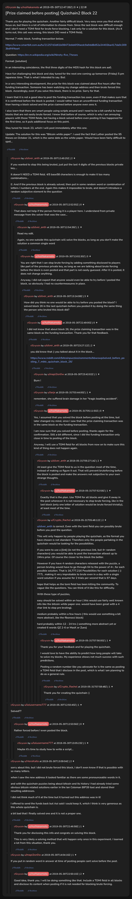

# [Prize claimed before posting] Quizchain2 Block 22

[Original thread](https://www.reddit.com/r/Grycoin/comments/busqnm/prize_claimed_before_posting_quizchain2_block_22/). The `sourceUrl` of the [quizchain2/22](../../../src/collections/quizchain2/22.ts) record and the source of its question, format, hash digits and funding transaction, with the solution the author edited in. The post went up on May 30, 2019, at 12:47:39 UTC, four hours after the claim: the funding transaction has a block time of 03:16:17 UTC and the claim 08:35:57 UTC. Nobody printed the winning string, and u/HeroKaito explains in a comment how they came to hold the key. The last edit is stamped 22:52:11 UTC the same day, so the transcript shows the post with the solution.

## Historical provenance

Provenance rests on a [www.reddit.com capture](https://web.archive.org/web/20200731175657/https://www.reddit.com/r/Grycoin/comments/busqnm/prize_claimed_before_posting_quizchain2_block_22/eph2ffl/) of the permalink of u/lolusername777's comment, stamped July 31, 2020, 17:56:57 UTC. The page state in its HTML carries the whole post, which matches the transcript below paragraph by paragraph, the update with the solution included, and that one comment, which matches word for word. The capture was read on October 2, 2026. `archive_content: confirmed` on that basis, for the post and that comment only. The `old.reddit.com` capture of the same permalink, a second later, shows the comment but leaves the post collapsed. The Wayback Machine also holds a capture of the thread URL itself, June 11, 2023, 20:19:06 UTC, whose `id_` body is Reddit's app shell titled "Reddit - Dive into anything", with neither the post nor a comment in its HTML. The one capture of the `old.reddit.com` URL, two seconds later, is a 302 redirect to a subreddit search for Grycoin. The archive.today timemaps for the `www.reddit.com`, `old.reddit.com` and bare `reddit.com` URLs answered 404. MemGator answered "No snapshots" for all three, but it gave the same answer for the block 11 thread, whose Wayback capture exists, so it settles nothing here.

The transcript takes the post and all 22 comments from the [Arctic Shift](https://arctic-shift.photon-reddit.com/) Reddit archive: the post record and the comment tree for `busqnm`, read on October 2, 2026. The [pullpush](https://pullpush.io/) Reddit archive, read the same day, gives the same post text, time and edit stamp, and the same 22 comments with the same authors, times, scores and parents.

The record names none of the commenters: nothing on the chain ties a claim to a name.

## Transcript

> Thank you for playing the quizchain. Another fairly difficult block. Very easy once you find what to focus on, but there is a lot of information to choose from. Since the last block was difficult enough and I don't need a TOMI field for brute force blocking, I ask only for a solution for this block. (As it turns out, this call was wrong, this block DID need a TOMI field).
>
> Normal 7 mbtc block, funding transaction below.
>
> https://www.smartbit.com.au/tx/21257d3d61b08473ebb6f3faedc9a9dd8d52a34403ba417da0c3093bdf4f4aa4
>
> Question: https://en.m.wikipedia.org/wiki/Ninety-five_Theses
>
> Format: [solution]
>
> In an interesting coincidence, the first three digits of the MD5 hash for this block are aa0.
>
> Have fun challenging this block and stay tuned for the next one coming up tomorrow (Friday) 5 pm Japanese time. That is what I intended to say. But:
>
> In a very interesting development, the prize for this block was claimed about five hours after the funding transaction. Someone has been watching my change address and then brute forced this block. Accordingly, even if you solve this block, there is no prize. Sorry for that.
>
> I learn that it is not a good idea to post the funding transaction too soon, even if that makes sure that it is confirmed before the block is posted. I would rather have an unconfirmed funding transaction than having a block solved and the prize claimed before anyone even sees it.
>
> I also learn that there are smart people using scripts around and I need to be a bit careful to have blocks that are not easily brute forced. I knew that before of course, which is why I am annoying players with those TOMI fields, but having a block solved before even posting it has happened for the first time, so it puts additional focus on this point.
>
> Stay tuned for block 23, which I will post immediately after this one.
>
> Update: The solution for this was "Bitcoin white paper". I used the fact that Luther posted the 95 theses on October 31, which is the same date as the white paper. Would have been fairly difficult to spot...

## Comments

**u/silver_anth**, 2 points:

> If you wanted to stop this being bruted, just put the last 4 digits of the previous blocks private key....
>
> It doesn't NEED a TOMI field. 4/5 base58 characters is enough to make it too many combinations...
>
> E: And if the previous block is already solved, then put in some random word or combination of letters / numbers at the end. Again this makes it impossible to brute, and doesn't introduce a random subjective element to the question

**u/AoiNakamoto**, 0 points, reply to u/silver_anth:

> That does not help if the person forcing it is a player here. I understand from private message from the solver that was the case...

**u/silver_anth**, 1 point, reply to u/AoiNakamoto:

> Read my edit.
>
> Again, no one outside this quizchain will solve the blocks, as long as you don't make the solution a common single word

**u/AoiNakamoto**, 0 points, reply to u/silver_anth:

> You are right that I can stop brute forcing by adding something disclosed to players like part of the previous private key, as long as we are talking about brute forcing before the block is even posted and that part is not easily guessed. After it is posted, it does not change anything.
>
> Anyway, I did not expect that anyone would even be able to try before I posted the block, so obviously I had no countermeasures in place.

**u/silver_anth**, 3 points, reply to u/AoiNakamoto:

> How did you think no one would be able to try before you posted the block? I solved block 26 in the last quizchain before you posted it by doing the same thing the person who bruted this block did?

**u/AoiNakamoto**, 0 points, reply to u/silver_anth:

> I did not know that about block 26, the prize claiming transaction was in the same block as the funding transaction. Thank you for that feedback.

**u/silver_anth**, 2 points, reply to u/AoiNakamoto:

> you did know that :) you talked about it in the block...
>
> https://www.reddit.com/r/bitcoinpuzzles/comments/bbwswp/solved_before_posting_7_mbtc_quizchain_block_26/

**u/mapl3sn0w**, 1 point, reply to u/silver_anth:

> Burn !

**u/tarje**, 1 point, reply to u/silver_anth:

> remember, she suffered brain damage in her "tragic boating accident".

**u/AoiNakamoto**, 0 points, reply to u/silver_anth:

> Yes, I assumed that you solved the block before posting at the time, but later changed my mind, since I saw that the prize claiming transaction was in the same block as the funding transaction.
>
> I am now sure that you solved before posting, thanks again for the confirmation. Still a bit different, since I did the funding transaction only close in time to posting of the block.
>
> Anyway, I will use a TOMI field for all blocks from now on to make sure this kind of thing does not happen again.

**u/silver_anth**, 2 points, reply to u/AoiNakamoto:

> At least give the TOMI field to us in the question most of the time, instead of making us figure it out. That will prevent bruteforcing before the block is posted and make the answers not subjective to your own strange thoughts.

**u/AoiNakamoto**, 1 point, reply to u/silver_anth:

> Exactly that is the plan. Use TOMI for all blocks and give it away in the post whenever it is not necessary to stop brute forcing, like in the last block (only one letter of solution would be brute forced trivially), at least most of the time.

**u/Crypto_Rachel**, 2 points, reply to u/AoiNakamoto:

> u/silver_anth is correct. Even with the tomi field you can possibly brute before you post the question.
>
> This will only happen by people playing the quizchain, as the format you have chosen is not standard. Therefore only the people partaking in the quizchain would be looking for the possibilities.
>
> If you were to use a \[link\] (ie not the previous link, but 4+ random characters) you would be able to post the transaction atleast up to 24hrs prior. Of course the closer to the block the better.
>
> However if you have 4 random characters released with the puzzle, a person bruting would have to go through 64 to the power of 4+, for each possible solution. That is 16,777,216 Possibilities for each solution ( :) 777) , making it very improbable to brute even in a day with a single word solution if you assume for 2 trials per second that is 97 days.
>
> hope that helps as the tomi field has been killing the community. To vague like the questions. You can think of it like this for difficulty.
>
> With these type of puzzles,
>
> easy should be solved within an hour ( this would use fairly well known info like the bitcoin white paper one. would have been great with a 4 char link to stop pre bruting).
>
> medium probably within a few hours ( this would use something a bit more abstract, like the fibonocci block)
>
> hard probably within 12 - 24 hrs ( something more abstract yet or created 6 words QZ 2-6 or MasK or Zues)

**u/AoiNakamoto**, 1 point, reply to u/Crypto_Rachel:

> Thank you for your feedback and for playing the quizchain.
>
> I would love to have the ability to predict how long people will take to solve my blocks. My experience shows not much success with such predictions.
>
> Posting a random number like you advocate for is the same as posting a TOMI field that I disclose in the post, which is what I am planning to do as a general rule.

**u/Crypto_Rachel**, 1 point, reply to u/AoiNakamoto:

> Thank you for creating the quizchain :)

**u/lolusername777**, 1 point:

> Solved??

**u/AoiNakamoto**, 0 points, reply to u/lolusername777:

> Rather forced before I even posted the block.

**u/lolusername777**, 1 point, reply to u/AoiNakamoto:

> Maybe it's time to study how to write a script...

**u/HeroKaito**, 2 points:

> sorry about this. but I did not brute forced this block, I don't even know if that is possible with so many letters.
>
> when I saw the new address it looked familiar as there are some pronounceable words in it.
>
> and with the quizchain puzzles being about bitcoin and its history I had already tried some obvious bitcoin related solutions earlier in the Ian Coleman BIP39 tool and stored their resulting addresses.
>
> I did not think much of it at the time but it turned out this address was in it!
>
> I offered to send the funds back but Aoi said I could keep it, which I think is very generous as this whole quizchain is.
>
> a bit bad that I finally solved one and it is not a proper one.

**u/AoiNakamoto**, 1 point, reply to u/HeroKaito:

> Thank you for disclosing this info and congrats on solving this block.
>
> This is very likely a solving method that will happen only once in this experiment. I learned a lot from this situation, thank you.

**u/mapl3sn0w**, 1 point:

> If you put in random word in answer at time of posting people cant solve before the post.

**u/AoiNakamoto**, 2 points, reply to u/mapl3sn0w:

> Good idea, thank you. I will be doing something like that. Include a TOMI field in all blocks and disclose its content when posting if it is not needed for blocking brute forcing.

## Screenshot

The screenshot is a render of the thread in Arctic Shift's ID lookup, not of Reddit, since the one capture that holds the post shows only one of its 22 comments. Capture method and limits: [source archive](../README.md).
