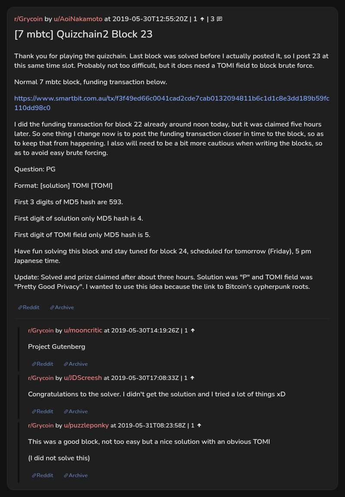

# [7 mbtc] Quizchain2 Block 23

[Original thread](https://www.reddit.com/r/Grycoin/comments/bustcu/7_mbtc_quizchain2_block_23/). The `sourceUrl` of the [quizchain2/23](../../../src/collections/quizchain2/23.ts) record and the source of its question, format, hash digits and funding transaction, with the solution the author edited in. Nobody in the thread printed the whole string. The post went up on May 30, 2019, at 12:55:20 UTC, twelve minutes after the block time of its funding transaction. Its last edit is stamped 22:55:53 UTC the same day, so the transcript shows the post as it stood after the claim.

## Historical provenance

No capture found. On October 2, 2026 the Wayback Machine index listed one capture of the thread under the `www.reddit.com` URL, June 11, 2023, 19:13:54 UTC. Its `id_` body is Reddit's app shell titled "Reddit - Dive into anything", with neither the post nor a comment in its HTML. The one capture of the `old.reddit.com` URL, two seconds later, is a 302 redirect to a subreddit search for Grycoin. The archive.today timemaps for the `www.reddit.com`, `old.reddit.com` and bare `reddit.com` URLs answered 404. MemGator answered "No snapshots" for all three, but it gave the same answer for the block 11 thread, whose Wayback capture exists, so it settles nothing here.

The transcript below comes from the [Arctic Shift](https://arctic-shift.photon-reddit.com/) Reddit archive: the post record and the comment tree for `bustcu`, read on October 2, 2026. The [pullpush](https://pullpush.io/) Reddit archive, read the same day, gives the same post text, time and edit stamp, and the same 3 comments with the same authors, times, scores and parents.

The record names none of the commenters: nothing on the chain ties a claim to a name.

## Transcript

> Thank you for playing the quizchain. Last block was solved before I actually posted it, so I post 23 at this same time slot. Probably not too difficult, but it does need a TOMI field to block brute force.
>
> Normal 7 mbtc block, funding transaction below.
>
> https://www.smartbit.com.au/tx/f3f49ed66c0041cad2cde7cab0132094811b6c1d1c8e3dd189b59fc110dd98c0
>
> I did the funding transaction for block 22 already around noon today, but it was claimed five hours later. So one thing I change now is to post the funding transaction closer in time to the block, so as to keep that from happening. I also will need to be a bit more cautious when writing the blocks, so as to avoid easy brute forcing.
>
> Question: PG
>
> Format: [solution] TOMI [TOMI]
>
> First 3 digits of MD5 hash are 593.
>
> First digit of solution only MD5 hash is 4.
>
> First digit of TOMI field only MD5 hash is 5.
>
> Have fun solving this block and stay tuned for block 24, scheduled for tomorrow (Friday), 5 pm Japanese time.
>
> Update: Solved and prize claimed after about three hours. Solution was "P" and TOMI field was "Pretty Good Privacy". I wanted to use this idea because the link to Bitcoin's cypherpunk roots.

## Comments

**u/mooncritic**, 1 point:

> Project Gutenberg

**u/JDScreesh**, 1 point:

> Congratulations to the solver. I didn't get the solution and I tried a lot of things xD

**u/puzzleponky**, 1 point:

> This was a good block, not too easy but a nice solution with an obvious TOMI
>
> (I did not solve this)

## Screenshot

The screenshot is a render of the thread in Arctic Shift's ID lookup, not of Reddit, since no readable capture of the Reddit page exists. Capture method and limits: [source archive](../README.md).
