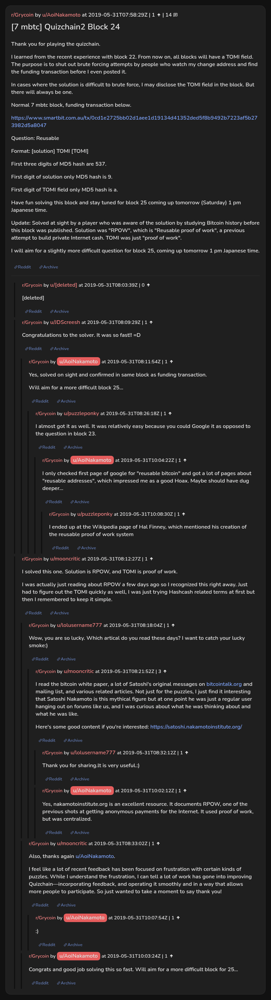

# [7 mbtc] Quizchain2 Block 24

[Original thread](https://www.reddit.com/r/Grycoin/comments/bv4rd2/7_mbtc_quizchain2_block_24/). The `sourceUrl` of the [quizchain2/24](../../../src/collections/quizchain2/24.ts) record and the source of its question, format, hash digits and funding transaction, with the solution the author edited in. u/mooncritic's comment gives the solution and the TOMI field. The post went up on May 31, 2019, at 07:58:29 UTC, eight minutes before the block time of its funding transaction, and the claim confirmed in that same block. Its last edit is stamped 10:06:53 UTC the same day, so the transcript shows the post as it stood after the claim.

## Historical provenance

No capture found. On October 2, 2026 the Wayback Machine index listed one capture of the thread under the `www.reddit.com` URL, June 11, 2023, 19:38:41 UTC. Its `id_` body is Reddit's app shell titled "Reddit - Dive into anything", with neither the post nor a comment in its HTML. The one capture of the `old.reddit.com` URL, two seconds later, is a 302 redirect to a subreddit search for Grycoin. The archive.today timemaps for the `www.reddit.com`, `old.reddit.com` and bare `reddit.com` URLs answered 404. MemGator answered "No snapshots" for all three, but it gave the same answer for the block 11 thread, whose Wayback capture exists, so it settles nothing here.

The transcript below comes from the [Arctic Shift](https://arctic-shift.photon-reddit.com/) Reddit archive: the post record and the comment tree for `bv4rd2`, read on October 2, 2026. The [pullpush](https://pullpush.io/) Reddit archive, read the same day, gives the same post text, time and edit stamp, and the same 14 comments with the same authors, times, scores and parents. One of them is a deleted comment, kept below as `[deleted]`.

The record names none of the commenters: nothing on the chain ties a claim to a name.

## Transcript

> Thank you for playing the quizchain.
>
> I learned from the recent experience with block 22. From now on, all blocks will have a TOMI field. The purpose is to shut out brute forcing attempts by people who watch my change address and find the funding transaction before I even posted it.
>
> In cases where the solution is difficult to brute force, I may disclose the TOMI field in the block. But there will always be one.
>
> Normal 7 mbtc block, funding transaction below.
>
> https://www.smartbit.com.au/tx/0cd1e2725bb02d1aee1d19134d41352ded5f8b9492b7223af5b273982d5a8047
>
> Question: Reusable
>
> Format: [solution] TOMI [TOMI]
>
> First three digits of MD5 hash are 537.
>
> First digit of solution only MD5 hash is 9.
>
> First digit of TOMI field only MD5 hash is a.
>
> Have fun solving this block and stay tuned for block 25 coming up tomorrow (Saturday) 1 pm Japanese time.
>
> Update: Solved at sight by a player who was aware of the solution by studying Bitcoin history before this block was published. Solution was "RPOW", which is "Reusable proof of work", a previous attempt to build private Internet cash. TOMI was just "proof of work".
>
> I will aim for a slightly more difficult question for block 25, coming up tomorrow 1 pm Japanese time.

## Comments

**[deleted]**:

> [deleted]

**u/JDScreesh**, 1 point:

> Congratulations to the solver. It was so fast!! =D

**u/AoiNakamoto**, 1 point, reply to u/JDScreesh:

> Yes, solved on sight and confirmed in same block as funding transaction.
>
> Will aim for a more difficult block 25...

**u/puzzleponky**, 1 point, reply to u/AoiNakamoto:

> I almost got it as well. It was relatively easy because you could Google it as opposed to the question in block 23.

**u/AoiNakamoto**, 1 point, reply to u/puzzleponky:

> I only checked first page of google for "reusable bitcoin" and got a lot of pages about "reusable addresses", which impressed me as a good Hoax. Maybe should have dug deeper...

**u/puzzleponky**, 1 point, reply to u/AoiNakamoto:

> I ended up at the Wikipedia page of Hal Finney, which mentioned his creation of the reusable proof of work system

**u/mooncritic**, 1 point:

> I solved this one. Solution is RPOW, and TOMI is proof of work.
>
> I was actually just reading about RPOW a few days ago so I recognized this right away. Just had to figure out the TOMI quickly as well, I was just trying Hashcash related terms at first but then I remembered to keep it simple.

**u/lolusername777**, 1 point, reply to u/mooncritic:

> Wow, you are so lucky. Which artical do you read these days? I want to catch your lucky smoke:)

**u/mooncritic**, 3 points, reply to u/lolusername777:

> I read the bitcoin white paper, a lot of Satoshi's original messages on [bitcointalk.org](https://bitcointalk.org) and mailing list, and various related articles. Not just for the puzzles, I just find it interesting that Satoshi Nakamoto is this mythical figure but at one point he was just a regular user hanging out on forums like us, and I was curious about what he was thinking about and what he was like.
>
> Here's some good content if you're interested: [https://satoshi.nakamotoinstitute.org/](https://satoshi.nakamotoinstitute.org/)

**u/lolusername777**, 1 point, reply to u/mooncritic:

> Thank you for sharing.lt is very useful.:)

**u/AoiNakamoto**, 1 point, reply to u/mooncritic:

> Yes, nakamotoinstitute.org is an excellent resource. It documents RPOW, one of the previous shots at getting anonymous payments for the Internet. It used proof of work, but was centralized.

**u/mooncritic**, 1 point, reply to u/mooncritic:

> Also, thanks again u/AoiNakamoto.
>
> I feel like a lot of recent feedback has been focused on frustration with certain kinds of puzzles. While I understand the frustration, I can tell a lot of work has gone into improving Quizchain—incorporating feedback, and operating it smoothly and in a way that allows more people to participate. So just wanted to take a moment to say thank you!

**u/AoiNakamoto**, 1 point, reply to u/mooncritic:

> :)

**u/AoiNakamoto**, 1 point, reply to u/mooncritic:

> Congrats and good job solving this so fast. Will aim for a more difficult block for 25...

## Screenshot

The screenshot is a render of the thread in Arctic Shift's ID lookup, not of Reddit, since no readable capture of the Reddit page exists. Capture method and limits: [source archive](../README.md).
