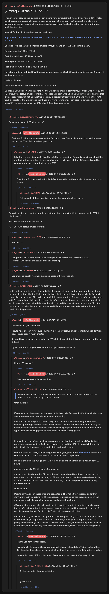

# [7 mbtc] Quizchain2 Block 25

[Original thread](https://www.reddit.com/r/Grycoin/comments/bvgsn7/7_mbtc_quizchain2_block_25/). The `sourceUrl` of the [quizchain2/25](../../../src/collections/quizchain2/25.ts) record and the source of its question, format, hash digits, hint and funding transaction, with the solution the author edited in. The full winning string is in u/Randomiser's comment. The post went up on June 1, 2019, at 03:57:35 UTC, an hour and a half after the block time of its funding transaction. Its last edit is stamped 01:25:36 UTC on June 9, 2019, so the transcript shows the post as it stood after the claim.

## Historical provenance

No capture found. On October 2, 2026 the Wayback Machine index listed one capture of the thread under the `www.reddit.com` URL, June 11, 2023, 19:56:39 UTC. Its `id_` body is Reddit's app shell titled "Reddit - Dive into anything", with neither the post nor a comment in its HTML. The one capture of the `old.reddit.com` URL, two seconds later, is a 302 redirect to a subreddit search for Grycoin. The archive.today timemaps for the `www.reddit.com`, `old.reddit.com` and bare `reddit.com` URLs answered 404. MemGator answered "No snapshots" for all three, but it gave the same answer for the block 11 thread, whose Wayback capture exists, so it settles nothing here.

The transcript below comes from the [Arctic Shift](https://arctic-shift.photon-reddit.com/) Reddit archive: the post record and the comment tree for `bvgsn7`, read on October 2, 2026. The [pullpush](https://pullpush.io/) Reddit archive, read the same day, gives the same post text, time and edit stamp, and the same 16 comments with the same authors, times, scores and parents. Their bodies differ only in how pullpush escapes the empty `&#x200B;` paragraph in two comments and the quote marker that opens one comment, and the transcript leaves those empty paragraphs out.

The record names none of the commenters: nothing on the chain ties a claim to a name.

## Transcript

> Thank you for playing the quizchain. I am aiming for a difficult block here. It will have a TOMI field, part because the solution by itself is lacking somewhat in entropy. But also just to make it a bit harder after the last couple of relatively easy blocks. If you feel lost, maybe you will want to wait until the first hint.
>
> Normal 7 mbtc block, funding transaction below.
>
> https://www.smartbit.com.au/tx/af41bfa7ffa60febb31ccaef88e0953fed581cbf42b8bc1219cf882908ec1efd
>
> Question: We use three Fibonacci numbers. One, zero, and two. What does this mean?
>
> Format: [solution] TOMI [TOMI]
>
> First three digits of MD5 hash are 457.
>
> First digit of solution only MD5 hash is a.
>
> FIrst digit of TOMI field only MD5 hash is 4.
>
> Have fun challenging this difficult block and stay tuned for block 26 coming up tomorrow (Sunday) 8 am Japanese time.
>
> Update, hint one:
>
> Not about Fibonacci. First word of TOMI field is total.
>
> Update 2: Solved soon after this hint. As the winner reported in comments, solution was 77 + 25 and TOMI field was total number of blocks. The Fibonacci stuff was a hoax, if you avoided falling for that, it was just a matter of noting that this block 25 is actually already block 102 and finding the TOMI field. Congrats to the winner and thank you everyone for playing. Next block is already posted and block 27 will come up tomorrow (Monday) 10 pm Japanese time.

## Comments

**u/lolusername777**, 1 point:

> Some details about TOMI please xD

**u/AoiNakamoto**, 3 points, reply to u/lolusername777:

> First hint for this block coming up after 24 hours, 1 pm Sunday Japanese time. Giving away part of the TOMI field may be a good hint.

**u/Quantris**, 1 point, reply to u/AoiNakamoto:

> I'd rather have a hint about what the solution is related to; I'm pretty convinced about the method but not sure how to narrow down to a particular solution. Of course I could be completely wrong about that method (56).

**u/AoiNakamoto**, 1 point, reply to u/Quantris:

> Thank you for your feedback. It is difficult to do that without giving it away completely though.

**u/Quantris**, 1 point, reply to u/AoiNakamoto:

> Fair enough. It does look like I was on the wrong track anyway :)

**u/Randomiser**, 2 points:

> Solved, thank you! I had the right idea yesterday but couldn't get it to pan out, so the TOMI hint helped!
>
> Edit: Finally confirmed, solution is
>
> 77 + 25 TOMI total number of blocks

**u/lolusername777**, 1 point, reply to u/Randomiser:

> 25+77=102?

**u/JDScreesh**, 1 point, reply to u/Randomiser:

> Congratulations Randomiser. I was trying some solutions but I didn't got it. xD
> I wonder which was the solution for this block =)

**u/Quantris**, 1 point, reply to u/Randomiser:

> Congrats, as usual I was way overcomplicating things. Nice job!

**u/reddeneer**, 2 points:

> that is quite a long tomi, and it sounds like the solver already had the right solution yesterday but just did not get the tomi? although the hint did it's job in this case but maybe before giving a hint give the number of items in the tomi right away or after 12 hours or so? especially those with 3 or more items in it, would be more helpful to human players than bots, for example it would have also have helped the guy that already had the correct solution of block 21 before the hint. just an idea, I would not have solved this one anyway, congrats to the solver and thanks for the puzzles!

**u/AoiNakamoto**, 1 point, reply to u/reddeneer:

> Thank you for your feedback.
>
> I could have chosen "total block number" instead of "total number of blocks", but I don't see how I could keep it much shorter.
>
> It would have been easier knowing the TOMI field format, but this one was supposed to be difficult.
>
> Again, thank you for your feedback and for playing the quizchain.

**u/lolusername777**, 1 point, reply to u/AoiNakamoto:

> Hint of 26, please:)

**u/AoiNakamoto**, 1 point, reply to u/lolusername777:

> Coming up on 8 am Japanese time.

**u/Crypto_Rachel**, 1 point, reply to u/AoiNakamoto:

> > I could have chosen "total block number" instead of "total number of blocks", but I don't see how I could keep it much shorter.
>
> total blocks ;)
>
> If you wonder why no one solves most of the blocks before your hint's, it's really because your questions are extremely vague and misleading.
>
> I hate to say anything as it seems every time someone says something the difficulty shoot's up through the roof. It makes me believe that it's done intentionally. As they are your questions they usually don't have any leading logic to start with, or a riddle of any type. Just a misleading question, that sends us down wrong paths.
>
> I know these type of puzzles (guessing games), are hard to control the difficulty, but it goes from impossible to a 5 min solve. When I posted the difficulty possibilities on the other block, the Idea was really with hint's and solving time.
>
> so for puzzles you designate as easy, have a nudge type hint like u/reddeneer states in a couple hours and then a more decisive hint in another couple hours.
>
> medium should get a nudge after like 4-6 hours and then a more decisive hint at 8-12 hours.
>
> and hard ones like 12-18 hours after posting
>
> for extremely hard ones like 77 more time of course should be allowed, however I can guarantee the only people working on 77 are computer scripts. I understand your trying to time that one out with this quizchain, dropping hints in the puzzles. That's totally understandable.
>
> truth be told:
>
> People can't work on these type of puzzles long. They take their guesses and if they don't work out you get stuck. These puzzles are guessing games though a person can only do so much, it's brutal on a person to do more than that.
>
> Of course this is Your quizchain, and you do have the right to do what ever makes you happy. After all you should get enjoyment out of it also, and I know creating puzzles for people to solve is quite fun :) , I only Try to help everyone with this.
>
> I do want to say Thank you though, You're amazing for doing this, and I really appreciate it. People may get angry but that is their problem, I think people forget that you are giving money away (even if we have to work for it :) .). Beyond everything it has been an experience, and I do like any chance to get more Bitcoin, since I was late to the game :)

**u/AoiNakamoto**, 2 points, reply to u/Crypto_Rachel:

> Thank you for your feedback.
>
> I could do hints sooner like you suggested. Maybe I should do a Twitter poll on that. On the other hand, keeping the original posting time keeps a fair distributed schedule.
>
> I do not increase difficulty because of comments. I increase it after easy blocks.

**u/Crypto_Rachel**, 1 point, reply to u/AoiNakamoto:

> :) I like the polls, they make it fair :)
>
> :) thank you

## Screenshot

The screenshot is a render of the thread in Arctic Shift's ID lookup, not of Reddit, since no readable capture of the Reddit page exists. Capture method and limits: [source archive](../README.md).
