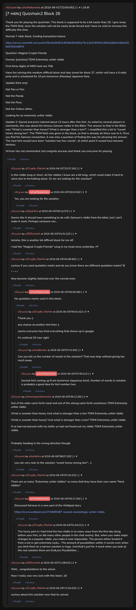

# [7 mbtc] Quizchain2 Block 26

[Original thread](https://www.reddit.com/r/Grycoin/comments/bvqrlr/7_mbtc_quizchain2_block_26/). The `sourceUrl` of the [quizchain2/26](../../../src/collections/quizchain2/26.ts) record and the source of its question, format, hash digits, hint and funding transaction, with the solution the author edited in. The format already gives the TOMI field, and the winner never commented. The post went up on June 1, 2019, at 23:00:05 UTC, nine hours after the block time of its funding transaction. Its last edit is stamped 13:11:46 UTC on June 3, 2019, so the transcript shows the post as it stood after the claim.

## Historical provenance

No capture found. On October 2, 2026 the Wayback Machine index listed one capture of the thread under the `www.reddit.com` URL, June 11, 2023, 19:57:11 UTC. Its `id_` body is Reddit's app shell titled "Reddit - Dive into anything", with neither the post nor a comment in its HTML. The one capture of the `old.reddit.com` URL, two seconds later, is a 302 redirect to a subreddit search for Grycoin. The archive.today timemaps for the `www.reddit.com`, `old.reddit.com` and bare `reddit.com` URLs answered 404. MemGator answered "No snapshots" for all three, but it gave the same answer for the block 11 thread, whose Wayback capture exists, so it settles nothing here.

The transcript below comes from the [Arctic Shift](https://arctic-shift.photon-reddit.com/) Reddit archive: the post record and the comment tree for `bvqrlr`, read on October 2, 2026. The [pullpush](https://pullpush.io/) Reddit archive, read the same day, gives the same post text, time and edit stamp, and the same 16 comments with the same authors, times, scores and parents. Their bodies differ only in how pullpush escapes the empty `&#x200B;` paragraph in one comment, and the transcript leaves those empty paragraphs out.

The record names none of the commenters: nothing on the chain ties a claim to a name.

## Transcript

> Thank you for playing the quizchain. This block is supposed to be a bit easier than 25. I give away the TOMI field, since the solution will not be easily brute forced and I have no wish to increase the difficulty this time.
>
> Normal 7 mbtc block, funding transaction below.
>
> https://www.smartbit.com.au/tx/05ed3d948218538a9f4d55a79c12b22900912862dd83d428d4268a6392eb8f24
>
> Question: Magical Crypto Friends
>
> Format: [solution] TOMI Extremely unfair riddle
>
> First three digits of MD5 hash are 7b8.
>
> Have fun solving this medium difficult block and stay tuned for block 27, which will have a 9 mbtc prize and is scheduled for 10 pm tomorrow (Monday) Japanese time.
>
> Update (hint one):
>
> Not Pan or Pon
>
> Not the Panda
>
> Not the Pony
>
> Not the Chikun either.
>
> Looking for an extremely unfair riddle.
>
> Update 2: Solved and prize claimed about 12 hours after this hint. As noted by several players in comments, this was about the famous Samson riddle in the Bible. The answer to that in the BIble was "What is sweeter than honey? What is stronger than a lion?". I simplified this a bit to "sweet honey strong lion". The TOMI field was given in the block, so that is already all there was to it. Once you find the Samson connection, it was only a question of finding the way for phrasing the answer. The next hint would have been "solution has four words", at which point it would have become obvious.
>
> Winner has not commented, but congrats anyway and thank you everyone for playing.

## Comments

**u/Crypto_Rachel**, 2 points:

> Is this riddle long or short, all the riddles I know are a bit long, which could make it hard to solve due to formatting alone. Or are we looking for the solution?

**u/AoiNakamoto**, 1 point, reply to u/Crypto_Rachel:

> Yes, you are looking for the solution.

**u/Quantris**, 1 point:

> Seems like it should have something to do with Samson's riddle from the bible, but I can't make it work. Perhaps someone can...

**u/JDScreesh**, 1 point:

> hehehe, this is another bit difficult block for me xD
>
> I had the "Magical Crypto Friends" song in my head since yesterday =P

**u/Crypto_Rachel**, 1 point:

> curious if you used quotation marks and do you know there are different quotation marks? IE
>
> “ “ " "
>
> they become slightly italicized over the normal ones

**u/AoiNakamoto**, 1 point, reply to u/Crypto_Rachel:

> No quotation marks used in this block.

**u/Crypto_Rachel**, 0 points, reply to u/AoiNakamoto:

> Thank you :)
>
> any chance at another hint then :)
>
> seems everyone has tried everything that shows up in google
>
> it's outlived 25 now right

**u/reddeneer**, 1 point, reply to u/AoiNakamoto:

> Can you tell us the number of words in the solution? That may help without giving too much away

**u/AoiNakamoto**, 1 point, reply to u/reddeneer:

> Second hint coming up 8 am tomorrow (Japanese time). Number of words in solution is probably a good idea for hint number two.

**u/martypyouknowme**, 3 points:

> Out of the eater came forth meat and out of the strong came forth sweetness TOMI Extremely unfair riddle
>
> What is sweeter than honey And what is stronger than a lion TOMI Extremely unfair riddle
>
> What is sweeter than honey? And what is stronger than a lion? TOMI Extremely unfair riddle
>
> If ye had not plowed with my heifer ye had not found out my riddle TOMI Extremely unfair riddle
>
> Probably heading in the wrong direction though

**u/suhailvs**, 1 point, reply to u/martypyouknowme:

> you can very near to the solution "sweet honey strong lion".. :(.

**u/Crypto_Rachel**, 1 point:

> There are so many "Extremely unfair riddles" so many that they have their own name "Neck riddles"

**u/AoiNakamoto**, 1 point, reply to u/Crypto_Rachel:

> Discussed fairness in a new part of the Wattpad story
>
> https://www.wattpad.com/740685487-second-exceedingly-unfair-riddle.

**u/Crypto_Rachel**, 1 point, reply to u/AoiNakamoto:

> The funny part is I had tried the lion riddle in so many ways from the first day (long before your hint, so did many other people in the chat rooms). But, when you make major changes to a popular riddle. you make it near impossible. The person either bruted it from a list or got extremely lucky... The amount of possibilities within 4 words even when you limit them to a narrow solution is huge. And that's just for 4 word when you look at the real solution there are EndLess Possibilities ...

**u/JDScreesh**, 2 points:

> Well... congratulations to the solver.
>
> Now I really was very lost with this block. xD

**u/Crypto_Rachel**, 2 points:

> curious about this solution now that its solved

## Screenshot

The screenshot is a render of the thread in Arctic Shift's ID lookup, not of Reddit, since no readable capture of the Reddit page exists. Capture method and limits: [source archive](../README.md).
