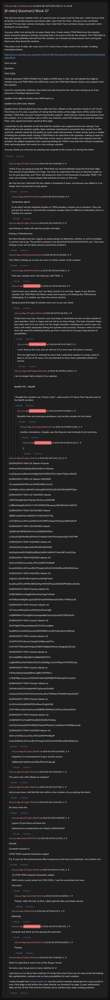

# [9 mbtc] Quizchain2 Block 27

[Original thread](https://www.reddit.com/r/Grycoin/comments/bwaepa/9_mbtc_quizchain2_block_27/). The `sourceUrl` of the [quizchain2/27](../../../src/collections/quizchain2/27.ts) record and the source of its question, format, hash digits, hint and funding transaction, with the solution the author edited in. The full winning string is in u/userm1010110's comment. The post went up on June 3, 2019, at 13:02:15 UTC, two and a half hours after the block time of its funding transaction. Its last edit is stamped 23:06:59 UTC on June 4, 2019, so the transcript shows the post as it stood after the claim.

## Historical provenance

No capture found. On October 2, 2026 the Wayback Machine index listed fifteen captures of the thread under the `www.reddit.com` URL, taken between June 19 and June 30, 2023, and none of the `old.reddit.com` URL. Every `id_` body of the fifteen is Reddit's app shell titled "Reddit - Dive into anything", with neither the post nor a comment in its HTML. The archive.today timemaps for the `www.reddit.com`, `old.reddit.com` and bare `reddit.com` URLs answered 404. MemGator answered "No snapshots" for all three, but it gave the same answer for the block 11 thread, whose Wayback capture exists, so it settles nothing here.

The transcript below comes from the [Arctic Shift](https://arctic-shift.photon-reddit.com/) Reddit archive: the post record and the comment tree for `bwaepa`, read on October 2, 2026. The [pullpush](https://pullpush.io/) Reddit archive, read the same day, gives the same post text, time and edit stamp, and the same 25 comments with the same authors, times, scores and parents. Their bodies differ only in how pullpush escapes the empty `&#x200B;` paragraph in one comment and the quote marker that opens one comment, and the transcript leaves those empty paragraphs out. One of them is a deleted comment, kept below as `[deleted]`.

The record names none of the commenters: nothing on the chain ties a claim to a name.

## Transcript

> The last two blocks needed a hint, so I want to have an easier level for this one. I note however that all blocks eventually become easy blocks after I give hints for them. And up to now, all blocks (except 77) have been solved eventually. Also I note that I have not been always successful when aiming for an easy block.
>
> Anyway, while I am aiming for an easier block here, it does need a TOMI field since the solution alone would be lacking in entropy. Knowing that is of course a hint for the solution. The TOMI field is however quite definitely derived from the solution, so it should not keep anyone from solving the block once they found the solution.
>
> This block is for 9 mbtc, the cross sum of 27, since it has a lucky seven in its number. Funding transaction below.
>
> https://www.smartbit.com.au/tx/00c41fb1d17837ff51e0def00f115c18da709db3034453542618ef0adbc65a2f
>
> Here we go.
>
> Question:
>
> FOG COOL
>
> Format: [solution] TOMI [TOMI]
> First 3 digits of MD5 hash is c3d. I do not indicate first digit of solution only and TOMI field only MD5 hash, since the TOMI field follows clearly and uniquely from the solution.
>
> Have fun solving this relatively easy block and stay tuned for the next once coming up at 5 pm tomorrow (Tuesday) Japanese time.
>
> Update: First digit of solution only MD5 hash is a.
>
> Update two (hint one): Atbash.
>
> Update three: Solved about four hours after this hint. Atbash on the question results in ULT XLLO. From there on it is only a question of noting that the letters at the edges form UTXO, which is the solution. TOMI field was just "unspent transaction output", which follows clearly and uniquely from the solution. It is a coincidence, but a COOL one, that the word FOG helped to conceal the solution. FGCL only would have been solved at first sight.
>
> I would like to call attention to the fact that the solution was supposed to be low entropy. Four letters like the real solution qualify, other solutions mentioned in comments (two words from BIP word list, website name) do not qualify as much under that premise. In other words, just as a matter of finding the solution itself, having a TOMI field is an extra hint in the question, making it easier to find said solution. And if the TOMI field (like in this case) is derived clearly and uniquely from the solution, the added complexity from requiring finding the TOMI is less than the reduced complexity from narrowing down the search to a low entropy solution.
>
> Anyway, thank you everyone for playing and congrats to the winner for solving this block.

## Comments

**u/Crypto_Rachel**, 4 points:

> I think if you are going to keep the TOMI field you should definitely keep the first hash digit. The amount of possibilities are Huge. You have to understand We have no Idea the length so we are just guessing. and There will always be many if not thousands of possible TOMI 's for every one solution. I know people that checked out early on this one.
>
> like the last one I had tried the lion riddle in hundreds of ways, yet because you edited it, it no longer was a puzzle just a lucky guess.

**u/BrainForceOne**, 4 points, reply to u/Crypto_Rachel:

> Completely agree!
>
> If you don't use the simplest solution or TOMI possible, scripters are in advance. They can just put the words in a list and the computer aranges those in different combination just in a fraction of a second.

**u/Crypto_Rachel**, 3 points:

> and entropy is really not used for puzzles normally.
>
> Entropy is Randomness
>
> the More Random the less Logical so using entropy to determine whether or not it's brutable is not the way to go. The perfect example is the BruteFUFUFUFUFUFUFUFUFU one. That ones entropy is low yet not likely anyone would have bruted it.

**u/martypyouknowme**, 2 points:

> The TOMI is killing me on this one since I’m fairly certain of the solution.

**u/BrainForceOne**, 1 point, reply to u/martypyouknowme:

> Post your solution and I will help you with TOMI :-)

**u/AoiNakamoto**, 0 points, reply to u/martypyouknowme:

> I don't know your solution, but I am fairly certain it is not mine. Again, if you find the solution, the TOMI field will follow easily and uniquely, so if finding the TOMI proves challenging, it is unlikely you have the correct solution.
>
> Going to post first digit of solution only now so you can check.

**u/Crypto_Rachel**, 1 point, reply to u/AoiNakamoto:

> If that were only true. However you must keep in mind that we have no idea outside of your question, which is vague and can link to so many things. The hash character helps, but really only if it's one word. For the single character, matching one word is easy not many will match (especially taking the question into account). However when it's more than one word the matching hashes go from a short list to Suuuper long amount of possibilities.

**u/AoiNakamoto**, 1 point, reply to u/Crypto_Rachel:

> I can't discuss this now, but we will see if it is true once this block is solved.
>
> The one digit hash is intended to show that a potential solution is wrong, which it does in 15 out of 16 cases. It is not intended to show that a potential solution is correct.

**u/martypyouknowme**, 2 points, reply to u/AoiNakamoto:

> I am no longer fairly certain of my solution.
>
> _touché_ AOI.... _touché_
>
> I thought the solution was "frozen creek"....each word is 27 down from fog and cool on the Bip39 wordlist.

**u/AoiNakamoto**, 1 point, reply to u/martypyouknowme:

> Beautiful idea and amazing coincidence, but not the solution for this block.

**u/martypyouknowme**, 1 point, reply to u/AoiNakamoto:

> Another coincidence...Google says that fog and cool translate to kiri and kuru.

**u/AoiNakamoto**, 1 point, reply to u/martypyouknowme:

> :)

**u/Crypto_Rachel**, 2 points:

> ZADRAZIWH TOMI AZ Atbash Wizards
>
> 1MMwz1RVmCipfGqkuEhtuiW8vC1cShbuqr
>
> L1aG2prjazmutDdvHb3VdjtgYQ2WNRGK7D1Y1batVTQjctw3BvZS
>
> ZADRAZIWH TOMI AZ Atbash WIZARDS
>
> 1CLwqaXqnEtVPRwa1r4FMfLtc86U1xs1Vy
>
> KyNE9jSrseCKAw3MeDCnhdUxg56v92XtCa2EAEZHSKhrj9NfYZqw
>
> ZADRAZIWH TOMI AZ WIZARDS Atbash
>
> 13EPCGoGjqEi5mCYSprQy79LDwyw5S3VRE
>
> L18BuoNqap8ve62nCv7uT9c4Kt9SXS9uquzsys81MDn2hu7wB7d2
>
> ZADRAZIWH TOMI AZWIZARDS Atbash
>
> 1B8GF1qct9UQw4q9XDrCi7Yo6C4XcfYTFg
>
> L3VYQFzHuvLrt67suLENkP2nXVmRRTc4mjoLT6vRwpnhRDTybFnP
>
> ZADRAZIWH TOMI AZWIZARDS atbash
>
> 16jd5Fo5j7kBPBuMKuVUuuTjSBQSZSfQAv
>
> L1DtazDrJj9V9wBiwiEMWroYrVqNteAANnTtKsUphsmDg7uWA78N
>
> ZADRAZIWH TOMI WIZARDS Atbash AZ
>
> 16XUKyFS2cJAuBoA3dXr8TJr5FUQWJrE9r
>
> KxEGtaKXerBSVDG8Gfy9jZ9uDd36KViNKNYrThdoY8K7unSi22Vg
>
> ZADRAZIWH TOMI WIZARDS atbash AZ
>
> 19arVyX2KDLwyca1NyyTDvCqXfSFMmBpdP
>
> KwdxZ44DshL3GYww6KrCPUuigYwSXAVnCefSoREow8N1DEiEAaLv
>
> ZADRAZIWH TOMI WIZARDS Atbash ZA
>
> 1GgnEvL4SrizFkh9e7xojeHYLwEtWg7WeV
>
> KwaNzyUEFkvxRMRLSBRzNz5qrHMHSPCeqU2QGDDffFQRj4wbhUbv
>
> ZADRAZIWH TOMI Wizards Atbash ZA
>
> 1K9DC6jEJRsvyWgqRvK5nvRmj7qxpFWdmb
>
> KxHGfbayfzbBgf61ugAGQRrEFakdSMSNdxvkZXJ3NaL7F5kKUL3K
>
> ZADRAZIWH TOMI Wizards Atbash AZ
>
> 1FVVAwmDKcpcZvJrezPjJ4kZLyEKjAn4g8
>
> L4Q8R56kfwTiUyi6gMcr2nasqpx8bkj7pHLxQscZoKFZ2BY9nk33
>
> ZADRAZIWH TOMI wizards Atbash AZ
>
> 1DWF8pfFXDJoaa4Mdak3Q74LTMcVret8eN
>
> Kxs89NzYuA3LBhQ1jxuQrdSRMf386CrsmdKTntGsr6yJe1K8KAtd
>
> ZADRAZIWH TOMI wizards atbash AZ
>
> 1CzKPhT2VCn5wzw13mghJJ2Af8comg7FVs
>
> L5AYMJ77FZknzbMW9puHKi8XFMd6pbJ4MaAirw9sgksjjVZCLeEJ
>
> ZADRAZIWH TOMI wizards atbash az
>
> 1GvnXpB68ivrQQsd6zi1on8dipGED1XiYc
>
> L1gBc5PZehsNdVS9dAU9152VLBZd9g11sz3VMPgLVPrXRFjPCybu
>
> ZADRAZIWH TOMI wizards Atbash az
>
> 12hSomtjmgrsKgUipBHp1xg8fr1WPi59vu
>
> L1fEqFf8qnvLtwxus3TKNUMVbDHJb3PEB67RV6kwfj3rFe1cUCdv
>
> ZADRAZIWH TOMI Wizards Atbash az
>
> 1GHHfvXVaf1ZzeWgdN45V3q2prx6vDsdEd
>
> L3esbm2JVb2vXShTeSXwUmWcu2ttwTXfNQac7fWaNPmfxqHS1jH7
>
> ZADRAZIWH TOMI Wizards atbash az
>
> 1L2JVHv4HVmBX5NPfjYfuGNavCCotjXM28
>
> L5WY9fJmss2bScXjzHszmnDfjBR8v3RN9kLSv2iPmuz33ApYsD4X
>
> ZADRAZIWH TOMI Wizards atbash AZ
>
> 1H2BNK57412V4qDPAfer8QWZU65sY6mFpx
>
> L2KTQAANeoMJDfWM69Q2jTGpmPPNuMsr11uRGbeEYHK9f8raumy8
>
> ZADRAZIWH TOMI WIZARDS atbash AZ
>
> 19arVyX2KDLwyca1NyyTDvCqXfSFMmBpdP
>
> KwdxZ44DshL3GYww6KrCPUuigYwSXAVnCefSoREow8N1DEiEAaLv

**u/Crypto_Rachel**, 2 points, reply to u/Crypto_Rachel:

> Hopefully I'm remembered if it give out the answer
>
> 1QBdacdaVVpHkuinaAn8LyRZvkzALQLugt

**u/Crypto_Rachel**, 1 point:

> The same only with Atbash as solution?

**u/Crypto_Rachel**, 1 point:

> Just so you know I did find this site within a few minutes of you posting this block

**u/Crypto_Rachel**, 1 point:

> So many more too

**u/Crypto_Rachel**, 1 point, reply to u/Crypto_Rachel:

> I guess I'll put these out there too
>
> zadraziwh.xln zaultdraziwh.xln Atbash ZADRAZIWH

**u/userm1010110**, 2 points:

> Solved!
>
> Complete solution is:
>
> UTXO TOMI unspent transaction output
>
> P.S. It was my first solved puzzle after trying hours and hours on Quizchain. Very thanks Aoi.

**u/Crypto_Rachel**, 1 point, reply to u/userm1010110:

> > UTXO TOMI unspent transaction output
>
> OMG what a wacky jump from FOG COOL. I see the connection but wow.
>
> nice solve

**u/userm1010110**, 1 point, reply to u/Crypto_Rachel:

> Thanks. After the hint, at first, I didn't get the idea. but finally solved.

**[deleted]**, reply to u/userm1010110:

> [deleted]

**u/AoiNakamoto**, 1 point, reply to u/userm1010110:

> Congrats and thank you for playing the quizchain.

**u/userm1010110**, 1 point, reply to u/AoiNakamoto:

> Thanks.

**u/Crypto_Rachel**, 1 point:

> Well I'm Glad that it wasn't any of the things I found
>
> So many ways to go and so many matches to 'a'
>
> I got stuck on my items that matched, it's kinda hard when there are no rules to the formatting like capitalization, symbols and so many possibilities for each solution.
>
> I really thought that [azfogwizards.com](https://azfogwizards.com) was the perfect solution (especially for a easy puzzle it was a first page result before this chain started, we knocked it to page 2, poor webmaster). After all the AZ the FOG and the Wizards not to mention they make cooling products.

## Screenshot

The screenshot is a render of the thread in Arctic Shift's ID lookup, not of Reddit, since no readable capture of the Reddit page exists. Capture method and limits: [source archive](../README.md).
