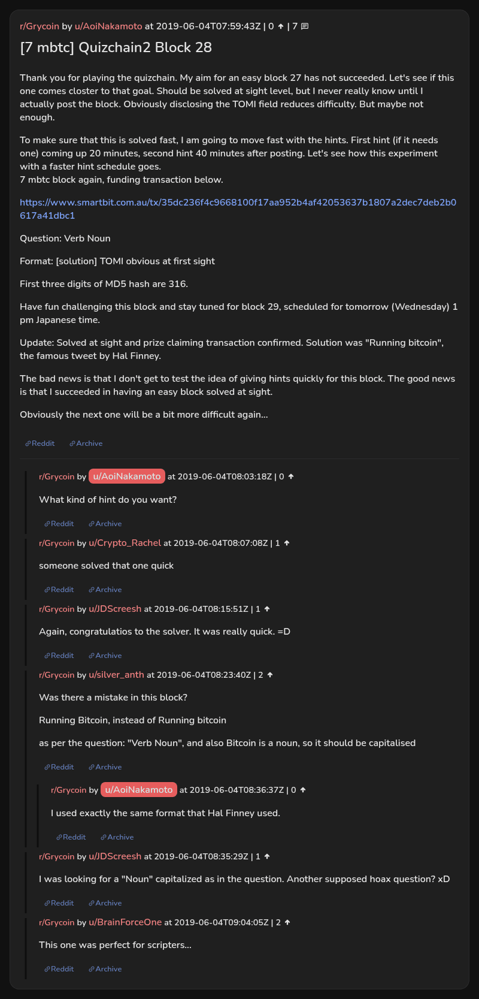

# [7 mbtc] Quizchain2 Block 28

[Original thread](https://www.reddit.com/r/Grycoin/comments/bwm5hb/7_mbtc_quizchain2_block_28/). The `sourceUrl` of the [quizchain2/28](../../../src/collections/quizchain2/28.ts) record and the source of its question, format, hash digits and funding transaction, with the solution the author edited in. The format already gives the TOMI field, and nobody in the thread printed the whole string. The post went up on June 4, 2019, at 07:59:43 UTC, an hour and 23 minutes after the block time of its funding transaction. Its last edit is stamped 08:23:15 UTC the same day, so the transcript shows the post as it stood after the claim.

## Historical provenance

No capture found. On October 2, 2026 the Wayback Machine index listed one capture of the thread under the `www.reddit.com` URL, June 11, 2023, 20:29:38 UTC. Its `id_` body is Reddit's app shell titled "Reddit - Dive into anything", with neither the post nor a comment in its HTML. The one capture of the `old.reddit.com` URL, two seconds later, is a 302 redirect to a subreddit search for Grycoin. The archive.today timemaps for the `www.reddit.com`, `old.reddit.com` and bare `reddit.com` URLs answered 404. MemGator answered "No snapshots" for all three, but it gave the same answer for the block 11 thread, whose Wayback capture exists, so it settles nothing here.

The transcript below comes from the [Arctic Shift](https://arctic-shift.photon-reddit.com/) Reddit archive: the post record and the comment tree for `bwm5hb`, read on October 2, 2026. The [pullpush](https://pullpush.io/) Reddit archive, read the same day, gives the same post text, time and edit stamp, and the same 7 comments with the same authors, times, scores and parents.

The record names none of the commenters: nothing on the chain ties a claim to a name.

## Transcript

> Thank you for playing the quizchain. My aim for an easy block 27 has not succeeded. Let's see if this one comes closter to that goal. Should be solved at sight level, but I never really know until I actually post the block. Obviously disclosing the TOMI field reduces difficulty. But maybe not enough.
>
> To make sure that this is solved fast, I am going to move fast with the hints. First hint (if it needs one) coming up 20 minutes, second hint 40 minutes after posting. Let's see how this experiment with a faster hint schedule goes.
> 7 mbtc block again, funding transaction below.
>
> https://www.smartbit.com.au/tx/35dc236f4c9668100f17aa952b4af42053637b1807a2dec7deb2b0617a41dbc1
>
> Question: Verb Noun
>
> Format: [solution] TOMI obvious at first sight
>
> First three digits of MD5 hash are 316.
>
> Have fun challenging this block and stay tuned for block 29, scheduled for tomorrow (Wednesday) 1 pm Japanese time.
>
> Update: Solved at sight and prize claiming transaction confirmed. Solution was "Running bitcoin", the famous tweet by Hal Finney.
>
> The bad news is that I don't get to test the idea of giving hints quickly for this block. The good news is that I succeeded in having an easy block solved at sight.
>
> Obviously the next one will be a bit more difficult again...

## Comments

**u/AoiNakamoto**, 0 points:

> What kind of hint do you want?

**u/Crypto_Rachel**, 1 point:

> someone solved that one quick

**u/JDScreesh**, 1 point:

> Again, congratulatios to the solver. It was really quick. =D

**u/silver_anth**, 2 points:

> Was there a mistake in this block?
>
> Running Bitcoin, instead of Running bitcoin
>
> as per the question: "Verb Noun", and also Bitcoin is a noun, so it should be capitalised

**u/AoiNakamoto**, 0 points, reply to u/silver_anth:

> I used exactly the same format that Hal Finney used.

**u/JDScreesh**, 1 point:

> I was looking for a "Noun" capitalized as in the question. Another supposed hoax question? xD

**u/BrainForceOne**, 2 points:

> This one was perfect for scripters...

## Screenshot

The screenshot is a render of the thread in Arctic Shift's ID lookup, not of Reddit, since no readable capture of the Reddit page exists. Capture method and limits: [source archive](../README.md).
