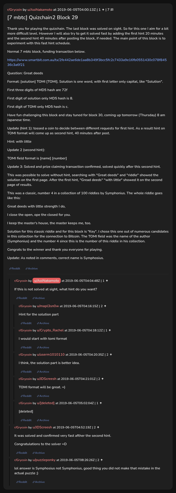

# [7 mbtc] Quizchain2 Block 29

[Original thread](https://www.reddit.com/r/Grycoin/comments/bwya8s/7_mbtc_quizchain2_block_29/). The `sourceUrl` of the [quizchain2/29](../../../src/collections/quizchain2/29.ts) record and the source of its question, format, hash digits, both hints and funding transaction, with the solution the author edited in and the later fix to the riddle author's name. Nobody in the thread printed the whole string. The post went up on June 5, 2019, at 04:00:13 UTC, four hours and 22 minutes after the block time of its funding transaction. Its last edit is stamped 08:49:57 UTC the same day, so the transcript shows the post as it stood after the claim.

## Historical provenance

No capture found. On October 2, 2026 the Wayback Machine index listed one capture of the thread under the `www.reddit.com` URL, June 11, 2023, 20:54:44 UTC. Its `id_` body is Reddit's app shell titled "Reddit - Dive into anything", with neither the post nor a comment in its HTML. The one capture of the `old.reddit.com` URL, two seconds later, is a 302 redirect to a subreddit search for Grycoin. The archive.today timemaps for the `www.reddit.com`, `old.reddit.com` and bare `reddit.com` URLs answered 404. MemGator answered "No snapshots" for all three, but it gave the same answer for the block 11 thread, whose Wayback capture exists, so it settles nothing here.

The transcript below comes from the [Arctic Shift](https://arctic-shift.photon-reddit.com/) Reddit archive: the post record and the comment tree for `bwya8s`, read on October 2, 2026. The [pullpush](https://pullpush.io/) Reddit archive, read the same day, gives the same post text, time and edit stamp, and the same 8 comments with the same authors, times, scores and parents. One of them is a deleted comment, kept below as `[deleted]`.

The record names none of the commenters: nothing on the chain ties a claim to a name.

## Transcript

> Thank you for playing the quizchain. The last block was solved on sight. So for this one I aim for a bit more difficult level. However I will also try to get it solved fast by adding the first hint 20 minutes and the second hint 40 minutes after posting the block, if needed. The main point of this block is to experiment with this fast hint schedule.
>
> Normal 7 mbtc block, funding transaction below.
>
> https://www.smartbit.com.au/tx/2fe442ae6de1aa8b349f3bcc5fc2c7433a9e16fb0551430c078f84536c3a6f21
>
> Question: Great deeds
>
> Format: [solution] TOMI [TOMI]. Solution is one word, with first letter only capital, like "Solution".
>
> First three digits of MD5 hash are 72f
>
> First digit of solution only MD5 hash is 8.
>
> First digit of TOMI only MD5 hash is c.
>
> Have fun challenging this block and stay tuned for block 30, coming up tomorrow (Thursday) 8 am Japanese time.
>
> Update (hint 1): tossed a coin to decide between different requests for first hint. As a result hint on TOMI format will come up as second hint, 40 minutes after post.
>
> Hint: with little
>
> Update 2 (second hint):
>
> TOMI field format is [name] [number]
>
> Update 3: Solved and prize claiming transaction confirmed, solved quickly after this second hint.
>
> This was possible to solve without hint, searching with "Great deeds" and "riddle" showed the solution on the first page. After the first hint, "Gread deeds" "with little" showed it on the second page of results.
>
> This was a classic, number 4 in a collection of 100 riddles by Symphonius. The whole riddle goes like this:
>
> Great deeds with little strength I do,
>
> I close the open, ope the closed for you.
>
> I keep the master's house, the master keeps me, too.
>
> Solution for this classic riddle and for this block is "Key". I chose this one out of numerous candidates in this collection for the connection to Bitcoin. The TOMI field was the name of the author (Symphonius) and the number 4 since this is the number of this riddle in his collection.
>
> Congrats to the winner and thank you everyone for playing.
>
> Update: As noted in comments, correct name is Symphosius.

## Comments

**u/AoiNakamoto**, 1 point:

> If this is not solved at sight, what hint do you want?

**u/mapl3sn0w**, 2 points, reply to u/AoiNakamoto:

> Hint for the solution part

**u/Crypto_Rachel**, 1 point, reply to u/AoiNakamoto:

> I would start with tomi format

**u/userm1010110**, 2 points, reply to u/AoiNakamoto:

> I think, the solution part is better idea.

**u/JDScreesh**, 2 points, reply to u/AoiNakamoto:

> TOMI format will be great. =)

**[deleted]**, reply to u/AoiNakamoto:

> [deleted]

**u/JDScreesh**, 2 points:

> It was solved and confirmed very fast afther the second hint.
>
> Congratulations to the solver =D

**u/puzzleponky**, 2 points:

> lol answer is Symphosius not Symphonius, good thing you did not make that mistake in the actual puzzle ;)

## Screenshot

The screenshot is a render of the thread in Arctic Shift's ID lookup, not of Reddit, since no readable capture of the Reddit page exists. Capture method and limits: [source archive](../README.md).
