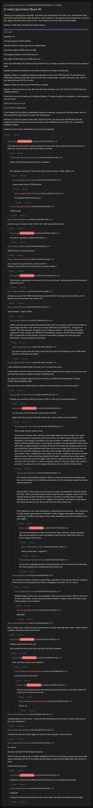

# [7 mbtc] Quizchain2 Block 30

[Original thread](https://www.reddit.com/r/Grycoin/comments/bx97d0/7_mbtc_quizchain2_block_30/). The `sourceUrl` of the [quizchain2/30](../../../src/collections/quizchain2/30.ts) record and the source of its question, format, hash digits, both hints and funding transaction, with the solution the author edited in. The full winning string is in u/kimi_tousan's comment. The post went up on June 5, 2019, at 22:59:19 UTC, nine minutes after the block time of its funding transaction. Its last edit is stamped 23:14:13 UTC on June 8, 2019, so the transcript shows the post as it stood after the claim.

## Historical provenance

No capture found. On October 2, 2026 the Wayback Machine index listed one capture of the thread under the `www.reddit.com` URL, June 11, 2023, 21:06:23 UTC. Its `id_` body is Reddit's app shell titled "Reddit - Dive into anything", with neither the post nor a comment in its HTML. The one capture of the `old.reddit.com` URL, two seconds later, is a 302 redirect to a subreddit search for Grycoin. The archive.today timemaps for the `www.reddit.com`, `old.reddit.com` and bare `reddit.com` URLs answered 404. MemGator answered "No snapshots" for all three, but it gave the same answer for the block 11 thread, whose Wayback capture exists, so it settles nothing here.

The transcript below comes from the [Arctic Shift](https://arctic-shift.photon-reddit.com/) Reddit archive: the post record and the comment tree for `bx97d0`, read on October 2, 2026. The [pullpush](https://pullpush.io/) Reddit archive, read the same day, gives the same post text, time and edit stamp, and the same 36 comments with the same authors, times, scores and parents. Their bodies differ only in how pullpush escapes the empty `&#x200B;` paragraph in two comments, and the transcript leaves those empty paragraphs out. Two of them are deleted comments, kept below as `[deleted]`.

The record names none of the commenters: nothing on the chain ties a claim to a name.

## Transcript

> Thank you for playing the quizchain. Last block was solved after two hints, but I released the hints 20 minutes and 40 minutes after the block, which made for a fast paced solving experience. I may try this again, but if this block needs a hint, I will release it 24 hours after the block again.
>
> Normal 7 mbtc block, funding transaction below.
>
> https://www.smartbit.com.au/tx/ea8cc06a7b115c1e5ec85d1cbfb4ff0a39d3cfa23e50526f4fb7c0155247ac47
>
> Question: AY
>
> Format: [solution] TOMI [TOMI]
>
> Solution format is three sets of two capital letters.
>
> FIrst three digits of MD5 hash are 086.
>
> FIrst digit of solution only MD5 hash is b.
>
> FIrst digit of TOMI field only MD5 hash is 4.
>
> Have fun challenging this block and stay tuned for 31, coming up tomorrow (Friday) 10 pm Japanese time.
>
> Update: Corrected schedule for next block. Tomorrow is Friday, not Saturday.
>
> Update 2 (Hint 1): A majority of players requested a hint on the TOMI format. The format for the TOMI field is [Word1] [word2]. Word1 starts with a capital letter, word2 is all lower case. There is one space between the two words.
>
> Update 3 (Hint 2): First word of TOMI field is Atbash.
>
> Update 4: Solved about one day after this third hint. Solution was "EU IQ KO" and TOMI field was "Atbash foldover".
>
> I found this puzzle by looking at an Atbash foldover. To make it easier to understand, I will reproduce one here now:
>
> A B C D E F G H I J K L M
>
> Z Y X WV U T S RQ P O N
>
> I was looking for two letter combinations that have meaning. Looking only directly below, there is BY, possibly FU (meaning force user), and nothing else.
>
> However, if I look one place to the right, I find EU IQ KO, with the bonus benefit that with the original hint AY the puzzle uses all six vowels, and the additional bonus that "IQ" is somewhat related to riddles.
>
> Congrats to the winner and thank you everyone for playing.

## Comments

**u/AoiNakamoto**, 1 point:

> If this block needs a hint, it will be posted 24 hours later (8 am Japanese time tomorrow). In that case, please tell me what kind of hint you prefer.

**u/martypyouknowme**, 2 points, reply to u/AoiNakamoto:

> Maybe something along the lines of a category.
>
> For example, does the AY have to do with a person, place, riddle, cipher, etc...

**u/Crypto_Rachel**, 1 point, reply to u/martypyouknowme:

> I agree, either that or TOMI format

**u/Crypto_Rachel**, 1 point, reply to u/Crypto_Rachel:

> I'm thinking TOMI format now :)

**[deleted]**, reply to u/AoiNakamoto:

> TOMI format

**u/reddeneer**, 1 point:

> just to be sure, solution is like "XX XX XX" with space between sets

**u/AoiNakamoto**, 0 points, reply to u/reddeneer:

> Yes. But no quotation marks in this block. :)

**u/Agelais**, 1 point:

> TOMI format or what related to?

**u/mapl3sn0w**, 2 points:

> Any chance for a quick follow-up hint on this ?
> Maybe a clue to discover the three pairs of capital letters ?

**u/AoiNakamoto**, 1 point, reply to u/mapl3sn0w:

> That may be a good idea for second hint. If it is not so!ved, I will post second hint tomorrow (Saturday) 8 am.

**u/reddeneer**, 1 point:

> perhaps as part of the TOMI format hint you can tell if the tomi explains the method, or if it follows from the solution like in block 27?

**u/Agelais**, 2 points:

> Again atbash... Again scripts...

**u/Agelais**, 4 points, reply to u/Agelais:

> I think someone have already discussed that this, but I will repeat. It will be much better to have bigger question, from which you can get infromation and SOLVE it... Not guess or brute it. We cant read your thoughts and in reallity as marked - the amount of possible uppercase 6 char combos are 308,915,776 divided by 16 gives 19,307,236 possibilities still.. It impossible to find manual. And from two letters question you cant get much information. Anyway thanks for challenge.

**u/Quantris**, 1 point, reply to u/Agelais:

> It's what we get when the vote on the first hint asks for information on the TOMI rather than for a hint about the theme

**u/Crypto_Rachel**, 1 point:

> I was working on atbash stuff from day 1 as i'm sure many were.
>
> I really believe that the hash check send us all down paths that are wrong. I'm sure every one has tried the obvious methods, leaving something else.
>
> the amount of possible uppercase 6 char combos are 308,915,776 divided by 16 gives 19,307,236 possibilities still..
>
> this gives sooo many rabbit holes you don't see them because you know the answer.

**u/Crypto_Rachel**, 1 point, reply to u/Crypto_Rachel:

> Perhaps you would be willing to make it 1/32 or 1/64 (2 or 3 hash characters) :)

**u/AoiNakamoto**, 0 points, reply to u/Crypto_Rachel:

> Are you sure 2 hash characters would make it 1/32?
>
> Again, this info is just to eliminate dead ends, not to confirm correct solutions.

**u/Crypto_Rachel**, 1 point, reply to u/AoiNakamoto:

> You're right I did my math wrong.
>
> The amount of Items I find with the same single character hash is huge, even when guessing along the same lines, and if you do have the right solution but your off a character it will change it and there is no way to know. In reality the single character doesn't eliminate dead ends as I have shown you before, the possibilities of items that will match a single character are huge. Of course the actual odd change based on the puzzle and how many different ways there are to see a single word. Like the Lion one block 26 I had 100's along the same line as the solution, and 100's that were not. Even When I had a solution that was within two words, I ended up moving on to other Ideas because I tried everything related to the riddle. I found soo many other paths, and only came back to the lion again with the hint. I keep track of all my matches so I can retry with new Ideas. so within so long of a block I'll have my trials if you want to see them. I usually just try not to spam the posts with my 1000's of Hand trials

**u/Quantris**, 2 points, reply to u/Crypto_Rachel:

> I'm certainly not defending that lion riddle. It should have been text directly from the source instead of some arbitrary rewording (or, the rewording should have been hinted somehow).
>
> But the point of this puzzle is not to just try random combinations until they match the hash. That's just doing what a script would do (and, I suppose, there's a bit of a parallel between that and bitcoin mining :) ) Granted, currently there is almost nothing to go on here anyway, so I suggest not to bother until there's a hint about the actual question (to me, the puzzle isn't even fully posed yet).
>
> IOW asking for more hash characters is a bad solution to the issue---all it would do is make random guessing more "feasible" (with a bigger advantage to computer searching). I'd rather encourage to have more interesting clues than providing more hash digits.

**u/AoiNakamoto**, 1 point, reply to u/Quantris:

> Yes, the advantage for scripts could become large with low entropy solutions. Still may be possible to go to two digits at least for the TOMI field if there is much support for the idea.

**u/silver_anth**, 2 points, reply to u/AoiNakamoto:

> that's a good idea, I support it.

**u/Crypto_Rachel**, 1 point, reply to u/Quantris:

> True a more expanded question would be better. If we had more of an solid Idea, the hash wouldn't be as important like for block 32.

**u/LiaVl**, 2 points, reply to u/Crypto_Rachel:

> 2 or 3 hash characters would be a good help, especially for the puzzles that are not given in the form of a real question but with an ambiguous word like "AY" or "oxen"

**u/silver_anth**, 1 point, reply to u/LiaVl:

> definitely agree, these one word questions need way more direction. Either in the form of more hash digits, or just actual questions instead of single words. Not really a quiz if the question isn't a question.

**[deleted]**, reply to u/silver_anth:

> [deleted]

**u/reddeneer**, 1 point:

> been a while since a block has gone unsolved for so long, especially after hints, maybe check if solution, all hashes, and info are okay?

**u/AoiNakamoto**, 1 point, reply to u/reddeneer:

> Always a good idea, thank you.
>
> Just checked for the fourth time and could not find a mistake.

**u/AoiNakamoto**, 1 point, reply to u/AoiNakamoto:

> Also, next hint will be more decisive...

**u/martypyouknowme**, 1 point, reply to u/AoiNakamoto:

> Is the next hint in 24 hours?

**u/AoiNakamoto**, 1 point, reply to u/martypyouknowme:

> Will be 8 am Japanese time like posting and previous hints. So 24 hours after hint 2, but not in 24 hours from now.

**u/martypyouknowme**, 1 point, reply to u/AoiNakamoto:

> Got it. Ty.

**u/JDScreesh**, 1 point:

> Congratulations to the solver. I was lost with this block too xD. Maybe I need to read more or pay more attention! ;)

**u/mapl3sn0w**, 2 points:

> I Second the idea for 2 hash digits for tomi for future puzzles. Same as silver.

**u/kimi_tousan**, 2 points:

> Hi, I got it!
>
> Solution: EU IQ KO TOMI Atbash foldover
>
> The AY said you had to use an Atbash alphabet of 25 not 26 and then you get some pairs that mean something. OK PK JP are others but the above match the first digit md5 hash and are in order
>
> Thanks for this puzzle!

**u/AoiNakamoto**, 1 point, reply to u/kimi_tousan:

> Congrats on solving this difficult block and thank you for playing the quizchain.

**u/Quantris**, 1 point, reply to u/kimi_tousan:

> Congrats!
>
> I tried JP at least (was thinking country codes; that was before the atbash hint though)

## Screenshot

The screenshot is a render of the thread in Arctic Shift's ID lookup, not of Reddit, since no readable capture of the Reddit page exists. Capture method and limits: [source archive](../README.md).
