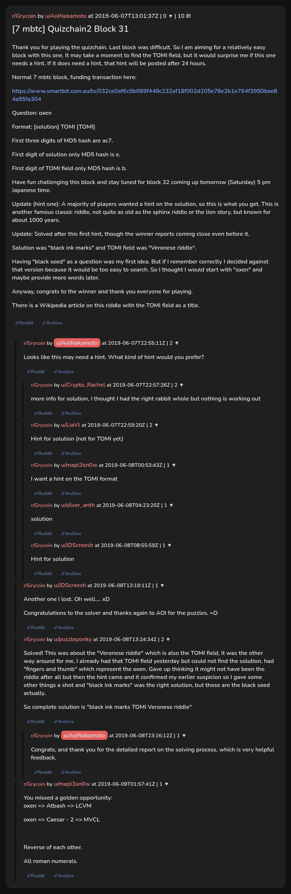

# [7 mbtc] Quizchain2 Block 31

[Original thread](https://www.reddit.com/r/Grycoin/comments/bxuciq/7_mbtc_quizchain2_block_31/). The `sourceUrl` of the [quizchain2/31](../../../src/collections/quizchain2/31.ts) record and the source of its question, format, hash digits, hint and funding transaction, with the solution the author edited in. The full winning string is in u/puzzleponky's comment. The post went up on June 7, 2019, at 13:01:37 UTC, an hour and a half after the block time of its funding transaction. Its last edit is stamped 23:27:40 UTC on June 8, 2019, so the transcript shows the post as it stood after the claim.

## Historical provenance

No capture found. On October 2, 2026 the Wayback Machine index listed one capture of the thread under the `www.reddit.com` URL, June 11, 2023, 23:53:30 UTC. Its `id_` body is Reddit's app shell titled "Reddit - Dive into anything", with neither the post nor a comment in its HTML. The one capture of the `old.reddit.com` URL, a second later, is a 302 redirect to a subreddit search for Grycoin. The archive.today timemaps for the `www.reddit.com`, `old.reddit.com` and bare `reddit.com` URLs answered 404. MemGator answered "No snapshots" for all three, but it gave the same answer for the block 11 thread, whose Wayback capture exists, so it settles nothing here.

The transcript below comes from the [Arctic Shift](https://arctic-shift.photon-reddit.com/) Reddit archive: the post record and the comment tree for `bxuciq`, read on October 2, 2026. The [pullpush](https://pullpush.io/) Reddit archive, read the same day, gives the same post text, time and edit stamp, and the same 10 comments with the same authors, times, scores and parents. Their bodies differ only in how pullpush escapes the `>` sign in one comment and the empty `&#x200B;` paragraph in one comment, and the transcript leaves those empty paragraphs out.

The record names none of the commenters: nothing on the chain ties a claim to a name.

## Transcript

> Thank you for playing the quizchain. Last block was difficult. So I am aiming for a relatively easy block with this one. It may take a moment to find the TOMI field, but it would surprise me if this one needs a hint. If it does need a hint, that hint will be posted after 24 hours.
>
> Normal 7 mbtc block, funding transaction here:
>
> https://www.smartbit.com.au/tx/032ce0af6c0b689f448c232af18f002d205e78e2b1e764f3950bee84a55fa304
>
> Question: oxen
>
> Format: [solution] TOMI [TOMI]
>
> First three digits of MD5 hash are ac7.
>
> First digit of solution only MD5 hash is e.
>
> FIrst digit of TOMI field only MD5 hash is b.
>
> Have fun challenging this block and stay tuned for block 32 coming up tomorrow (Saturday) 5 pm Japanese time.
>
> Update (hint one): A majority of players wanted a hint on the solution, so this is what you get. This is another famous classic riddle, not quite as old as the sphinx riddle or the lion story, but known for about 1000 years.
>
> Update: Solved after this first hint, though the winner reports coming close even before it.
>
> Solution was "black ink marks" and TOMI field was "Veronese riddle".
>
> Having "black seed" as a question was my first idea. But if I remember correctly I decided against that version because it would be too easy to search. So I thought I would start with "oxen" and maybe provide more words later.
>
> Anyway, congrats to the winner and thank you everyone for playing.
>
> There is a Wikipedia article on this riddle with the TOMI field as a title.

## Comments

**u/AoiNakamoto**, 2 points:

> Looks like this may need a hint. What kind of hint would you prefer?

**u/Crypto_Rachel**, 2 points, reply to u/AoiNakamoto:

> more info for solution, I thought I had the right rabbit whole but nothing is working out

**u/LiaVl**, 2 points, reply to u/AoiNakamoto:

> Hint for solution (not for TOMI yet)

**u/mapl3sn0w**, 1 point, reply to u/AoiNakamoto:

> I want a hint on the TOMI format

**u/silver_anth**, 1 point, reply to u/AoiNakamoto:

> solution

**u/JDScreesh**, 1 point, reply to u/AoiNakamoto:

> Hint for solution

**u/JDScreesh**, 1 point:

> Another one I lost. Oh well.... xD
>
> Congratulations to the solver and thanks again to AOI for the puzzles. =D

**u/puzzleponky**, 2 points:

> Solved! This was about the "Veronese riddle" which is also the TOMI field, it was the other way around for me, I already had that TOMI field yesterday but could not find the solution, had "fingers and thumb" which represent the oxen. Gave up thinking it might not have been the riddle after all but then the hint came and it confirmed my earlier suspicion so I gave some other things a shot and "black ink marks" was the right solution, but those are the black seed actually.
>
> So complete solution is "black ink marks TOMI Veronese riddle"

**u/AoiNakamoto**, 1 point, reply to u/puzzleponky:

> Congrats, and thank you for the detailed report on the solving process, which is very helpful feedback.

**u/mapl3sn0w**, 1 point:

> You missed a golden opportunity:
> oxen => Atbash => LCVM
>
> oxen => Caesar - 2 => MVCL
>
> Reverse of each other.
>
> All roman numerals.

## Screenshot

The screenshot is a render of the thread in Arctic Shift's ID lookup, not of Reddit, since no readable capture of the Reddit page exists. Capture method and limits: [source archive](../README.md).
