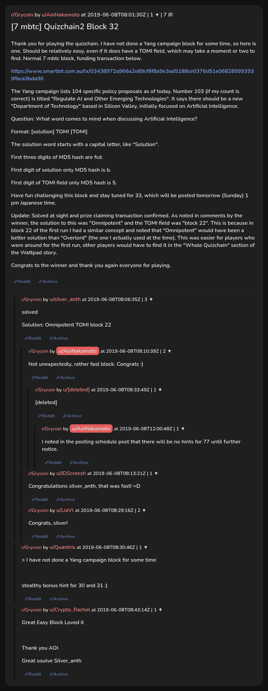

# [7 mbtc] Quizchain2 Block 32

[Original thread](https://www.reddit.com/r/Grycoin/comments/by5p2x/7_mbtc_quizchain2_block_32/). The `sourceUrl` of the [quizchain2/32](../../../src/collections/quizchain2/32.ts) record and the source of its question, format, hash digits and funding transaction, with the solution the author edited in. The full winning string is in u/silver_anth's comment. The post went up on June 8, 2019, at 08:01:30 UTC, three and a half hours after the block time of its funding transaction, and the claim confirmed eleven minutes later. Its last edit is stamped 09:18:25 UTC the same day, so the transcript shows the post as it stood after the claim.

## Historical provenance

No capture found. On October 2, 2026 the Wayback Machine index listed one capture of the thread under the `www.reddit.com` URL, June 11, 2023, 23:38:09 UTC. Its `id_` body is Reddit's app shell titled "Reddit - Dive into anything", with neither the post nor a comment in its HTML. The one capture of the `old.reddit.com` URL, a second later, is a 302 redirect to a subreddit search for Grycoin. The archive.today timemaps for the `www.reddit.com`, `old.reddit.com` and bare `reddit.com` URLs answered 404. MemGator answered "No snapshots" for all three, but it gave the same answer for the block 11 thread, whose Wayback capture exists, so it settles nothing here.

The transcript below comes from the [Arctic Shift](https://arctic-shift.photon-reddit.com/) Reddit archive: the post record and the comment tree for `by5p2x`, read on October 2, 2026. The [pullpush](https://pullpush.io/) Reddit archive, read the same day, gives the same post text, time and edit stamp, and the same 8 comments with the same authors, times, scores and parents. Their bodies differ only in how pullpush escapes the `>` sign in one comment and the empty `&#x200B;` paragraph in two comments, and the transcript leaves those empty paragraphs out. One of them is a deleted comment, kept below as `[deleted]`.

The record names none of the commenters: nothing on the chain ties a claim to a name.

## Transcript

> Thank you for playing the quizchain. I have not done a Yang campaign block for some time, so here is one. Should be relatively easy, even if it does have a TOMI field, which may take a moment or two to find. Normal 7 mbtc block, funding transaction below.
>
> https://www.smartbit.com.au/tx/03438972a966a2e89cf8f8a9e3ad5188ce0376d51e068289993939fbca3bda96
>
> The Yang campaign lists 104 specific policy proposals as of today. Number 103 (if my count is correct) is titled "Regulate AI and Other Emerging Technologies". It says there should be a new "Department of Technology" based in Silicon Valley, initially focused on Artificial Intelligence.
>
> Question: What word comes to mind when discussing Artificial Intelligence?
>
> Format: [solution] TOMI [TOMI]
>
> The solution word starts with a capital letter, like "Solution".
>
> First three digits of MD5 hash are fcd.
>
> FIrst digit of solution only MD5 hash is b.
>
> FIrst digit of TOMI field only MD5 hash is 5.
>
> Have fun challenging this block and stay tuned for 33, which will be posted tomorrow (Sunday) 1 pm Japanese time.
>
> Update: Solved at sight and prize claiming transaction confirmed. As noted in comments by the winner, the solution to this was "Omnipotent" and the TOMI field was "block 22". This is because in block 22 of the first run I had a similar concept and noted that "Omnipotent" would have been a better solution than "Overlord" (the one I actually used at the time). This was easier for players who were around for the first run, other players would have to find it in the "Whole Quizchain" section of the Wattpad story.
>
> Congrats to the winner and thank you again everyone for playing.

## Comments

**u/silver_anth**, 3 points:

> solved
>
> Solution: Omnipotent TOMI block 22

**u/AoiNakamoto**, 2 points, reply to u/silver_anth:

> Not unexpectedly, rather fast block. Congrats :)

**[deleted]**, reply to u/AoiNakamoto:

> [deleted]

**u/AoiNakamoto**, 1 point, reply to a deleted comment:

> I noted in the posting schedule post that there will be no hints for 77 until further notice.

**u/JDScreesh**, 1 point, reply to u/silver_anth:

> Congratulations silver\_anth, that was fast! =D

**u/LiaVl**, 2 points, reply to u/silver_anth:

> Congrats, silver!

**u/Quantris**, 1 point:

> > I have not done a Yang campaign block for some time
>
> stealthy bonus hint for 30 and 31 :)

**u/Crypto_Rachel**, 1 point:

> Great Easy Block Loved it
>
> Thank you AOI
>
> Great soulve Silver\_anth

## Screenshot

The screenshot is a render of the thread in Arctic Shift's ID lookup, not of Reddit, since no readable capture of the Reddit page exists. Capture method and limits: [source archive](../README.md).
