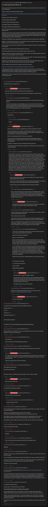

# [7 mbtc] Quizchain2 Block 33

[Original thread](https://www.reddit.com/r/Grycoin/comments/bygeur/7_mbtc_quizchain2_block_33/). The `sourceUrl` of the [quizchain2/33](../../../src/collections/quizchain2/33.ts) record and the source of its question, format, hash digits, four hints and funding transaction, with the solution the author edited in. The full winning string is in u/Randomiser's comment. The post went up on June 9, 2019, at 04:06:52 UTC, thirteen minutes before the block time of its funding transaction. Its last edit is stamped 05:49:28 UTC on June 11, 2019, so the transcript shows the post as it stood after the claim.

## Historical provenance

Provenance rests on a [www.reddit.com capture](https://web.archive.org/web/20200728191135/https://www.reddit.com/r/Grycoin/comments/bygeur/7_mbtc_quizchain2_block_33/eqqstj0/) of the permalink of a comment that is now deleted, stamped July 28, 2020, 19:11:35 UTC. The page state in its HTML carries the whole post, which matches the transcript below paragraph by paragraph, all 22 of them, the updates with the four hints and the solution included. It holds no comment. The capture was read on October 2, 2026. `archive_content: confirmed` on that basis, for the post only. The `old.reddit.com` capture of the same permalink, four seconds later, leaves the post collapsed and says "there doesn't seem to be anything here" where the comment was. The Wayback Machine also holds fourteen captures of the thread URL itself under `www.reddit.com`, taken between June 21 and June 30, 2023, and every `id_` body of the fourteen is Reddit's app shell titled "Reddit - Dive into anything", with neither the post nor a comment in its HTML. The archive.today timemaps for the `www.reddit.com`, `old.reddit.com` and bare `reddit.com` URLs answered 404. MemGator answered "No snapshots" for all three, but it gave the same answer for the block 11 thread, whose Wayback capture exists, so it settles nothing here.

The transcript takes the post and all 33 comments from the [Arctic Shift](https://arctic-shift.photon-reddit.com/) Reddit archive: the post record and the comment tree for `bygeur`, read on October 2, 2026. The [pullpush](https://pullpush.io/) Reddit archive, read the same day, gives the same post text, time and edit stamp, and the same 33 comments with the same authors, times, scores and parents. Their bodies differ only in how pullpush escapes the `>` sign in two comments and the empty `&#x200B;` paragraph in three comments, and the transcript leaves those empty paragraphs out. Two of them are deleted comments, kept below as `[deleted]`.

The record names none of the commenters: nothing on the chain ties a claim to a name.

## Transcript

> Thank you for playing the quizchain. SInce the last block was solved at sight, this one may be a bit more challenging.
>
> Normal 7 mbtc block, funding transaction below.
>
> https://www.smartbit.com.au/tx/c97d65c858d5009cdb3e2fdd95f3519f28c9c106af0f7205c7e770402047ac24
>
> Question: Can you find the answer?
>
> Format: [solution] TOMI [TOMI]
>
> FIrst three digits of MD5 hash are b60.
>
> FIrst digit of solution only MD5 hash is f.
>
> FIrst digit of TOMI field only MD5 hash is 7.
>
> Have fun challenging this block and stay tuned for block 34, scheduled for 8 am tomorrow (Monday) Japanese time.
>
> Update: There has been a lively discussion about this block, mostly feedback saying that this block is impossible to solve without hint. But there was only one request about the hint, which said I should refrain from giving away too much and also indicated a preference for a TOMI field hint. So here we go. Deliberately inconclusive TOMI field hint.
>
> First item of TOMI field is three capital letters, format XXX. There are four items in the TOMI field.
>
> Update 2: I want this block solved now, so I am going to switch to rapid fire hint mode. The next hint will come up in twenty more minutes, if necessary.
>
> Hint 2: I did not come up with the method for this block by myself, but found it in a comment by one of the players.
>
> Update 3 (hint 3): Last item of the TOMI field is the word "list".
>
> If this needs another hint, it will come up another twenty minutes from now.
>
> Update 4: Sorrry for the delay in posting the above hint 3, there was a technical problem. Next hint will come up 2:15 pm Japanese time, if necessary.
>
> Update 5 (hint 4): Format for solution is four digit number, like "0007". If this still needs another hint, next one will come up in 30 minutes (2:45 pm Japanese time).
>
> Update 6: Solved after the above hint. Solution was 0078 which is the four digit number for the word "answer" in the "BIP 39 word list", which in turn was the TOMI field.
>
> The four digit format comes from the website I used for the word list:
>
> https://www.mobilefish.com/services/cryptocurrency/bip39_wordlist.html
>
> I heard about this method in comments to block 27, thank you to the player who mentioned this beautiful idea at the time. If you think about this method, resistance to solving comes only from the format of the number (78 or 0078) and maybe
> finding the TOMI field phrasing.
>
> Congrats to the winner and thank you everyone for playing. Much easier block coming up later today, 10 pm Japanese time.

## Comments

**u/mapl3sn0w**, 2 points:

> That depends, where should i look ?

**u/AoiNakamoto**, 0 points, reply to u/mapl3sn0w:

> Very easy block if you find the method. Seems impossible if not.
>
> This may need a hint. If so, it will come up tomorrow (Monday) 1 pm Japanese time.

**u/silver_anth**, 6 points, reply to u/AoiNakamoto:

> every single block is easy if you know the method. Can we avoid these guessing game blocks?
>
> One block I really liked, and was definitely a quiz, was the block about the "perfect murder" especially after the Agatha Christie hint was given. It gave a nice search space and still took time to be solved. The TOMI field was a bit random, but still alright. But tbh, a TOMI field probably wasn't needed for that block.

**u/Crypto_Rachel**, 1 point, reply to u/silver_anth:

> Totally Agree

**u/LiaVl**, 2 points, reply to u/Crypto_Rachel:

> Me too

**u/AoiNakamoto**, -1 point, reply to u/silver_anth:

> Thank you for your feedback, especially the part about which block you liked.
>
> And yes, most blocks rely on players not knowing the method for resistance to solving. Opposite of the Kerckhoffs principle, as noted earlier. Interestingly, the one you mentioned as something you liked did not.
>
> What is a guessing game block? Is this one an example?
>
> If you mean that I should avoid blocks that require guessing large numbers of potential solutions, I completely agree. Brute force is for the other chain (the one running Bitcoin).
>
> And again, something I said in the introduction sticky post above:
>
> > If you find a block to be difficult, it probably is. In that case, you may want to wait for the first hint.

**u/silver_anth**, 3 points, reply to u/AoiNakamoto:

> Yes this block is an example of a guessing block, along with all the other blocks that just have a single word or a are some variant of: "Can you find the answer with no hint whatsoever?" The first time you did this it was okay, the second time less reasonable but not bad. But now this way too many times expecting us to know what you are wanting from nothing. Just like block 77. It amazed me last time when you had this block and you said " The only data you have is the block number". If that was the only data we had, then why was the answer to all the previous "Can you answer this with no hint whatsoever?" themed blocks not involving the block number at all. I think you need to view the block you are making differently, think about them without your knowledge about what the solution is, and actually think if these blocks are solvable without hints. If they aren't, don't do a single word question, or one of these blocks, they clearly would need more to be solved, and you might as well just post them 24 hours later when you release the hint.

**u/AoiNakamoto**, 0 points, reply to u/silver_anth:

> How do I think about a block without my knowledge of the solution without a tragic boating accident involved?
>
> And how do I predict which blocks need a hint before posting them? I have failed in many ways, but most constantly when trying to predict difficulty.
>
> Anyway, thank you for your feedback and for playing the quizchain.

**u/reddeneer**, 1 point, reply to u/AoiNakamoto:

> haha, I don't mind the build up with hints with more difficult blocks. I have a solution right now that fits the question perfectly and matches the hash but I am unsure about the TOMI. Ofcourse I could be totally wrong about my solution but I never know and I will be sleeping when the next hint comes :( so don't make it too easy ;)

**u/AoiNakamoto**, 1 point, reply to u/reddeneer:

> I am happy to hear that at least one player has an idea even at this stage. I will keep your request to keep the hint indicisive in mind.

**u/silver_anth**, 3 points, reply to u/AoiNakamoto:

> "How do I think about a block without my knowledge of the solution without a tragic boating accident involved?"
>
> This is clearly a skill you lack xD
>
> "And how do I predict which blocks need a hint before posting them? I have failed in many ways, but most constantly when trying to predict difficulty."
>
> Have you not noticed the common theme yet? All the blocks that have one word vague "questions" needed hints. It's very clear if you could look at these from our perspective. But as you mentioned, you lack that ability.

**u/Crypto_Rachel**, 1 point, reply to u/silver_anth:

> > Have you not noticed the common theme yet? All the blocks that have one word vague "questions" needed hints
>
> I agree these, puzzles are killing me.
>
> Worse is I can't help but try.
>
> But a puzzle that is highly unlikely to be solved without a hint, is really torture. And changing the theme of a question that is like another question, is the real torture since it doesn't look like it follows the same method (and the other similar questions each uses a different method).
>
> As I've said before You do have the right to do whatever you like, after all it's your btc. It's just I know So many people that check out as soon as they see the post, not worth trying. I have been following since block 1 of chain 1, and with my ocd, I really like seeing things finished, so it makes it impossible for me to not try. Unless I just stop playing. period. Which I would hate to do since there have been some good ones, and has been for the most part enjoyable.
>
> I thank you for the puzzles, I really appreciate any chance to get more btc
>
> "f" will torture me to death
>
> "f" I was lucky to escape alive
>
> I have no TOMI
>
> without TOMI had difficult

**u/AoiNakamoto**, 1 point, reply to u/Crypto_Rachel:

> I can't stop either, though for different reasons.
>
> The good news is that the quizchain is now humming along smoothly without major mistakes (at least compared to the first round). So I plan to proceed to the final block in this round and then stop the chain. Only less than 50 blocks left to endure.
>
> And again thank you very much for playing.

**u/silver_anth**, 2 points, reply to u/AoiNakamoto:

> Perhaps your tragic boating accident caused you to suffer from this: https://en.m.wikipedia.org/wiki/Mind-blindness

**u/AoiNakamoto**, 1 point, reply to u/silver_anth:

> Yes. Very tragic tragedy.

**u/Crypto_Rachel**, 1 point:

> I'll wait for the hint. pointless amount of possibilities Thank you
>
> find the answer == f
>
> First == 7
>
> Thank you ==7
>
> playing the quizchain == 7
>
> don't forget the capital I's
>
> remember me if it helps 1QBdacdaVVpHkuinaAn8LyRZvkzALQLugt

**u/Crypto_Rachel**, 1 point:

> Maybe with these "no Question" ones, you could atleast give the word count or something that makes it more than a lucky guess

**u/Crypto_Rachel**, 1 point, reply to u/Crypto_Rachel:

> Funny TOMI no
>
> can't solve without hint TOMI playing the quizchain

**u/martypyouknowme**, 1 point:

> Is it safe to assume the answer is in plain sight somewhere based on the question?

**u/AoiNakamoto**, 1 point, reply to u/martypyouknowme:

> Yes, I think this was possible to solve even without hint and only based on the question, but I am unable to see reality as a consequence of the "mind-blindness" caused by my tragic boating accident.
>
> I think you may agree once you see the solution.

**u/martypyouknowme**, 1 point:

> MCF Magical Crypto Friends
>
> PGP Pretty Good Privacy
>
> Both those result in a TOMI hash that starts with 7. No luck with the solution

**u/AoiNakamoto**, 1 point, reply to u/martypyouknowme:

> Both of these are dead ends...

**u/martypyouknowme**, 1 point:

> eye TOMI TOM Thinking Only Method

**u/AoiNakamoto**, 1 point, reply to u/martypyouknowme:

> TOM not the XXX in question either...

**u/martypyouknowme**, 1 point, reply to u/AoiNakamoto:

> Another swing and a miss....

**u/reddeneer**, 1 point:

> hint only taught me that my solution was probably not correct haha, sorry people. my answer was perfect though :(
>
> maybe it is a fun experiment to solve mine as well, address is 1Fj1LT6gwok76x3QC5zfnWJ2X2jDueVh1B (sorry, no actual btc in this one)
>
> first 3 digits of hash are obviously different and are 50d, everything else is the same as described in block above except for the TOMI update, my TOMI has just two words
>
> post solution in reply, maybe Aoi wants to try as well, let's see which can be solved faster

**u/martypyouknowme**, 1 point:

> Think I have the TOMI...possibly.

**[deleted]**, reply to u/martypyouknowme:

> [deleted]

**u/martypyouknowme**, 1 point, reply to u/martypyouknowme:

> Had it...Had the half-correct solution but didn't think of adding zeroes...

**[deleted]**:

> [deleted]

**u/Randomiser**, 1 point:

> I solved it. The answer was 0078 TOMI BIP 39 word list - "answer" being the 78th word in the BIP-39 wordlist.
>
> "Three capital letters" had already made me think of BIP, but I wasn't sure about it until Hint 2.
>
> However, I found the format of the solution very strange. I didn't really see a good reason for the leading zeroes, as the numbers aren't normally written like that.
>
> Thank you Aoi, for the puzzles.

**u/puzzleponky**, 1 point:

> This is the official link to the BIP 39 list [https://github.com/bitcoin/bips/blob/master/bip-0039/english.txt](https://github.com/bitcoin/bips/blob/master/bip-0039/english.txt)
>
> The use of 00 because of that particular list in your link is a bit hoaxy as it is technically not used that way, in fact it is wrong to use it that way. 78 without 00 makes sense because it is correct to say it is the 78th word but not 0078 because the BIP 39 list is used with a zero-based index and "answer" is actually 77 ( which would have been a nice coincidence as well :)

**u/reddeneer**, 1 point:

> Ai, missed the rapid hint storm
>
> anyway, here is my perfect answer to this block
>
> _Think harder BFUB Yang hat LLD TOMI previous quizchain_
>
> both matching hashes f and 7. the solution is the answer to block 33 from quizchain 1. I thought "find" meant you had to search for the answer and I did in the previous quizchain
>
> maybe "Can you look up the answer?" would have helped me but I don't think I would have ever guessed this particular solution because of the 00 and it seems nobody else had either until the very last hint
>
> I hope this shows Aoi that for players there are a lot more different answers that make perfect sense

## Screenshot

The screenshot is a render of the thread in Arctic Shift's ID lookup, not of Reddit, since the one capture that holds the post shows none of its comments. Capture method and limits: [source archive](../README.md).
