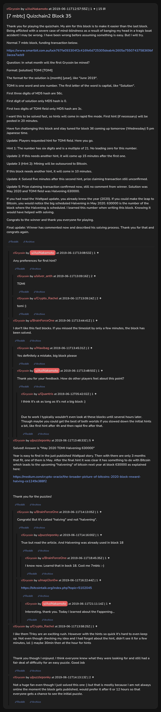

# [7 mbtc] Quizchain2 Block 35

[Original thread](https://www.reddit.com/r/Grycoin/comments/bzc5ed/7_mbtc_quizchain2_block_35/). The `sourceUrl` of the [quizchain2/35](../../../src/collections/quizchain2/35.ts) record and the source of its question, format, hash digits, both hints and funding transaction, with the solution the author edited in. The full winning string is in u/puzzleponky's comment. The post went up on June 11, 2019, at 12:57:55 UTC, almost six hours after the block time of its funding transaction. Its last edit is stamped 13:55:42 UTC the same day, so the transcript shows the post as it stood after the claim.

## Historical provenance

No capture found. On October 2, 2026 the Wayback Machine index listed one capture of the thread under the `www.reddit.com` URL, June 11, 2023, 22:02:29 UTC. Its `id_` body is Reddit's app shell titled "Reddit - Dive into anything", with neither the post nor a comment in its HTML. The one capture of the `old.reddit.com` URL, three seconds later, is a 302 redirect to a subreddit search for Grycoin. The archive.today timemaps for the `www.reddit.com`, `old.reddit.com` and bare `reddit.com` URLs answered 404. MemGator answered "No snapshots" for all three, but it gave the same answer for the block 11 thread, whose Wayback capture exists, so it settles nothing here.

The transcript below comes from the [Arctic Shift](https://arctic-shift.photon-reddit.com/) Reddit archive: the post record and the comment tree for `bzc5ed`, read on October 2, 2026. The [pullpush](https://pullpush.io/) Reddit archive, read the same day, gives the same post text, time and edit stamp, and the same 15 comments with the same authors, times, scores and parents. Their bodies differ only in how pullpush escapes the empty `&#x200B;` paragraph in three comments, and the transcript leaves those empty paragraphs out.

The record names none of the commenters: nothing on the chain ties a claim to a name.

## Transcript

> Thank you for playing the quizchain. My aim for this block is to make it easier than the last block. Being afflicted with a severe case of mind-blindness as a result of banging my head in a tragic boat accident I may be wrong. I have been wrong before assuming something is easy. But I will try.
>
> Normal 7 mbtc block, funding transaction below.
>
> https://www.smartbit.com.au/tx/e767fa093304f2c416fe6d725305deab4c2605a7550743758369bf3acea7acb9
>
> Question: In what month will the first Grycoin be mined?
>
> Format: [solution] TOMI [TOMI]
>
> The format for the solution is [month] [year], like "June 2019".
>
> TOMI is one word and one number. The first letter of the word is capital, like "Solution".
>
> First three digits of MD5 hash are 56c.
>
> First digit of solution only MD5 hash is 0.
>
> First two digits of TOMI field only MD5 hash are 3c.
>
> I want this to be solved fast, so hints will come in rapid fire mode. First hint (if necessary) will be posted in 20 minutes.
>
> Have fun challenging this block and stay tuned for block 36 coming up tomorrow (Wednesday) 5 pm Japanese time.
>
> Update: Players requested hint for TOMI field. Here you go.
>
> Hint 1: The number has six digits and is a multiple of 21. No leading zero for this number.
>
> Update 2: If this needs another hint, it will come up 15 minutes after the first one.
>
> Update 3 (Hint 2): MIning will be outsourced to Bitcoin.
>
> If this block needs another hint, it will come in 10 minutes.
>
> Update 4: Solved five minutes after this second hint, prize claiming transaction still unconfirmed.
>
> Update 5: Prize claiming transaction confirmed now, still no comment from winner. Solution was May 2020 and TOMI field was Halvening 630000.
>
> If you had read the Wattpad update, you already knew the year (2020). If you could make the leap to Bitcoin, you would notice the big scheduled Halvening in May 2020. 630000 is the number of the block where the Halvening is scheduled. I learned this number when writing this block. Knowing it would have helped with solving.
>
> Congrats to the winner and thank you everyone for playing.
>
> Final update: Winner has commented now and described his solving process. Thank you for that and congrats again.

## Comments

**u/AoiNakamoto**, 1 point:

> Any preferences for first hint?

**u/silver_anth**, 2 points, reply to u/AoiNakamoto:

> TOMI

**u/Crypto_Rachel**, 2 points, reply to u/AoiNakamoto:

> tomi :)

**u/BrainForceOne**, 1 point:

> I don't like this fast blocks. If you missed the timeslot by only a few minutes, the block has been solved.

**u/Maxibag**, 2 points, reply to u/BrainForceOne:

> Yes definitely a mistake, big block please

**u/AoiNakamoto**, 1 point, reply to u/BrainForceOne:

> Thank you for your feedback. How do other players feel about this point?

**u/Quantris**, 1 point, reply to u/AoiNakamoto:

> I think it's ok as long as it's not a big block :)
>
> Due to work I typically wouldn't even look at these blocks until several hours later.
> Though maybe you could get the best of both worlds if you slowed down the initial hints a bit, like first hint after 4h and then rapid fire after that.

**u/puzzleponky**, 5 points:

> Solved! Answer is "May 2020 TOMI Halvening 630000"
>
> Year is easy to find in the just published Wattpad story. Then with there are only 3 months that fit, one of them is May. After the final hint it was clear it has something to do with Bitcoin which leads to the upcoming "halvening" of bitcoin next year at block 630000 as explained here:
>
> [https://medium.com/crypto-oracle/the-broader-picture-of-bitcoins-2020-block-reward-halving-ce1249e388f2](https://medium.com/crypto-oracle/the-broader-picture-of-bitcoins-2020-block-reward-halving-ce1249e388f2)
>
> Thank you for the puzzles!

**u/BrainForceOne**, 1 point, reply to u/puzzleponky:

> Congrats!
> But it's called "halving" and not "halvening".

**u/puzzleponky**, 1 point, reply to u/BrainForceOne:

> True but read the article. And Halvening was already used in block 18

**u/BrainForceOne**, 1 point, reply to u/puzzleponky:

> I know now. Learnd that in bock 18. Cost me 7mbtc :-)

**u/mapl3sn0w**, 1 point, reply to u/BrainForceOne:

> [https://bitcointalk.org/index.php?topic=5102045](https://bitcointalk.org/index.php?topic=5102045)

**u/AoiNakamoto**, 1 point, reply to u/mapl3sn0w:

> Interesting, thank you. Today I learned about the Fappening...

**u/Crypto_Rachel**, 1 point:

> I like them THey are an exciting rush. However with the hints so quick it's hard to even keep up. Not even though checking my idea and I had forgot about the hint, didn't see it for a few minutes, lol :) maybe 30min then at the hour for hints
>
> Thank you though I enjoyed. I think everyone knew what they were looking for and still had a fair deal of difficulty for an easy puzzle. Good Job

**u/puzzleponky**, 2 points:

> Not a huge fan even though I just solved this one :) but that is mostly because I am not always online the moment the block gets published, would prefer it after 6 or 12 hours so that everyone gets a chance to see the initial puzzle.

## Screenshot

The screenshot is a render of the thread in Arctic Shift's ID lookup, not of Reddit, since no readable capture of the Reddit page exists. Capture method and limits: [source archive](../README.md).
