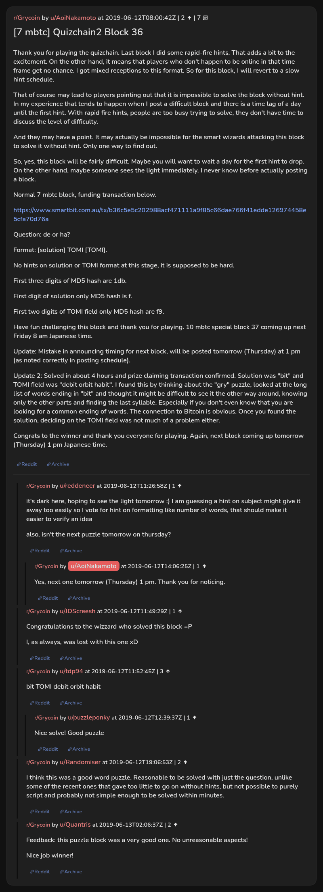

# [7 mbtc] Quizchain2 Block 36

[Original thread](https://www.reddit.com/r/Grycoin/comments/bzodlf/7_mbtc_quizchain2_block_36/). The `sourceUrl` of the [quizchain2/36](../../../src/collections/quizchain2/36.ts) record and the source of its question, format, hash digits and funding transaction, with the solution the author edited in. The full winning string is in u/tdp94's comment. The post went up on June 12, 2019, at 08:00:42 UTC, seven and a half hours after the block time of its funding transaction. Its last edit is stamped 14:14:49 UTC the same day, so the transcript shows the post as it stood after the claim.

## Historical provenance

No capture found. On October 2, 2026 the Wayback Machine index listed one capture of the thread under the `www.reddit.com` URL, June 11, 2023, 21:57:52 UTC. Its `id_` body is Reddit's app shell titled "Reddit - Dive into anything", with neither the post nor a comment in its HTML. The one capture of the `old.reddit.com` URL, three seconds later, is a 302 redirect to a subreddit search for Grycoin. The archive.today timemaps for the `www.reddit.com`, `old.reddit.com` and bare `reddit.com` URLs answered 404. MemGator answered "No snapshots" for all three, but it gave the same answer for the block 11 thread, whose Wayback capture exists, so it settles nothing here.

The transcript below comes from the [Arctic Shift](https://arctic-shift.photon-reddit.com/) Reddit archive: the post record and the comment tree for `bzodlf`, read on October 2, 2026. The [pullpush](https://pullpush.io/) Reddit archive, read the same day, gives the same post text, time and edit stamp, and the same 7 comments with the same authors, times, scores and parents.

The record names none of the commenters: nothing on the chain ties a claim to a name.

## Transcript

> Thank you for playing the quizchain. Last block I did some rapid-fire hints. That adds a bit to the excitement. On the other hand, it means that players who don't happen to be online in that time frame get no chance. I got mixed receptions to this format. So for this block, I will revert to a slow hint schedule.
>
> That of course may lead to players pointing out that it is impossible to solve the block without hint. In my experience that tends to happen when I post a difficult block and there is a time lag of a day until the first hint. With rapid fire hints, people are too busy trying to solve, they don't have time to discuss the level of difficulty.
>
> And they may have a point. It may actually be impossible for the smart wizards attacking this block to solve it without hint. Only one way to find out.
>
> So, yes, this block will be fairly difficult. Maybe you will want to wait a day for the first hint to drop. On the other hand, maybe someone sees the light immediately. I never know before actually posting a block.
>
> Normal 7 mbtc block, funding transaction below.
>
> https://www.smartbit.com.au/tx/b36c5e5c202988acf471111a9f85c66dae766f41edde126974458e5cfa70d76a
>
> Question: de or ha?
>
> Format: [solution] TOMI [TOMI].
>
> No hints on solution or TOMI format at this stage, it is supposed to be hard.
>
> First three digits of MD5 hash are 1db.
>
> First digit of solution only MD5 hash is f.
>
> First two digits of TOMI field only MD5 hash are f9.
>
> Have fun challenging this block and thank you for playing. 10 mbtc special block 37 coming up next Friday 8 am Japanese time.
>
> Update: Mistake in announcing timing for next block, will be posted tomorrow (Thursday) at 1 pm (as noted correctly in posting schedule).
>
> Update 2: Solved in about 4 hours and prize claiming transaction confirmed. Solution was "bit" and TOMI field was "debit orbit habit". I found this by thinking about the "gry" puzzle, looked at the long list of words ending in "bit" and thought it might be difficult to see it the other way around, knowing only the other parts and finding the last syllable. Especially if you don't even know that you are looking for a common ending of words. The connection to Bitcoin is obvious. Once you found the solution, deciding on the TOMI field was not much of a problem either.
>
> Congrats to the winner and thank you everyone for playing. Again, next block coming up tomorrow (Thursday) 1 pm Japanese time.

## Comments

**u/reddeneer**, 1 point:

> it's dark here, hoping to see the light tomorrow :) I am guessing a hint on subject might give it away too easily so I vote for hint on formatting like number of words, that should make it easier to verify an idea
>
> also, isn't the next puzzle tomorrow on thursday?

**u/AoiNakamoto**, 1 point, reply to u/reddeneer:

> Yes, next one tomorrow (Thursday) 1 pm. Thank you for noticing.

**u/JDScreesh**, 1 point:

> Congratulations to the wizzard who solved this block =P
>
> I, as always, was lost with this one xD

**u/tdp94**, 3 points:

> bit TOMI debit orbit habit

**u/puzzleponky**, 1 point, reply to u/tdp94:

> Nice solve! Good puzzle

**u/Randomiser**, 2 points:

> I think this was a good word puzzle. Reasonable to be solved with just the question, unlike some of the recent ones that gave too little to go on without hints, but not possible to purely script and probably not simple enough to be solved within minutes.

**u/Quantris**, 2 points:

> Feedback: this puzzle block was a very good one. No unreasonable aspects!
>
> Nice job winner!

## Screenshot

The screenshot is a render of the thread in Arctic Shift's ID lookup, not of Reddit, since no readable capture of the Reddit page exists. Capture method and limits: [source archive](../README.md).
