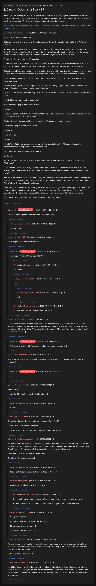

# [10 mbtc] Quizchain2 Block 37

[Original thread](https://www.reddit.com/r/Grycoin/comments/c012gd/10_mbtc_quizchain2_block_37/). The `sourceUrl` of the [quizchain2/37](../../../src/collections/quizchain2/37.ts) record and the source of its question, format, hash digits, six hints and funding transaction, with the solution the author edited in. The full winning string is in u/Randomiser's comment. The post went up on June 13, 2019, at 04:00:21 UTC, four hours after the block time of its funding transaction. Its last edit is stamped 05:12:22 UTC the same day, so the transcript shows the post as it stood after the claim.

## Historical provenance

No capture found. On October 2, 2026 the Wayback Machine index listed one capture of the thread under the `www.reddit.com` URL, June 11, 2023, 21:13:37 UTC. Its `id_` body is Reddit's app shell titled "Reddit - Dive into anything", with neither the post nor a comment in its HTML. The one capture of the `old.reddit.com` URL, a second later, is a 302 redirect to a subreddit search for Grycoin. Two more captures, both September 24, 2026, 21:13:20 UTC, are of the bare `www.reddit.com/r/Grycoin/comments/c012gd/` path: one is Reddit's JavaScript check page titled "Reddit", the other the challenge's redirect, a page titled "Reddit - The heart of the internet", and neither holds the post or a comment. The archive.today timemaps for the `www.reddit.com`, `old.reddit.com` and bare `reddit.com` URLs answered 404. MemGator answered "No snapshots" for all three, but it gave the same answer for the block 11 thread, whose Wayback capture exists, so it settles nothing here.

The transcript below comes from the [Arctic Shift](https://arctic-shift.photon-reddit.com/) Reddit archive: the post record and the comment tree for `c012gd`, read on October 2, 2026. The [pullpush](https://pullpush.io/) Reddit archive, read the same day, gives the same post text, time and edit stamp, and the same 22 comments with the same authors, times, scores and parents. Two of them are deleted comments, kept below as `[deleted]`.

The record names none of the commenters: nothing on the chain ties a claim to a name.

## Transcript

> Thank you for playing the quizchain. This block will have a slightly higher prize since it is a lucky number. Interesting coincidence that it is posted on a day with the unlucky number 13. The prize will be the cross sum of 37, which is 10 mbtc. Funding transaction below.
>
> https://www.smartbit.com.au/tx/4e63d912321e10883730adcb1af660bca1a1dd0efe77bfedc2f0e6830ab82702
>
> Question: I created a new word. Minmin. What does it mean?
>
> Format: [solution] TOMI [TOMI]
>
> Solution format is two words, with the first one starting with a capital letter, like this: "Word1 word2".
>
> TOMI format is four words. Each has four letters. The first and last word differ by only one letter. Only the first word starts with a capital letter, like this: "Word1 word2 word3 word4". No words of dubious moral standing in this TOMI field.
> First three digits of MD5 hash are 394.
>
> First digit of solution only MD5 hash is d.
>
> First two digits of TOMI field only MD5 hash are 49. Interesting coincidence that these two are the last two of the whole MD5 hash read backwards. And d is the fourth letter in the alphabet.
>
> Since the last block was on slow hint timing, I do this one with rapid-fire timing again. First hint after 30 minutes, second after a further 25 minutes, and so on, down to 5 minutes for the sixth one.
>
> Have fun challenging this block and stay tuned for block 38, coming up tomorrow (Friday) 8 am Japanese time.
>
> Update 1 (hint 1): No specific requests for first hint, so I will just go with what I had in mind. First word in TOMI field is a homonym related to Bitcoin.
>
> Update 2: Players requested to step up the hint rapid fire to one each 5 minutes. Okay. Let's try this once.
>
> Hint 2: How do you mine the quizchain?
>
> Next one coming up 5 minutes from now.
>
> Update 3:
>
> Hint 3: The first word of the TOMI field is "Mine". It is a homonym, since it has the meaning to mine a chain or gold as well as "this is mine".
>
> Posting these hints very fast increases the risks of making a simple mistake...
>
> Hint4 coming up five minutes from now.
>
> Update 4:
>
> Hint 4: You all
>
> Update 5:
>
> Hint 5: Tomi field may be used as a slogan for the quizchain, just as "Satoshi without the consonants" is a catchphrase for my handle name.
>
> Next (and last) hint five minutes from now.
>
> Update 6:
>
> Hint 6 (last one, after that you are on your own until further notice): First word of solution is "Quizchain"
>
> Final update: While I was busy posting hints 5 and 6, the winner posted his solution, which he already found before hint 5. Solution was "Quizchain player" and TOMI field was "Mine with your mind".
>
> The new word Minmin is a short way to say "Mindminer", which in turn means someone mining the quizchain in the way it is supposed to be mined (by thinking only). I liked the fact that "mind" and "mine" share the same first three letters.
>
> Congrats to the winner of this slightly hectic round and thank you everyone for playing. I would be interested in feedback on the extremely rapid fire hint format. From my side I feel it is kind of stressful. On the other hand, it probably makes for a more exciting and thrilling experience.
>
> Next block coming up tomorrow 8 am Japanese time, stay tuned.

## Comments

**u/AoiNakamoto**, 1 point:

> I have something in mind for first hint. Any requests?

**u/Maxibag**, 2 points, reply to u/AoiNakamoto:

> Solution ples

**u/mapl3sn0w**, 3 points:

> Go straight into 5 minute bursts ! :P

**u/AoiNakamoto**, 1 point, reply to u/mapl3sn0w:

> Any support from other players for this?

**[deleted]**, reply to u/AoiNakamoto:

> I second this

**u/Maxibag**, 1 point, reply to a deleted comment:

> 3rd

**u/mapl3sn0w**, 1 point, reply to u/Maxibag:

> 4th

**u/BrainForceOne**, 1 point, reply to u/AoiNakamoto:

> No, please not.
> I completely missed this block.

**u/LiaVl**, 1 point:

> Maybe I am mistaken but the word homonym has meaning only in use with more than one words (at least in my mother language which is not English), e.g. you may say "This word is homonym of that word" or "These words are homonyms" but not "this word is a homonym" (homonym of what?)

**u/AoiNakamoto**, 1 point, reply to u/LiaVl:

> Wll answer with hint 3 (already scheduled anyway) in a moment.

**u/mapl3sn0w**, 1 point:

> if you make a mistake for the rapid fire, we'll give you a pass on this one since it was at my request ;)

**u/AoiNakamoto**, 1 point, reply to u/mapl3sn0w:

> :)

**u/JDScreesh**, 1 point:

> Hello there!
>
> I have the TOMI but I'm stuck with Solution =D

**u/Quantris**, 1 point, reply to u/JDScreesh:

> Same!

**u/JDScreesh**, 1 point:

> Congratulations to the solver. (it was solved before Hint 5)
>
> I think I was too close this time xD
>
> Let's see which was the Solution now that TX is confirmed =)

**u/Randomiser**, 4 points:

> Solved! (before the 5th hint). This was maybe the first time I had the TOMI before I knew what to look for for the solution... I was kind of nervous that you kept hinting at the TOMI until hint 4, but thought it might be selfish to request a hint that only helped me.
>
> Quizchain player TOMI Mine with your mind
>
> Thanks for the puzzle, as usual!

**u/Quantris**, 1 point, reply to u/Randomiser:

> Nice! I got close but tried "solvers" instead of "player"

**[deleted]**, reply to u/Randomiser:

> Good block, I enjoy the fast-paced ones!

**u/Randomiser**, 2 points, reply to a deleted comment:

> It does put a little extra pressure on the solvers, which can be fun in its own way.
>
> But I don't mind still having the slower ones that give more players a chance.

**u/JDScreesh**, 1 point, reply to u/Randomiser:

> Congrats Randomiser.
>
> As I said, I was too close with this block xD
>
> I'll continue sleeping now. =D
>
> Thanks Aoi for the puzzles ;D

**u/puzzleponky**, 1 point:

> As mentioned not a huge fan of these because not everyone is online. You get in that time of day issue again which you had already solved by spreading it out over 4 different times but this brings that back again.
>
> But congrats to Randomiser!

**u/reddeneer**, 2 points:

> not liking these rapid fire hint ones either, it is more luck involved not mind, you have to be lucky to be there, and you have to be more fast than smart. Yesterday puzzle was better and showed how a difficult puzzle can be solved without hints by a smart wizard using his mind and not luck

## Screenshot

The screenshot is a render of the thread in Arctic Shift's ID lookup, not of Reddit, since no readable capture of the Reddit page exists. Capture method and limits: [source archive](../README.md).
